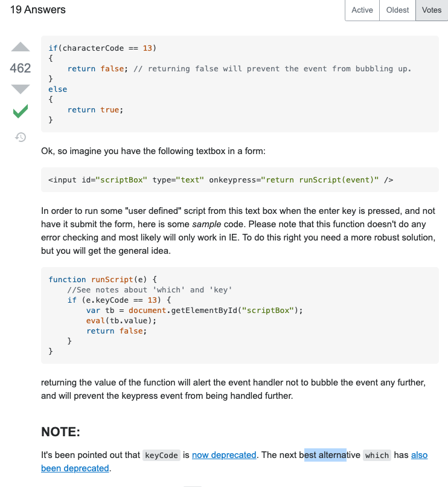

# Even/Odd List Follow-Along

1. In your terminal you can run these commands one at a time:

    ```terminal
        cd devFolder
        cd evenOdd-lists
        touch index.html
        code .
    ```

    > NOTE: You can also just use finder and VS code to do the same thing if it's more comfortable to you.

2. In the `index.html` file create the boilerplate HTML code and inside the Body Element create a Form with an Input for text and a Submit button.

    ```html
        <h1>Even Odd Lists</h1>
        <hr/> 

        <form id="even-odd-form" autocomplete="off" target="_blank">
          <div> 
            <label for="word">word</label> 
            <input type="text" name="word" id="word"  placeholder="what's your word?" onkeyup=""> 
          </div>
          <div>
            <input type="button" value="Even or Odd?" onclick="">
          </div>
        </form>
    ```

## Introducing OL & UL Elements

3. Now let's add some elements we can show users their inputs. Below the form create two Section elements titled "Even" and "Odd" Inside those sections create to **Unordered Lists (UL)**:

    ```html
        <section>
          <h2>Even</h2>
          <ul></ul>
        </section>
        <section>
          <h2>Odd</h2>
          <ul></ul>
        </section>
    ```

    > NOTE: In these **Unordered List elements** is where we'll add our words as **List Items (LI)**. You could change these out for **Ordered Lists** if you'd like numbers instead of bullets.

    > [MDN Docs - UL Element](https://developer.mozilla.org/en-US/docs/Web/HTML/Element/ul)

4. Now let's create some temporary storage to keep up with our user's input. Create a variable called: `usersWord`.

    > NOTE: For simplicity sakes we'll put our JS in a Script element but feel free to keep it in a separate .js file you like.

    ```html
        <script>
          let usersWord = ""
        </script>
    ```

5. Then let's create a function that will update this variable when the user types in.

    ```html
      <script>
        let usersWord = ""

        function updateWord(element) {
          usersWord = element.value

          console.log(usersWord)
        }
      </script>
    ```

    > NOTE: the console.log call is there to prove you're changing the variable as expected. This is a good practice as you're learning but you don't want these statements in **Production Code**.

6. Now you'll need attach this function to the `onkeyup=` event on the Input Element and pass itself to it as `this`:

    ```html
      <!-- ...more code above -->
      <input type="text" name="word" id="word"  placeholder="what's your word?" onkeyup="updateWord(this)"> 
      <!-- ...more code below -->
    ```

    > NOTE: Test it. If it ain't workin' don't move on yet.

7. Our next step is to get the word to appear in just one of the lists. Let's, for now, put them all in the Odd list. To do that we'll need to start by creating a reference to our Odd List. First, give the UL Elements `id=` properties with appropriate values and create a variable to hold a reference to them in:

    ```html
      <section>
        <h2>Even</h2>
        <ul id="even"></ul>
      </section>
      <section>
        <h2>Odd</h2>
        <ul id="odd"></ul>
      </section>
    ```

    ```js
      let usersWord = ""
      let oddList = document.getElementById("odd")
    ```

8. Now create function that will create a new element (`<li>`), put the input as its `innerText` and `append` it to the Odd List:

    ```js
      function handleSubmit() {
        let newListItem = document.createElement('LI')
        newListItem.innerText = usersWord

        oddList.appendChild(newListItem)
      }
    ```

    > NOTE: We could have created the `oddList` variable at the top of this function but because we'll run this function every time we submit a new word there's no reason to make the computer work hard to re-create a reference every time we re-run the function.

9. Don't forget to reset the form and clear the `userWord` variable:

    ```js
      function handleSubmit() {
        let newListItem = document.createElement('LI')
        newListItem.innerText = usersWord

        oddList.appendChild(newListItem)

        usersWord = ""
        document.getElementById("even-odd-form").reset()
      }
    ```
  
## Introducing If/Else

10. Now the trick is to figure out where to change the logic so the program FIRST counts the letters of the word then decides whether it should be in the Even list or the Odd list. To do this let's look at the code line-by-line:

    ```js
      function handleSubmit() {
        // this line creates a new LI Element. We'll do this every time a word is submitted so this should stay the same
        let newListItem = document.createElement('LI')

        // this line sticks the user's word into the newly create LI Element so we'll keep this the same, as well.
        newListItem.innerText = usersWord

        // this line attaches/appends the element to the Odd List !!!THIS IS WHERE THE PROGRAM SHOULD DECIDE IF IT'S EVEN OR ODD!!!
        oddList.appendChild(newListItem)

        // these two lines will be the same
        usersWord = ""
        document.getElementById("even-odd-form").reset()
      }
    ```
  
11. Okay so here's the line we're looking at:

    ```js
      // this line attaches/appends the element to the Odd List !!!THIS IS WHERE THE PROGRAM SHOULD DECIDE IF IT'S EVEN OR ODD!!!
      oddList.appendChild(newListItem)
    ```

    At this point we're going to need to learn a bit of new JavaScript - If/Else Statements!

    If/Else statements do exactly what they sound like. "If this statement is true then do this thing. Else, so that thing." Syntactically they look like this:

    ```js
      if( 1 === 1) {
        return true
      } else {
        return false
      }
    ```

    This statement will return "true" every time because 1 will always equal 1! However, we don't have to compare just 1 to 1 we can compare word lengths and even do mathematics in an if/else statement.

12. Add an **[If/Else Statement](https://developer.mozilla.org/en-US/docs/Web/JavaScript/Reference/Statements/if...else)** to our function:

    ```js
      // ...more code above...
      function handleSubmit() {
        let newListItem = document.createElement('LI')
        newListItem.innerText = usersWord

        if(/*word length is even*/) {
          /*put word in even lists*/
        } else {
          /*put word in odd list*/
          oddList.appendChild(newListItem)
        }

        usersWord = ""
        document.getElementById("even-odd-form").reset()
      }
    ```

    > NOTE: This code isn't going to work because it doesn't have values but make sure you understand what's being told to the computer.

13. Next we're going to have to have a reference to the Even List the same way we do with the Odd List. Just copy/paste the last variable and change the values:

  ```js
    let usersWord = ""
    let oddList = document.getElementById("odd")
    let evenList = document.getElementById("even")

    // ...more code below
  ```

## Introducing The Modulus and Data Types: String and Boolean

14. Our next challenge is to figure out how to count the length of the word and decided if it's even or odd. For this step we'll learn two new JS techniques but let you work through some ideas on your own before moving on:

  * [String Data Types](https://developer.mozilla.org/en-US/docs/Web/JavaScript/Reference/Global_Objects/String) like the word stored in `usersWord` have a property on them called `.length`
    > Try It. Type in an input and in the Browser's Console type `usersWord.length` + ENTER.
  * [The Modulus](https://developer.mozilla.org/en-US/docs/Web/JavaScript/Reference/Operators/Remainder), `%`, is a mathematical operator that returns the remainder of a division, i.e. `20/5` would equal `4` but `20 % 5` would equal `0`.
    > Try it. Go to your Browser's Console and type each of those in + ENTER.
  
  STOP! Before moving on spend some time on your own to think about how you could use these two concepts inside the If/Else statement to determine if the word is odd or even.

*********
<!-- ! NEW PAGE  -->
*********

## After You've Tried it Yourself

### Putting It All Together

15. Let's identify all the pieces we have available to use to solve this problem:

    * the word: `usersWord`
    * the length of the word: `usersWord.length`
    * `%` operator
    * An argument give to the `if()` function to do something if it's true
    * Truth 1: even numbers are evenly divided by 2, aka they have a remainder of `0`
    * Truth 2: odd numbers are not evenly divided by 2, aka they have a remainder of not `0`

    What if we divided the length of the word and compared the remainder to 0?

    ```js
      usersWord.length % 2 === 0
    ```

    This comparison will resolve to `true` or `false`. If the word's length is even it will resolve to `true` if not then it will resolve to `false`. This is a good thing because the `if( )` function works on these **[Boolean Values](https://developer.mozilla.org/en-US/docs/Web/JavaScript/Reference/Global_Objects/Boolean)** of `true` and `false`.

    If we give this comparison to the `if( )` function we are telling the computer to run ask a few questions:
      * "What's the length of the word?"
      * "What's the remainder when divided by 2?"
      * "Is that remainder equal to 0?"

    Now our **If/Else Statement** should look like this:

    ```js
      // ...more code above...

      if(usersWord.length % 2 === 0) { 
        /*put word in even lists*/
      } else {
        /*put word in odd list*/
        oddList.appendChild(newListItem)
      }

      // ...more code below...
    ```

16. Now tell the program to insert the word in the even list inside the `{ }` before the `else {`

    ```js
      let usersWord = ""
      let oddList = document.getElementById("odd")
      let evenList = document.getElementById("even")

      // ...more code here...updateWord()

      function handleSubmit() {
        let newListItem = document.createElement('LI')
        newListItem.innerText = usersWord

        /* compare remainder to 0 to see if even or not */
        if(usersWord.length % 2 === 0) {
            /*put word in even lists*/
            evenList.appendChild(newListItem)
          } else {
            /*put word in odd list*/
            oddList.appendChild(newListItem)
            }

        usersWord = ""
        document.getElementById("even-odd-form").reset()
      }
    ```

### Push Yourself Further

If you'd like to prevent the the Form from reload the page if you hit ++enter++ try to [implement this solution](https://stackoverflow.com/questions/905222/prevent-form-submission-on-enter-key-press).

  > Look for the Big Green Check mark for the best answers on StackOverflow.

