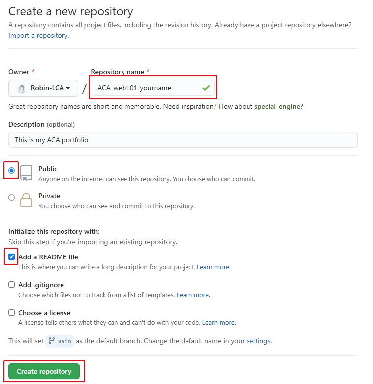

## Create a Repo

Now that you've moved on to using VS Code locally on your computer you're going to need to store your code in a remote repository for double-safe keeping.

To create a new repository (*repo*):

- [ ] Open your web browser and sign in to your [GitHub account](https://www.github.com){:target="_blank"}.
- [ ] Click the **New** button in the top-right corner of the window.

- [ ] Enter `ACA_web101_yourFirstName_yourLastName` in the **Repository name** field.

  > NOTE: Change `firstName` for your **actual** first name and `lastName` for your **actual** last name.

- [ ] Enter `This is my ACA portfolio` in the Description field.
- [ ] Leave the **Public** radio button selected.
- [ ] Check the **Add a README** file checkbox. (this will create a `README.md` file for you to take notes in.)
- [ ] Click the **Create repository** button.

- [ ] Once the repo is created, click the **Code** button and copy the link it provides in the drop-down menu by clicking on the icon that looks like a page with the arrow pointing left.

- [ ] Go back to your terminal.
- [ ] Type `git clone` and paste the link you copied from your repo on GitHub to clone the repo onto your computer: `git clone paste-that-link-here-and-replace-me`
- [ ] Press the ++enter++ key and watch it work!

*You will need to create a repo for most assignments and every time you want to start a new project on your own, for a friend or whenever you want to build something new. Keep this instructions handy as they will be the same in the future.*

