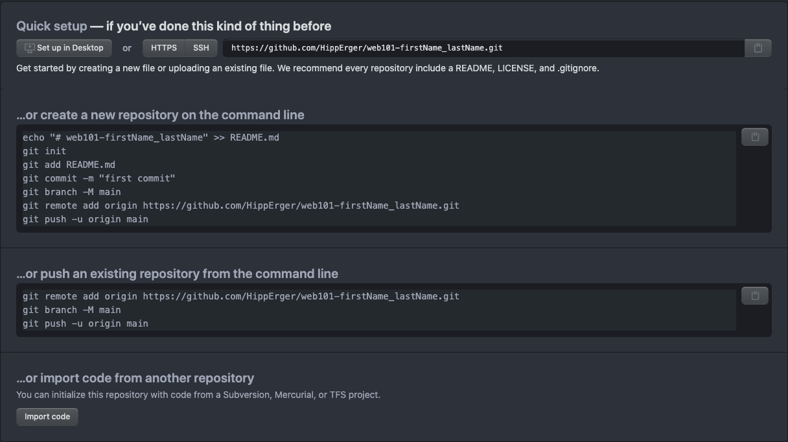
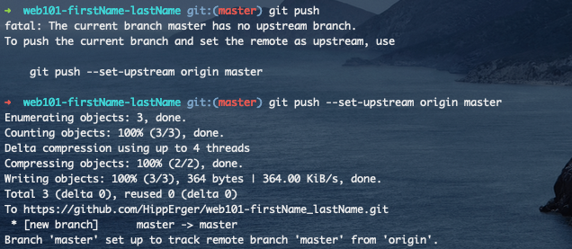
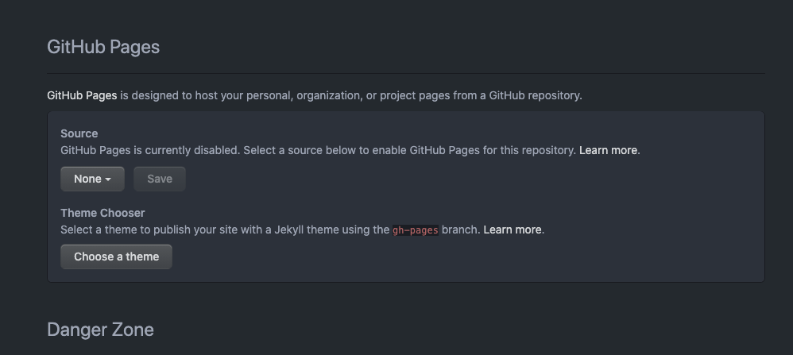
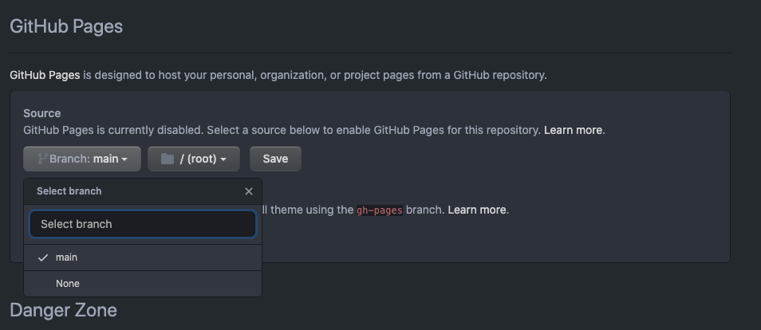
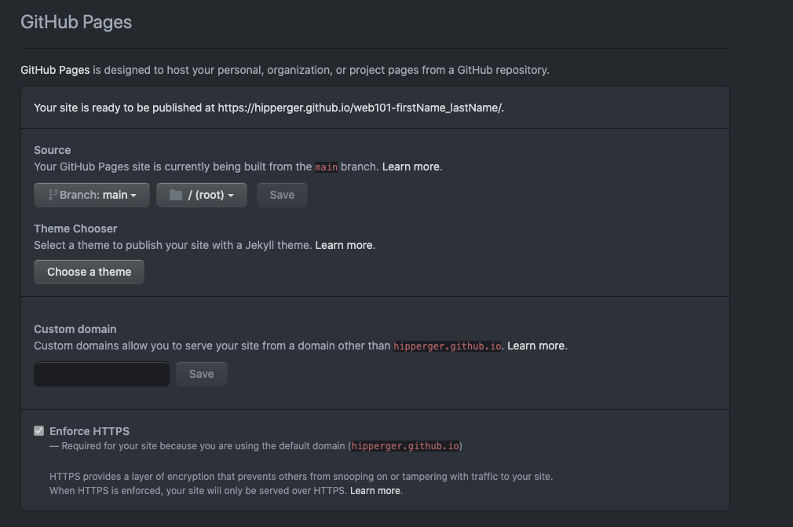
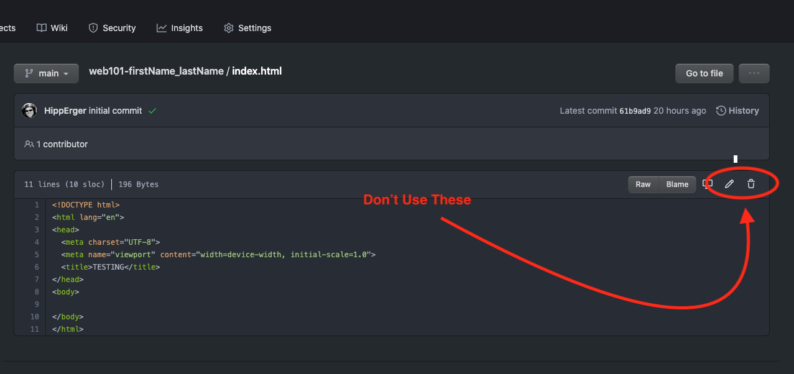

# Git Setup

## Accounts, Downloads, and Git Software Check-In, 30 minutes

In this section we'll take things step at a time with time to slow down and get help, we'll call them **Pause and Partner** where students that were successful in the steps will partner with students that weren't to help them through any troubles. This will help conserve class time so your instructor can teach thing everyone needs to learn.

We'll be using these two programs tonight and for the rest of class. If you didn't get both of them downloaded and opened up, ask your new friends if they did so they can help you out.

1. The **IDE**: [Visual Studio Code](https://code.visualstudio.com/download)
  
    * Plus the extension: [Live-Server](https://marketplace.visualstudio.com/items?itemName=ritwickdey.LiveServer)

2. The version control software: Git

=== "For Windows"
    
    1. [How To Install Git on Windows](https://www.youtube.com/embed/J_Clau1bYco)
    2. Install [Git](https://git-scm.com/download/windows)

=== "For Mac"

    1. Install [HomeBrew](https://brew.sh/) - `/bin/bash -c "$(curl -fsSL https://raw.githubusercontent.com/Homebrew/install/HEAD/install.sh)"`
    2. Install [Git](https://git-scm.com/download/mac) - `brew install git`

  > NOTE: There is no icon for this program, just go to your terminal/shell/commandPrompt/bash and type git + ++enter++

  > **Pause and Partner:**
    > Did anyone NOT get these downloaded? Did anyone not get them opened? Partner up and help each other.

*****

### Create a Repo on GitHub

1. First, Sign-in to GitHub. At the top-right of the screen click on the "+" icon and select "New Repository"
2. In the "Repository Name" field type: web101_firstName_lastName

    > NOTE: remember to change firstName for your actual first name and lastName for your actual last name.

3. In the "Description field" type: "This is my portfolio website!"
4. Make it "Public" by clicking the radio button next to Public. So your instructor can view it.
5. Check the box to "Initialize this repository with a README.md"
  
    > NOTE: This is a file we'll use later on and you'll understand why it's important to use later on.

6. Click "Create Repository". After this you should see a screen that looks like this:



7. Find your Portfolio Folder in the terminal by either:

    * dragging and dropping the folder in the terminal
    * Use the command `cd` to change directories until you're inside the folder.

8. Type `pwd` to confirm your in the correct folder.
9. Then use these commands one after another. They're modified a little from the image above.

    * `git init` - this will initialize the folder as a folder for the git software to watch.
    * `git add -A` - this adds all the files you created for your Portfolio Landing Page.
    * `git commit -m "first commit"` - This stages your new files to be added to the remote remote, you're "committing" to the changes.
    * `git branch -M main` - [GitHub recently changed the name of the "main" branch](https://www.theserverside.com/feature/Why-GitHub-renamed-its-master-branch-to-main#:~:text=The%20master%20branch%20is%20no,like%20any%20other%20Git%20branch.){:target="_blank"} from `master` to `main`. This command ensure you're using `main` as your "main" branch.
    * `git remote add origin https://github.com/YOUR-USERNAME/web101-firstName_lastName.git` - Attaches the remote repo to this local folder.
      >  NOTE: be sure you replace the link wit the link given to YOU from gitHub.
    * `git push -u origin main` - pushes your committed files up to the remote repo.

10. Watch the progress in your terminal then refresh the tab with your GitHub Repo to see if the files are there. In your terminal you're looking for feedback that looks like this:



  > **Pause and Partner:**

* What problems have you encountered?
* Is there anyone that was rejected by GitHub? Password? Username?
* Let's partner up according to our problems and help each other get through them! Who's successful and who is struggling?
* [Follow-Up Video: Creating a Repo and Using Git](https://vimeo.com/391317916){:target="_blank"}
* Is anyone having a trouble `push`ing? Maybe your configurations aren't set correctly. See next section: Git Configurations

  > NOTE: Mac users can learn to setup the `code .` path for VS Code in this video.

#### Git Configurations

When you're pushing code to a repo, Git needs to know who you are so it can sign-in to GitHub. It uses your username/email and password to do this. If you don't setup this configuration, git will populate your email with an address assigned to your computer that doesn't match your account on GitHub.

  > NOTE: if while doing these steps you'll see a strange looking screen pop up, it might be your computer's [default text editor, VIM or VI](https://en.wikipedia.org/wiki/Vim_(text_editor)){:target="_blank"}. Just follow the instructions below and/or watch the video to use it.

##### Set up Git Config(urations) All Machine Users

1. Set your git username. In your terminal, copy/paste this code and replace YOUR-USERNAME with your GitHub username: `git config --global user.name "YOUR-USERNAME"` + ENTER

2. Now, set your email. In your terminal, copy/paste this code and replace YOUR EMAIL with the email you used to create your GitHub account: `git config --global user.email "YOURemail@address.com"` + ENTER

    > Note: If it asks you for a password this is your GitHub account password

##### VIM/VI - How to Use It

When doing your git config you may see a more unusual window in your terminal. it will have a bunch of `~` or `#` along the left side. This is a built-in text editor like VS Code but very stripped down. It allows you to change files and write code. For this step you'll be changing your `.gitconfig` file to contain your username and email.

VIM has two modes: **Insert** (input text) and **Command** (move around and do stuff). For now, we really only need to insert text, but you'll need to know how to get in and out of the two different modes.

  * To start the **Insert Mode**: Press `i` to enter **Insert mode** and press `esc` to begin **Command mode**. You'll know which one you're in because "insert" will appear at the bottom of the screen when you enter insert mode.

  * While **Command Mode** is active you navigate around the page with your arrow keys (d-pad). When you need to type in your email or anything else, press `i`. You're then free to type in whatever you need.

  * In this `.gitconfig` file all lines that begin with `#` are read as "comments" meaning the computer doesn't read them. Make sure you remove them from the important lines. Ask your instructor.

  * When you're finished inserting, press `esc` to move back to **Command mode**. Then to exit and save the file type `:wq` + ENTER. This simply says to the computer: "I'm about to give you a command(`:`), write the file(`w`) then quit the program(`q`)."

    > NOTE: If you're lost, it's totally fine. VIM is an old relic that's stuck around and become a hipster text editor but really it's there so you can always change files, no matter what!

If you're having trouble: [Git Config How-To Video](https://vimeo.com/384020788){:target="_blank"}

  > **Pause and Partner:** How we doing? Try `git push`ing again. Who hasn't been able to push?

*****

### Practice It Again: Add A file and Push It

Now that you've configured your git software and learned the `status`, `add`, `commit`, `push` process, let's practice using git again.

1. Create another file in the same directory called: `.gitignore`. Then copy/paste this code into that file:

  ```yaml
    ### macOS ###
    # General
    .DS_Store
    .AppleDouble
    .LSOverride

    # Icon must end with two \r
    Icon

    # Thumbnails
    ._*

    # Files that might appear in the root of a volume
    .DocumentRevisions-V100
    .fseventsd
    .Spotlight-V100
    .TemporaryItems
    .Trashes
    .VolumeIcon.icns
    .com.apple.timemachine.donotpresent

    # Directories potentially created on remote AFP share
    .AppleDB
    .AppleDesktop
    Network Trash Folder
    Temporary Items
    .apdisk

    ### Windows ###
    # Windows thumbnail cache files
    Thumbs.db
    Thumbs.db:encryptable
    ehthumbs.db
    ehthumbs_vista.db

    # Dump file
    *.stackdump

    # Folder config file
    [Dd]esktop.ini

    # Recycle Bin used on file shares
    $RECYCLE.BIN/

    # Windows Installer files
    *.cab
    *.msi
    *.msix
    *.msm
    *.msp

    # Windows shortcuts
    *.lnk

    # Sensitive Environment Variables
    .env

    # VS CODE
    .vscode/settings.json 
    .vscode

    # End of https://www.toptal.com/developers/gitignore/api/macos,windows
  ```

  > NOTE: This step is mainly for Mac users but really all users should know how to use `.gitignore` which is a file that git software looks for and will ignore whatever you write inside of it. Its good practice to include this file with all projects you do in the future.

2. To move this file up to your remote repo by running these commands in order:

    * `git status` - check to see what files you've changed and that you hit "SAVE"
    * `git add .gitignore` - Adds the changed file to the staging area.
    * `git commit -m "to git to ignore certain files"` - Commits the file changes with a descriptive message about the changes made.
    * `git push` - pushes the change from the staging area to the remote repo.

13. Make a note for yourself!! Every time you make substantial changes to your code bases you'll run these commands in this order EVERYTIME!

**Pause & Partner**: How we doing? Any questions about these four commands? Who didn't get this `.gitignore` file into their repo?

### Serve Your Landing Page

Now that your web page is hosted on a publicly available computer, GitHub's server, you can change the permissions and allow for it to seen by the world!

1. Go back to the repo you just created on GitHub then go to the "Settings Tab".


2. Under the Settings, scroll down almost to the bottom of the page until you see "GitHub Pages".



3. Click the None dropdown and select `main` branch and then click "Save".



4. Now, scroll back down to the "GitHub Pages" section and you'll see a section that says "Your site is ready to be published at `https://yourusername.github.io/`." - This is the ROOT of your live site. In order to see your live site, you need to put in the rest of the URL's **path**.



5. Use your browser to navigate to: `https://YOUR-GITHUB-USERNAME.github.io/ACA_web101_FIRSTNAME_LASTNAME/myPortfolio/index.html`

  > NOTE: Do you see how the forward-slashes `/` in the URL look the exact same as the path names in our `<link/>` tags? That's because server-computers hold files the same way your personal computer does and the structure of the directories are the same, i.e. the current path to your portfolio looks like: `documents/DevFolder/myPortfolio/index.html`. All computers are built the same way and talk the same way.

  > **Pause & Partner**
    * Where are we? Is anyone able to see their site live? It can take a few minutes to populate.
    * Who's lost?

#### Turning in Your Assignments

Your instructor will show you where and how to turn your assignments in using this live GitHub link as an example.

<!-- TODO Create a new video for this -->

#### Important Notes About Git and GitHub

DON'T make changes to your code using the tools on GitHub like editing, deleting, creating, or uploading any files.




Only make changes in your editor (VS Code) and push them up EVERY TIME. No exceptions. If you don't it may cause you some headaches.

Git software is powerful but confusing for beginners. If something goes wrong while using git follow these steps:

1. PLEASE DON'T delete your local folder with work in it that is not on GitHub. That is your precious time you are deleting! THIS IS WHY WE KEEP OUR CODE IN A REPO IN THE FIRST PLACE!!
2. Check the branch you're on: `git branch`
3. Change branches to see if the code you're looking for is on that branch: `git checkout <NameOfBranch>`
4. Replace the "broken" folder with a new folder:

    * Rename your folder on your computer `web101_firstName_lastName` to `web101_firstName_lastName-broken`
    * Re-clone your repository from GitHub `git clone https://github.com/username/ACA_web101_firstName_lastName.git`
    * Copy over all changed files from `ACA_web101_firstName_lastName-broken` folder into the new `ACA_web101_firstName_lastName`
    * `git add -A` - Add all new files
    * `git status` - See green
    * `git commit -m "fixed my mess-up"` - to commit the changes
    * `git push origin main` or `master` - push your code up to GitHub.
    * ONLY AFTER you've confirmed that all changes are on GitHub, delete the broken repo folder.

<!-- TODO Make New Video that replaces this one: https://youtu.be/EHsblW8CcaY -->

*****