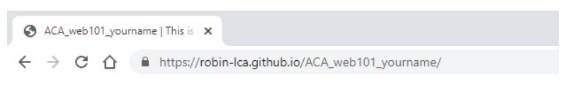

## Host Your Webpage

Before you can view your web page in a browser and turn in your assignment, you need to set your repository as a GitHub page. This tells GitHub you want to display this repo to the web.

- [ ] Go to your GitHub account and open your **ACA_web101_yourname** repo.
- [ ] Click the Settings icon in the top navigation menu.

- [ ] Scroll down almost to the bottom of the page to the **GitHub Pages** section.
- [ ] Click the **Source** dropdown and select the `main` or `master` branch (the first option).

- [ ] Click the **Save** button. The page will automatically refresh.
- [ ] Scroll back down to the **GitHub Pages** section, and you will see a message and link that says *“Your site is published at https://yourusername.github.io/ACA_web101_yourname."*.

Click the link. This is the **Root** of your live site.

- [ ] Always test your site to make sure everything is working. You can make and push changes as many times as you need.
- [ ] **Bookmark this link** so you can find it throughout the course. This will be the link you turn in for your assignments.

*You will only use GitHub pages when you want to host a page to the world. Most of our assignments won't require you to do this but it's a darn handy tool for when you want to get something up on the cheap.*

