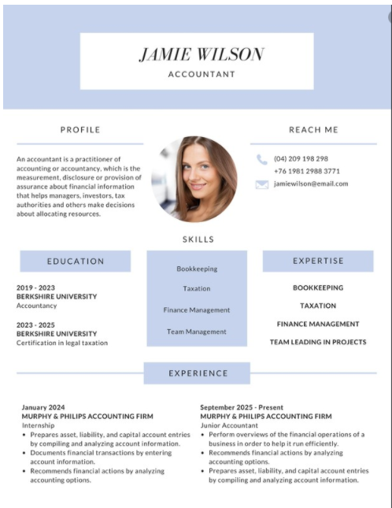
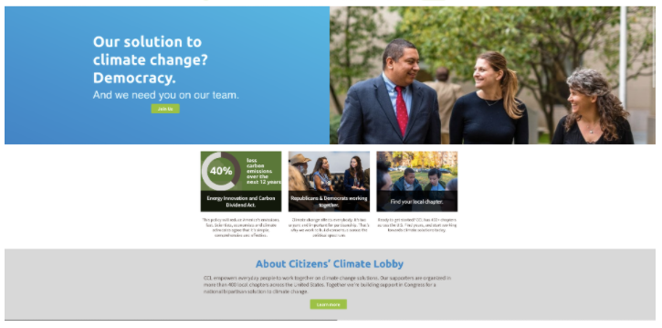
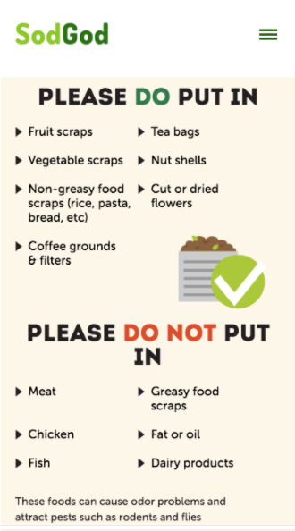
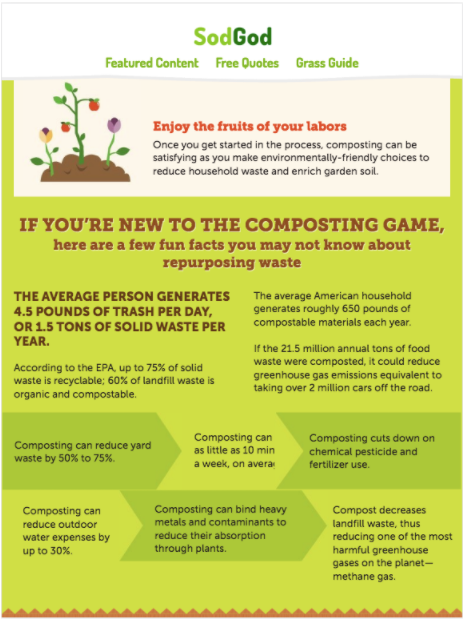
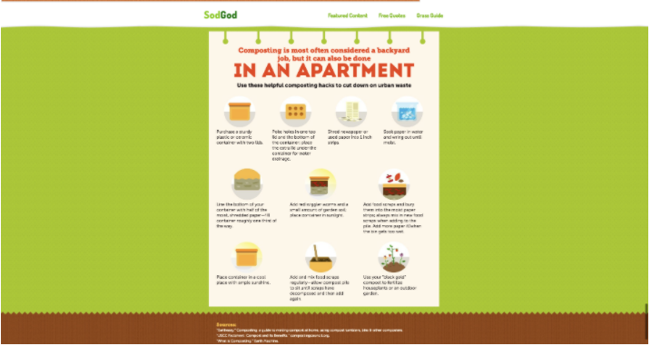

# Interview Challenges

## Why Train for Interviews?

Interviewing for development jobs is tough! To prepare you for the challenges ahead we will practice whiteboarding in front of the class every day. Think of it as a warm-up for the project that awaits. The whiteboarding challenges should be taken seriously and practiced even outside of class. Help yourself by following these steps to attack the problem, work through the problem and collaborate with your interviewer (instructor):

## How to Solve Your Challenge

- [ ] Restate the question aloud.
- [ ] Write the question out at the top of the whiteboard.
- [ ] Ask any clarifying questions you need.
- [ ] Invoke the function and write out the expected output given the sample input. If none is given, make it up.
Write out a code plan to the side of the whiteboard.
Speak aloud every thought you have. THIS IS THE MOST IMPORTANT PART!
- [ ] Build the structure of your function(s).
- [ ] Slowly work through your code plan, building the steps you need.
- [ ] Don't be afraid to mess up and say it aloud.
- [ ] It's not about finding the solution. It's about collaborating and working toward a solution!
- [ ] After you finish, take a picture and transfer it to a Repl.it when you get home.

<!-- ```javascript
  // optional code example
``` -->

## The Prompts

### Class 1

- [ ] **Prompt 1: NONE**

### Class 2

- [ ] **Prompt 1: Wireframe & Plan** - *What is wireframing? How do we plan the construction of a web page? How can we use paper and pencil to guide us while coding? As a class, talk through and develop a plan to build the NASA Contact Page.*
<!-- - [ ] **Prompt 2: Title** - *description* -->

### Class 3

- [ ] **Prompt 1: Title** - *Two students, at-a-time, will come up to the board at a time to work with their instructor to wireframe the following website mockups:*

  > NOTE: please use the time to create meaningful wireframes with semantic elements and maybe useful CSS pseudo code that can guide your coding for today's project.

=== "Resume Challenge"
    

=== "Landing Page Challenge"
    

### Class 4

- [ ] **Prompt 1: Title** - *Two students at a time will come up to the board to work with their instructor to wireframe each of the the three [website](https://www.sodgod.com/composting/) mockups below. 3 views = 6 students total.*

=== "Mobile View"
    

=== "Tablet View"
    

=== "Desktop View"
    

### Class 5

- [ ] **Prompt 1: Title** - *Two students(6 total) will come up to the board at a time to work with their instructor to wireframe each of the the three mockups from the [Scientific American](https://www.scientificamerican.com/article/co2-levels-just-hit-another-record-heres-why-it-matters/). While the students work at the board, the rest of the class should be following along with pencil and paper at their own desks.*

=== "Mobile View"
    

=== "Tablet View"
    

=== "Laptop View"
    

### Class 6

- [ ] **Prompt 1: Title** - *Wireframe the Image Gallery Mockup below. How do you get the text to appear when the user's cursor is over the top of it?*


### Class 7

- [ ] **Prompt 1: Code Plan** - *As a class, what problem do we need to solve in the Calculator App? How do we solve it? Let's create a list of actions we need to take to complete it.*
<!-- - [ ] **Prompt 2: Title** - *description* -->


### Class 8

- [ ] **Prompt 1: Title** - *description*
<!-- - [ ] **Prompt 2: Title** - *description* -->

### Class 9

- [ ] **Prompt 1: Title** - *description*
<!-- - [ ] **Prompt 2: Title** - *description* -->

### Class 10

- [ ] **Prompt 1: Title** - *description*
<!-- - [ ] **Prompt 2: Title** - *description* -->

### Class 11

- [ ] **Prompt 1: Title** - *description*
<!-- - [ ] **Prompt 2: Title** - *description* -->

### Class 12

- [ ] **Prompt 1: Title** - *description*
<!-- - [ ] **Prompt 2: Title** - *description* -->

### Class 13

- [ ] **Prompt 1: Title** - *description*
<!-- - [ ] **Prompt 2: Title** - *description* -->

### Class 14

- [ ] **Prompt 1: Title** - *description*
<!-- - [ ] **Prompt 2: Title** - *description* -->

### Class 15

- [ ] **Prompt 1: Title** - *description*
<!-- - [ ] **Prompt 2: Title** - *description* -->

### Class 16

- [ ] **Prompt 1: Title** - *description*
<!-- - [ ] **Prompt 2: Title** - *description* -->

<!-- Two students(6 total) will come up to the board at a time to work with their instructor to wireframe each of the the three mockups from the [Bite](https://bitetoothpastebits.com/). While the student work at the board, the rest of the class should be following along with pencil and paper at their own desks. Choose one site and start wireframing it. Make sure to include class and ids. -->