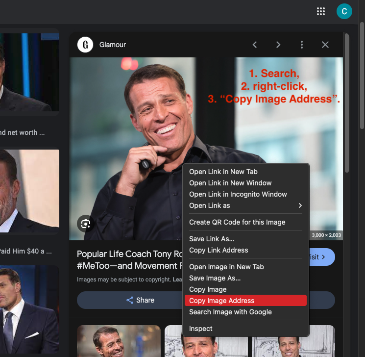

# Portfolio Landing Page

<!-- ** -->

## Overview

Today you will build the first page of your portfolio website, the Landing Page! You'll get the hang of it quickly, so don't worry if you don't understand all the code right of the bat. You'll build your page using [Code Sandbox](http://codesandbox.io/){target="_blank"}.

## Today's Checklist

  > NOTE: Each class throughout the program will include a "checklist" that describes the general flow of the class, as well as, key points and topics so you will know what to expect before diving in.

- [ ] Build "hero" style landing page.
- [ ] Play and explore
- [ ] Push Yourself Further

## Project Instructions

### Your Wireframe

  *A [wireframe is a simplified outline](https://careerfoundry.com/en/blog/ux-design/how-to-create-your-first-wireframe/){:target="_blank"} that defines the main design of a web page or site. Wireframes are used to plan the page structure, specify major elements, and explain functionality. It is the skeleton or blueprint of a website. You'll be using wireframes to plan your work throughout this course and your career.*

  Take a look at the wireframe below. This is the outline of the page you're building today and will serve as blueprint for you to build from.

  

<hr>

### Create a place to Code

For every project, you need a place to code:

- [ ] Go to [CodeSandbox](https://codesandbox.io/dashboard) and create a new HTML + CSS Sandbox named "Portfolio Website".

### Start with some "Boilerplate"

Every web site or web app has something called **Boilerplate code** which refers to the core bit of code that is required to make the whole thing function. In our case, building a web page, we need the code you see below which creates a Document (`<!DOCTYPE html>`), creates an HTML element (`<html> </html>`), creates a Head element for the document (`<head> </head>`), creates a Body element for the document (`<body> </body>`), as well as a few meta links to help the web browser know how to display the whole document.

From here on, you only have to worry about what goes inside the `<body> </body>` element because that's all that gets displayed on the browser's window.

- [ ] Copy and paste the following code into the HTML file.

```html
  <!DOCTYPE html>
  <html lang="en">
  <head>
    <meta charset="UTF-8">
    <meta name="viewport" content="width=device-width, initial-scale=1.0">
    <meta http-equiv="X-UA-Compatible" content="ie=edge">
    <link rel="stylesheet" href="./style.css">
    <title>My Portfolio</title>
  </head>
    <body>
    <!-- This is a what comment line looks like in HTML -->
    <!-- The rest of your code goes between here... -->


    <!-- ...and here. -->
    </body>
  </html>
```

  > NOTE: In the code above and below, you'll notice lines of code in grey that begin with `<!--` and end with `-->`. These are called "**comments**" which are ignored by the computer but can still be read by us humans! They're useful for sharing notes, thoughts, and suggestions with other humans. In this lesson you'll need to read them to understand where to put certain pieces of code. When you get to the end, or as you go, feel free to delete them to clean up the code.

  > **REMEMBER**: You must manually save in CodeSandbox to see your work rendered: ++cmd++ + ++s++ (Mac) / ++ctrl++ + ++s++ (Windows).

### Add Your Header and Main Elements

With HTML, we want to organize pieces of the web page into a few of categories as possible. With these two elements we'll be able organize everything else to come into one of two places: **The Header**(top part of the page), or **The Main**(the main/center part of the page).

- [ ] Create two elements inside the Body tags called **Header** and **Main**. Copy/paste the code below in-between the opening `<body>` tag and the closing `</body>` tag.

```html
  <!-- Don't include this <body> tag. It's for reference only -->
  <!-- <body>  -->
    <header>
    <!-- REPLACE THIS LINE WITH THE PROVIDED LOGO IMG TAG  -->
    <!-- REPLACE THIS LINE WITH A NAV ELEMENT -->
    </header>
    <main>
      <!-- REPLACE THIS LINE WITH YOUR HEAD SHOT IMG TAG -->

      <!-- REPLACE THIS LINE WITH THE PORTFOLIO BUTTON -->
      <a class="small-text" href="https://austincodingacademy.com/">© Austin Coding Academy</a>
    </main>
  <!-- </body> -->
  <!-- Don't include this </body> tag. It's for reference only -->
```

  > NOTE: The words **Head** and **Header** can be confusing so let's clear that up now: The `<head>` element is not displayed on the browser window and contains information on how the browser should build and display the web page. By contrast, the `<header>` is displayed on the web window and is simply another element like any other HTML element that is displayed to the user.

### Logo & Navigation

As you've seen with many web pages, navigation and logos are a typical part of the top of the web page, aka the header of the web page.

- [ ] Copy/paste the line of code below inside the Header element:

  ```html
  
  ```

- [ ] Below that new `` tag but still inside the Header tag, create a **Nav**(igation) **element**.

  ```html
  <nav>
    <!-- Put the 4 Anchor tags here -->
  </nav>
  ```

These next elements are called **Anchor** tags because they anchor one page of the website to another page. On this one you're going to have to write some come by hand.

- [ ] Create 4 Anchor elements inside the Nav element for each of the following pages: "Resume", "About Me", "My Blog", and "Contact Me". Use this code as a template.

  ```html
    <a href="./contactMe.html" class="has-border">Contact Me</a>
  ```

  > NOTE: The `href="..."` part of that code is called the **path name**. It tells the web browsers where to navigate to when the user clicks on the link. We don't have multiple files here just yet so it won't work but write them all as if you did have them built. *We're going to be building these pages very very soon.*

  > NOTE 2: The `class="has-border"` part is something you're going to use when you get to the CSS. It's a **class name** that labels these elements so that you can style them together at the same time. *You'll see shortly ;)*

*****

### Add Content

- [ ] Copy/paste following code in-between the opening `<main>` tag and the `<a class="small-text" href="https://austincodingacademy.com/">© Austin Coding Academy</a>` element:

  ```html
    
  ```

Now you need to add a picture of yourself (or someone else) into this page.

- [ ] Do a Google image search of yourself, i.e. LinkedIn or a person you look up to and copy the **Image Address**.



```html
  https://media.glamour.com/photos/5ac8fdda056de418042efe4c/master/pass/tony-robbins-getty.jpg
```

- [ ] Now replace the `./myProfilePic.jpg` part of that last bit of code with the image address you just copied, i.e: 

```html
  
```

- [ ] Now is your chance to write from scratch again. Create an **H1** element with your full name in it below this new **Img** tag.

- [ ] Then create an **H2** element below that with your current title: "Student of Web Development".

- [ ] Next, add this line of code below the **H2** element to create a **Button** element that will, eventually, take you to your portfolio page:
  
  `<button id="portfolio"><a href="./portfolio.html">Portfolio</a></button>`.

How's it looking?

Not matching your wireframe? That's okay. What you see is called **normal document flow**. In all web files, each element is read top-to-bottom and left-to-right and rendered on the screen top-to-bottom and left-to-right. Next, we'll add styles to arrange our page and make it pretty.

<hr>

### CSS: Style the Page

Look in the **Head** tag at the top of your `index.html` file. Do you see `<link rel="stylesheet" href="style.css">` on line 8? This line of code allows you to link styles to the otherwise very boring web page. The line is telling the browser to go find a file called `style.css` in the same folder as your `index.html` file. Luckily, when you created an HTML + CSS sandbox, CodeSandbox already automatically created one for you!!

- [ ] Copy/paste the following code inside the CSS file:

  ```css
  body {
      font-family: Arial, Helvetica, sans-serif;
      background-image: url("https://encrypted-tbn0.gstatic.com/images?q=tbn:ANd9GcS8JH6eaP22GW7wUyYtfqujCKr0YQzBxwGsXw&usqp=CAU");

      /* background image options: 1. https://pixahive.com/wp-content/uploads/2021/03/music-illustration-387168-pixahive.jpg 2. https://images.rawpixel.com/image_800/czNmcy1wcml2YXRlL3Jhd3BpeGVsX2ltYWdlcy93ZWJzaXRlX2NvbnRlbnQvbHIvYTAxMC1tYXJrdXNzcGlza2UtZmViMTktbXNwXzE5MDJfNTAyMy5qcGc.jpg 3. https://encrypted-tbn0.gstatic.com/images?q=tbn:ANd9GcS8JH6eaP22GW7wUyYtfqujCKr0YQzBxwGsXw&usqp=CAU */
      
      background-repeat: no-repeat;
      background-size: cover;
    }
    /* What kind of selector is this? */
    .logo {
      width: 150px;
      height: 100px;
      margin: 3% 10%;
    }

    header {
      display: grid;
      grid-template-columns: 40% 60%;
      width: 100%;
    }

    main {
      height: auto;
      width: 100%;
      display: grid;
      grid-template-columns: 30% 40% 30%;
    }

    /* This is an element within an element selector */ 
    nav > a {
      margin: 2% 1% 3%;
      height: 10%;
      width: 15%;
      color: white;
      font-family: Arial, Helvetica, sans-serif;
      font-size: 20px;
      border-radius: 25px;
      background: transparent;
      padding: 20px;
      text-align: center;
      border: 2px solid white;
    }

    .has-border {
      border-radius: 25px;
      border: 2px solid #0795C3;
      background: none;
      padding: 20px;
    }

    nav {
      display: flex;
      justify-content: flex-end;
      width: 100%;
      padding-right: 2%;
    }
    /* This is an ID selector */
    #profile-pic {
      width: 300px;
      height: 300px;
      border-radius: 50%;
      margin: 15% auto;
      grid-column: 2/3;
    }

    h1 {
      color:white;
      grid-column: 2/3;
      margin: 3% auto;
      border-bottom: 2px solid #1940A9;;
    }

    h2 {
      grid-column: 2/3;
      margin: 3% auto;
      font-style: italic;
    }

    .small-text {
      grid-column: 2/3;
      color: white;
      font-size: 10px;
      margin: 3% auto;
    }

    button {
      grid-column: 2/3;
      margin: 3% auto;
      width: 70%;
      height: 15%;
      font-family: Arial, Helvetica, sans-serif;
      font-size: 20px;
      border-radius: 25px;
      background: transparent;
      padding: 20px;
      padding-bottom: 5%;
      text-align: center;
      color: white;
      letter-spacing: 16px;
      font-style: italic;
    }
  ```

> NOTE: In the code above you see new types of **comment lines** denoted by `/*` and `*/`. This is the syntax for creating comments in CSS and JavaScript while the `<!--` and the `-->` is the syntax for HTML comments.

<hr>

## Playtime

- [ ] What's happening? Is it all working?
- [ ] If so, read through and see if you can figure out how to change the `background-image` to something you like better.
- [ ] Can you figure out how to change the color of the links at the top?
- [ ] What about the logo at the top-left? Can you replace that? 
- [ ] What about sizing? Can you adjust the picture? The Anchor links?
- [ ] **Finally**: Fix any bugs you have and get excited about playing with stuff. Show off!

This is how you will be learning from here on out! Playing, breaking, fixing, playing, breaking and fixing again! Don't be afraid to change colors, text sizes, font families – whatever! You can always undo.

> NOTE: As you learn you will be pushing into unfamiliar territory. This will be your job! To push the boundary, experiment, and come up with solutions to problems. Embrace this learning, love the bugs, find joy in squashing them and you will do well!

<hr>

## Review and Push Yourself Further

*Every lesson in this book will end with a **Review and Push Yourself Further** section. These sections are here to help you push yourself further once you've completed the in-class assignment. You should never stop coding or think you can't do or learn more. So to help guide you forward, these sections are given as highly-recommended suggestions on what you should code next. Take advantage of them and don't be afraid to Google your way through the challenges*

- [ ] Play with the **properties** and other values in the CSS file to see what they are changing on the page. Don't be afraid to break things. Just click undo! If you feel like you've made a mess, remember that you have all of the original code here within this assignment.
- [ ] Google each of the **properties** in the CSS file like  `margin`, `font-family`, `text-align`, `color`, and so forth.
- [ ] Learn new **values** for each of those **properties**.
- [ ] *Don't be afraid to break things*. You can always come back and fix them. Just come back to these instructions!
- [ ] See what else you can change and really get this page customized to your tastes. We'll learn more about CSS later on, but you should start experimenting and playing with it now.
- [ ] Use these pages for inspiration:


