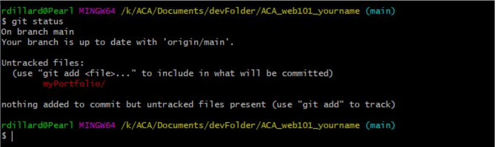

## Push to GitHub

You've created a new repo, cloned it to your local machine, and moved your `myPortfolio` folder with your project files into the new repo. Now it's time to push your files to GitHub.

- [ ] Open your terminal,  and `cd` (change directory) to your `ACA_web101_yourname` folder:
  
  * Example:  `cd ACA_web101_yourname` 

  >TIP: Type the first few letters of the folder and press ++tab++, and the terminal will fill in the rest of the folder name.

- [ ] You will see the full directory path with (`main`) or (`master`) at the end. This confirms you are in a Git repo and on the `main`/`master` branch.


- [ ] Type `git status` + ++enter++. You will see your `myPortfolio` folder (or a list of files) that have been changed in red.



- [ ] Type `git add -A` + ++enter++ to add/**track** all files to what will be **committed**.

  > You won't get a message back.

- [ ] Type `git status` + ++enter++ again and you will see the files you just **staged** to commit *now* in green.


- [ ] Type `git commit -m "moved files into repo"` + ++enter++ to **commit** your changes (the files you just moved over) so they're ready(**staged**) to be sent to GitHub.

  > You will see a summary of changes about to be pushed in white.


  > the `commit` command takes an argument `-m` for "message" followed by some plain text inside `" "`. This is for you to write a detailed message about the code changes you've made so your team can easily reference & understand the updates.

- [ ] Type `git push` + ++enter++ to **push** your files to GitHub. You will see the a success messages in white.


- [ ] **IF** *you get a DENIED error you may need to redo your Git Configurations with the proper email/username and password*

- [ ] **IF** *you get a fatal message:*
  
  ```console
    fatal: The current branch example-branch has no upstream branch.
    To push the current branch and set the remote as upstream, use
  ```

  > simply copy/paste the command it gives you: `git push --set-upstream origin <example-branch>`


- [ ] See [Git & Terminal Commands](./../additionalResources/gitCommands.md){:target="_blank"} for a full list of commands.

  > NOTE: All over the web and in this ebook when you see `<yourName>` or `<example-branch>` this means you should type in the name of your file or folder **WITHOUT** the wrapping `<` and `>`.

*You will do this step over, and over and OVER throughout the rest of your career. So write it down now, ask questions, understand what's happening and remember, **git status**, **git add**, **git commit**, and **git push**. Over and over and over again.*

<hr>