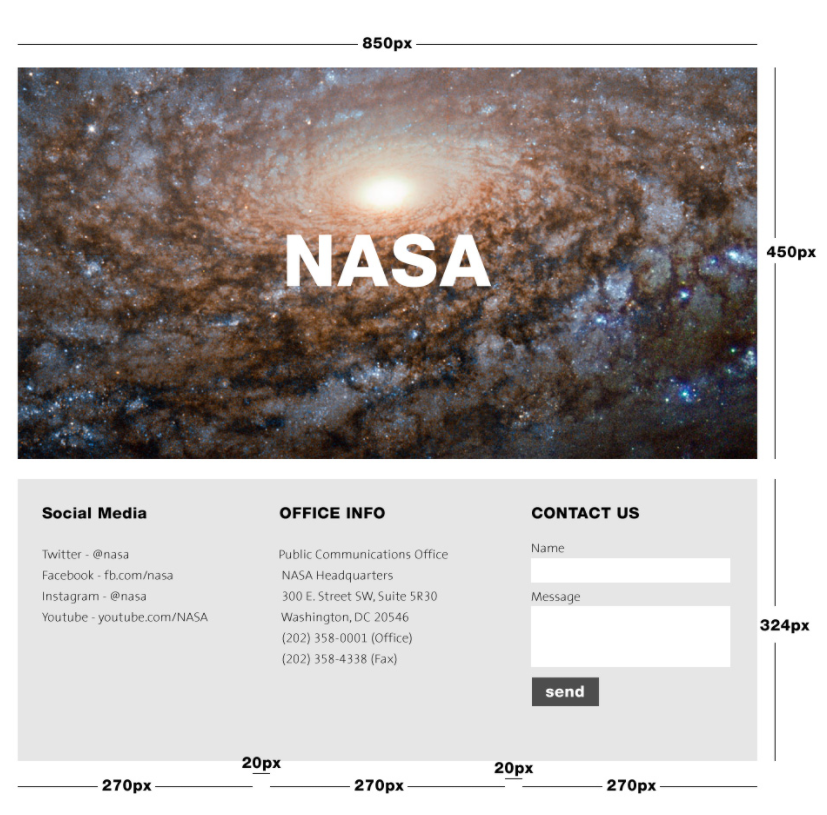

# Class 2: NASA Contact Page

<!-- ! HIDE FROM STUDENT; INSTRUCTOR ONLY CONTENT -->
<!-- ## Instructor Only Content - HIDE FROM STUDENTS -->

<!-- ! END INSTRUCTOR ONLY CONTENT -->

*Share your ideas and gratefully listen to others.*

## Greet, Outline, and Objectify

<!-- SMART: Specific, Measurable, Attainable, Relevant, and Timely. -->
<!-- https://examples.yourdictionary.com/well-written-examples-of-learning-objectives.html -->

Today we're going to:
  
*OBJECTIVE: Applying recently learned concepts to real world challenges, let's learn to use what we learn immediately.*

- [ ] Questions for Student Led Discussion
- [ ] Interview Challenge: Wireframe the NASA Web Page together - 25 mins
- [ ] Organize Student Presentations - 15 mins
- [ ] Creation Time
    * [ ] NASA Contact Page - 75 mins
    * [ ] use CSS Flex & Box Model
    * [ ] create a new repo,
    * [ ] host it, and turn it in
- [ ] Push Yourself Further
- [ ] Interview Questions: Blog to Show You Know
- [ ] Exit Recap, Attendance, and Reminders

### Questions for Student Led Discussion, 15 mins
<!-- This section should be structured with the 5E model: https://lesley.edu/article/empowering-students-the-5e-model-explained -->

[Questions to prompt discussion](./../additionalResources/questionsForDiscussion/qfd-class-2.md)

### Interview Challenge, 25 mins
<!-- The last two E happen here: elaborate and evaluate  -->
<!-- this sections should have a challenge that can be solved with the skills they've learned since their last class. -->
<!-- ! HIDDEN CONTENT: INSTRUCTOR ONLY -->
[See Your Challenge Here](./../additionalResources/interviewChallenges.md)
<!-- ! END HIDDEN CONTENT: INSTRUCTOR ONLY -->

### Student Presentations, 15 mins

  Let's take some time to assign & document individual students and groups of students to present the coming topics.

  [List of Student Daily Presentations](./../additionalResources/studentPresentations.md)

## Creation Time, 60-90 mins

* Instructor to Demonstrate with Examples, Explain and Set Expectations
* Group Students in pairs
  * plan and implements
* Partner with other groups for elaboration
* Share with the class for evaluation (potentially carry into the next class)

*****

- [ ] Draw a wireframe with HTML tags denoting each element
- [ ] Create a repo on GitHub with a `README.md`
- [ ] `git clone` it to your local machine.
- [ ] Create an `index.html` and `style.css` file and link them together.
- [ ] Using `display: flex;` and the box model, follow the mock-up below to build the NASA landing page.
- [ ] Use [PixaBay](https://pixabay.com/) to download an image that is similar to the one on your mockup.
- [ ] Use [GoogleFonts](https://fonts.google.com/) to find the font closest to the font on the mockup.
- [ ] Use [ColorPick Eyedropper](https://chrome.google.com/webstore/detail/colorpick-eyedropper/ohcpnigalekghcmgcdcenkpelffpdolg?hl=en) to get the right colors.
- [ ] Push your local changes up to your remote repo:
    * [ ] `git status`,
    * [ ] `git add .`,
    * [ ] `git status`,
    * [ ] `git commit -m "your meaningful message"`,
    * [ ] `git push`,
    * [ ] `git status`
- [ ] Go to the settings of this repo and host it with GitHub Pages.
- [ ] Copy/Paste the URL into Zollege.com.

  > In case you need it, here's a [Follow-Up Video for the NASA Page](https://player.vimeo.com/video/296667713).

### Push Yourself Further

- [ ] Use a Form & Input elements to create the form in the mockup.
- [ ] Link your new NASA Page to your Portfolio website by creating a portfolio page in your Portfolio website folder that has a list of links with one of them as: "NASA Contact Page". This way you have 2 hosted pages and one of them links to the other. Go do it! You have the skills now. Get messy and play!!
- [ ] Remember to link your `portfolio.html` file to your `index.html` file in your Portfolio folder and `push` your changes again.
- [ ] Add a [slide show of images](https://www.w3schools.com/howto/howto_js_slideshow.asp) to your NASA Contact Page.
- [ ] [Add an Overlay Zoom](https://www.w3schools.com/howto/tryit.asp?filename=tryhow_css_image_overlay_zoom) to the page.

## Blogs to Show You Know

[Blog Prompts](./../additionalResources/blogPrompts.md)

## Exit Recap, Attendance, and Reminders, 5 mins

- [ ] Create NASA Contact Page Assignment
- [ ] Create BlogPost_102 Assignment
- [ ] Prepare for next class by completing all of your pre-class lessons
<!-- * Complete the feedback survey -->
- [ ] Over the next few days you'll learn about CSS Grid and how to wireframe so that you can build more efficiently and confidently!

<!-- <iframe id="openedx-zollege" src="https://openedx.zollege.com/feedback" style="width: 100%; height: 500px; border: 0">Browser not compatible.</iframe>
 -->

<!-- TODO Create 3 question exit questions -->

<!-- TODO INSERT Student Feedback From -->

<!-- TODO INSERT *HIDDEN* Instructor Feedback Form -->

<!-- 
height/width = 1.777 ---- width="655" height="368"
cp workspace/resources/classOutlineTemplate.md docs/module-
 -->