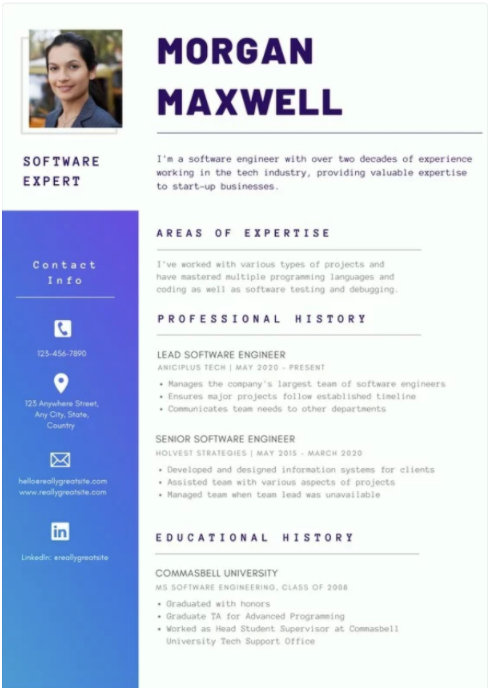
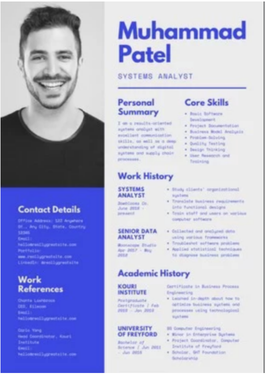

# Class 3: Resume

<!-- ! HIDE FROM STUDENT; INSTRUCTOR ONLY CONTENT -->
<!-- ## Instructor Only Content - HIDE FROM STUDENTS -->

<!-- ! END INSTRUCTOR ONLY CONTENT -->

*Interesting people want to work with interesting people.*

## Greet, Outline, and Objectify

<!-- SMART: Specific, Measurable, Attainable, Relevant, and Timely. -->
<!-- https://examples.yourdictionary.com/well-written-examples-of-learning-objectives.html -->

Today we're going to:
  
*OBJECTIVE: After this class students will have a firm understanding of: The application and use of CSS Grid as it is used in professional web development*

- [ ] Questions for Student Led Discussion
- [ ] Interview Challenge
- [ ] Student Presentations
- [ ] Creation Time
    * [ ] Choose and build a resume for your Portfolio project - 75 mins
- [ ] Push Yourself Further
<!-- - [ ] Interview Questions: Blog to Show You Know -->
- [ ] Exit Recap, Attendance, and Reminders

### Questions for Student Led Discussion, 15 mins
<!-- This section should be structured with the 5E model: https://lesley.edu/article/empowering-students-the-5e-model-explained -->

[Questions to prompt discussion](./../additionalResources/questionsForDiscussion/qfd-class-3.md){:target="_blank"}

### Interview Challenge, 15 mins
<!-- The last two E happen here: elaborate and evaluate  -->
<!-- this sections should have a challenge that can be solved with the skills they've learned since their last class. -->
<!-- ! HIDDEN CONTENT: INSTRUCTOR ONLY -->
[See Your Challenge Here](./../additionalResources/interviewChallenges.md){:target="_blank"}
<!-- ! END HIDDEN CONTENT: INSTRUCTOR ONLY -->

### Student Presentations, 15 mins

[See Student Presentations List](./../additionalResources/studentPresentations.md){:target="_blank"}

## Creation Time, 60-90 mins

Today you're going to **first** wireframe then build an online resume. It will not be your resume, but for someone else besides you; the point is that you shouldn't feel personally connected to the content so you don't struggle to come up with the content but instead focus on the structure so that it can hold anyone's content. Later on, we'll convert this resume to represent you and have your content but for now, just build the structure.

First plan, then code. Trust this process; it will save you **so** much time!

- [ ] Choose one of the mockups below or the one in the [Daily Interview Training](#interview-challenge) section to build.
- [ ] Draw out your wireframe into detail to help you plan your code. *Remember, the code is just a tool, you are the thinker. How to you think up the plan before you execute with the tool?*
- [ ] You're going to build this online resume into your ACA_web101_firstName_lastName folder and link it to the Landing Page so users can access your resume.
- [ ] Using your terminal, navigate to `ACA_web101_firstName_lastName` O*bviously switching out `firstName` & `lastName` with your real name...*
- [ ] Open the folder in VS Code
- [ ] Create a new file called resume.html and another called resume-style.css
- [ ] Generate your **boilerplate** HTML in that file and link the stylesheet to it. (`html:5` + ++enter++)
- [ ] Then go to the `index.html` and link your *resume.html* file to the "Resume" a tag at the top of the page by changing the href= value to the pathname that points to the new *resume.html* you just created.
- [ ] From there, test your link by Live-Serving your page and clicking on the "Resume" link.
- [ ] From here, you can start building!
- [ ] Once you're finished, `git status`, `add`, `commit`, `push` your changes then turn in the url to the resume page, NOT the url to the landing page. So the url you turn in should have something like `/resume.html` at the end of it.

### Tips

* Build a resume for Kobe Bryant (RIP), Barack Obama, Michelle Williams, Jeff Bezos, Elon Musk, Ryan Holiday or some other figure you can find on wikipedia. *This will be easier building one for yourself!*
* If you don't want to type content, then copy/paste [Lorem Ipsum](https://getlorem.com/){:target="_blank"} to get words into your page. Lorem Ipsum is a tried & true industry practice to get word spacing and aesthetics across without the wait time of **copy** to be created.

### Example Mockups

1. [Mockup One](https://www.resume-now.com/wp-content/uploads/2018/02/RB_Modern2_CTP1_rsm_1664x2153-hi_res.png){:target="_blank"}
1. [Mockup Two](https://img.resume.com/templates/2.png){:target="_blank"}
1. [Mockup Three](https://encrypted-tbn0.gstatic.com/images?q=tbn:ANd9GcTu_OJu366oz6ps7JRkLbnMfo5moNM6strMT1qTpUBrbdbEOdMzKg){:target="_blank"}
1. [Canva Resume Templates](https://www.canva.com/resumes/templates/){:target="_blank"}

=== "Other One"
    

=== "Other Two"
    

### Follow-Up Video

- [ ] [Vimeo, Clayton@ACA - Building a Resume Page](https://vimeo.com/292956427/ae48516429){:target="_blank"}
- [ ] [YT, Clayton@ACA - Whiteboarding](https://www.youtube.com/watch?v=iXf5DSCeyAA){:target="_blank"}

### Push Yourself Further

- [ ] Add an image to the resume.
- [ ] Link the resume to actual social media platforms.
- [ ] Comment your code. Go through, and write in comments to help yourself or other developers later.
- [ ] Use the `` tag to make text pop on `:hovers`.
- [ ] Look ahead to next class's material, and see if you can make the resume responsive.
- [ ] Learn [how to read documentation](https://sweetcode.io/art-reading-documentation/).

## Exit Recap, Attendance, and Reminders, 5 mins

- [ ] Create Resume Assignment
- [ ] Prepare for next class by completing all of your pre-class lessons
- [ ] Remind students to bring paper and pencils to all future classes.
  > **Wireframes are required for all future projects**! You'll turn these in via pictures that are added to your code base so they get turned in with your code.
- [ ] Complete the feedback survey(if applicable)
- [ ] Exit Questions:
    * [ ] What does **Boilerplate Code** mean?
    * [ ] What does **copy** mean?

Next class we'll be making our webpages responsive to mobile devices to read up, practice and get ready!!

## Student Feedback

<iframe src="https://docs.google.com/forms/d/e/1FAIpQLSd85nNCk_MdnaXCsX7fWl3vYgcqvozzlK2cKq26d2g67Zh8Kg/viewform?embedded=true" width="640" height="500" frameborder="0" marginheight="0" marginwidth="0">Loading…</iframe>

<!-- <iframe id="openedx-zollege" src="https://openedx.zollege.com/feedback" style="width: 100%; height: 500px; border: 0">Browser not compatible.</iframe>
 -->

<!-- TODO Create 3 question exit questions -->

<!-- TODO INSERT Student Feedback From -->

<!-- TODO INSERT *HIDDEN* Instruc tor Feedback Form -->

<!-- 
height/width = 1.777 ---- width="655" height="368"
cp workspace/resources/classOutlineTemplate.md docs/module-
 -->