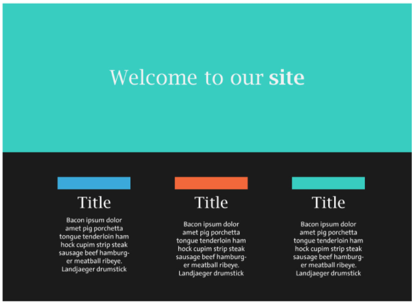
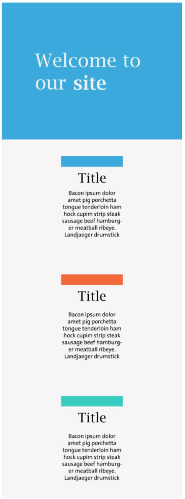

# Class 4: Responsive Website

<!-- ! HIDE FROM STUDENT; INSTRUCTOR ONLY CONTENT -->
<!-- ## Instructor Only Content - HIDE FROM STUDENTS -->

<!-- ! END INSTRUCTOR ONLY CONTENT -->

*Teach someone something new. And today you shall learn something new!*

## Greet, Outline, and Objectify

<!-- SMART: Specific, Measurable, Attainable, Relevant, and Timely. -->
<!-- https://examples.yourdictionary.com/well-written-examples-of-learning-objectives.html -->

Today we're going to:
  
*OBJECTIVE: After this class students will have a firm understanding of: The application and use of CSS Grid-Template-Areas & Media Queries to design responsive websites for professional web development*

- [ ] Questions for Student Led Discussion
- [ ] Interview Challenge
- [ ] Student Presentations
- [ ] Creation Time: Responsive Website
- [ ] Push Yourself Further
- [ ] Interview Questions: Blog to Show You Know
- [ ] Exit Recap, Attendance, and Reminders

### Questions for Student Led Discussion, 15 mins
<!-- This section should be structured with the 5E model: https://lesley.edu/article/empowering-students-the-5e-model-explained -->

[Questions to prompt discussion](./../additionalResources/questionsForDiscussion/qfd-class-4.md){:target="_blank"}

### Interview Challenge, 15 mins
<!-- The last two E happen here: elaborate and evaluate  -->
<!-- this sections should have a challenge that can be solved with the skills they've learned since their last class. -->
<!-- ! HIDDEN CONTENT: INSTRUCTOR ONLY -->
[See Your Challenge Here](./../additionalResources/interviewChallenges.md){:target="_blank"}
<!-- ! END HIDDEN CONTENT: INSTRUCTOR ONLY -->

### Student Presentations, 15 mins

[See Student Presentations List](./../additionalResources/studentPresentations.md){:target="_blank"}

## Creation Time, 60-90 mins

Bringing together all the skills you've learned you're now asked to build a website for a small company. Make sure you practice good file structure, use css grid, flex, media queries, and the box model to build a well-built and responsive website.

<!-- 
* Instructor to Demonstrate with Examples, Explain and Set Expectations
* Group Students in pairs
  * plan and implements
* Partner with other groups for elaboration
* Share with the class for evaluation (potentially carry into the next class)

*****
-->

Our company needs this website up really soon, please make judgments about colors and layout that we haven't specifically laid out. Don't worry about content, use the lorem ipsum we provided for now or find your own. Remember to work from outside to in, commit often, plan your code, and comment your CSS code so our next developers know what you built.

- [ ] **FIRST**, use the Mockups & Specs below to draw your wireframes and plan your code.
- [ ] Go to [CodeSandbox](https://codesandbox.io/dashboard) and create a new HTML + CSS Sandbox named "First-Responsive-Website".
- [ ] Then turn in the CodeSandbox URL for your instructor to grade it.

=== "Laptop View"
    

=== "Mobile View"
    

=== "Break Points"
    | Target | Media Query |
    | --- | --- |
    | Phone | `@media (min-width: 576px) { ... }`|
    | Desktop | `@media (min-width: 992px) { ... }` |

## Blogs to Show You Know

[Blog Prompts](./../additionalResources/blogPrompts.md){:target="_blank"}

## Exit Recap, Attendance, and Reminders, 5 mins

- [ ] Create Responsive Website Assignment
- [ ] Create Class 4 Blog Assignment
- [ ] Prepare for next class by completing all of your pre-class lessons
- [ ] Complete the feedback survey(if applicable)

Next week we'll be digging into the surface of JavaScript to make our web pages interactive. We'll start by building a calculator but we'll soon be fetching data from remote sources and rendering it on our pages with the CSS and HTML we've learned so far. Keep reading, watching, and practicing all of the concepts you learn about.

## Student Feedback

<iframe src="https://docs.google.com/forms/d/e/1FAIpQLSd85nNCk_MdnaXCsX7fWl3vYgcqvozzlK2cKq26d2g67Zh8Kg/viewform?embedded=true" width="640" height="500" frameborder="0" marginheight="0" marginwidth="0">Loading…</iframe>

<!-- <iframe id="openedx-zollege" src="https://openedx.zollege.com/feedback" style="width: 100%; height: 500px; border: 0">Browser not compatible.</iframe>
 -->

<!-- TODO Create 3 question exit questions -->

<!-- TODO INSERT Student Feedback From -->

<!-- TODO INSERT *HIDDEN* Instructor Feedback Form -->

<!-- 
height/width = 1.777 ---- width="655" height="368"
cp workspace/resources/classOutlineTemplate.md docs/module-
 -->