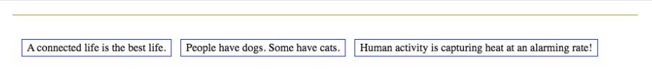

# Flex and Relevant Properties

<!-- To begin, let's take a look at that image we saw in the last lesson: -->


Above we see three different products inside a single horizontal row. The code for one of these products might look something like this:

```html
  <!-- shop.html -->
  <article>
    <div class="item-banner">
      <button onclick="savePin(this)"></button>
      <span class="sale"></span>
    </div>
    
    <div class="item-description-price">
      <h3>Amet Lipstick</h3>
      <p><span class="sale-price">£40.00</span>£28.00</p>
    </div>
  </article>
```

And some of the CSS might look like this:

```css
  /* shop-styles.css */
  .item-banner {
    display: flex;
    background: transparent;
    margin-bottom: -5%; /*approximate*/
  }

  /* more CSS Code here */

  .sale-price {
    text-decoration: line-through;
  }
```

To create the other two products we could copy/paste the HTML we see above and change out the values, BUT, that would only stack them below each other like all the other web pages we've built. In our next project we want to lay the items out horizontally like this screenshot. To do this we would need to "wrap" all of these items inside a "container" elements that can control the flow of the element. In this example we'll use a Section element:

```html
  <!-- shop.html -->
  <!-- ...more code here... -->
  <section> <!-- this element "wraps" around the other elements and becomes the "container", or Parent Element -->
    <article>
      <div>
      <!-- ...more code here... -->
        <h3>Amet Lipstick</h3>
        <p><span class="sale-price">£40.00</span>£28.00</p>
      </div>
    </article>

    <article>
      <div>
      <!-- ...more code here... -->
        <h3>Aps Lipstick</h3>
        <p><span class="sale-price">£40.00</span>£28.00</p>
      </div>
    </article>

    <article>
      <div>
      <!-- ...more code here... -->
        <h3>BB Cream</h3>
        <p><span class="sale-price">£40.00</span>£28.00</p>
      </div>
    </article>
  </section>
```

The CSS to make it work looks like this:

```css
  /* shop-style.css */
  section {
    display: flex;
    justify-content: space-evenly;
  }
```

## How Does Flex Work

See, `flex`, formally known as: flexbox, is a value that can be given to the display property on any block element that would normally contain other elements, i.e. section, article, footer, header, nav. When added to an element, it gives us control of how its child elements inside that element will be rendered. Take a look at the code snippets below and then check out the following screenshot to see if you can figure out how the flex value on the property display works before reading on.

=== "HTML"

    ```html
    <!-- this section is the parent/container element -->
    <section class="truthful-statements">
      <!-- Each of these article elements are child elements/flex items -->
      <article>A connected life is the best life.</article>
      <article>People have dogs. Some have cats.</article>
      <article>Human activity is capturing heat at an alarming rate!</article>
    </section>
    ```
=== "CSS"

    ```css
    /* the CSS to make it happen */
    .truthful-statements {
      display: flex;
    }

    article {
      border-color: blue;
      border-style: solid;
      border-width: 1pt;
      margin: 20pt 5pt;
      padding: 2pt 5pt;
    }
    ```

=== "Result"
    

You figure it out?

If not, that's cool. Think about it like this: the `flex` value allows us to flexibly display child elements within a parent element. Unlike the inline and block values, `flex` doesn't do anything to the way the parent element is displayed in relation to its sibling elements. `flex` only changes the way its child elements are rendered inside of it.

When we add `flex` to an element's display property, it comes with some other properties that can be tweaked, including these properties and their potential values:

* **flex-direction** - values include: row(the default), column & column-reverse
* **flex-wrap** - wrap (default), no-wrap, wrap-reverse
* **justify-content** - flex-start (default), center, end, space-between, space-evenly, stretch
* **align-items** - stretch (default), flex-start, center, baseline, flex-end
* **align-content** - stretch (default), center, flex-end, space-around, space-between

  > NOTE: If you like using shorthand code you'll enjoy: flex-flow = flex-direction & flex-wrap

## Practice It: CSS Tricks - Flex Guide

[Try it](https://codepen.io){:target="_blank"} !! Go to CodePen and create Section element to be your "Flex" Container. Then create three Article elements inside of it:

```html
  <section class="my-flex-container">
    <article class="square-one"></article>
    <article class="square-two"></article>
    <article class="square-three"></article>
  <section>
```

Then use the CSS snippet you see above but apply it to the class: `.my-flex-container`.

Then size all of your articles to be just simple square blocks:

```css
  .my-flex-container {
    border: 5pt solid EE621F;
    display: flex;
  }

  article {
    border: 5pt solid #FDEFE1;
    height: 144pt;
    width: 144pt;
  }

/* Just for fun ;) */
  article:hover {
    border-color: #EE2D7A;
    border-style: dotted;
  }
```

Now open up this website, [A Complete Guide to Flex(box)](https://css-tricks.com/snippets/css/a-guide-to-flexbox/). This website will be your guide in flex display from here until the end of time so you might as well get familiar with it now.

On the left side of the guide you'll see all the properties that can be given to the Parent Element, The "Container" element. Start with `flex-direction` and work through all the values of `flex-direction`.

Then move on to `flex-wrap` and do the same thing. Then move on to `justify-content`, and so forth and so forth.

Do NOT move on until you've worked through all the properties available to the display container. In the next lesson we'll cover the properties for items of a "Container" element.

## Additional Resources

* [MDN Docs - CSS Flex Box Layout](https://developer.mozilla.org/en-US/docs/Web/CSS/CSS_Flexible_Box_Layout){:target="_blank"}
* [W3S Docs - Flex/Flex Box](https://www.w3schools.com/css/css3_flexbox.asp){:target="_blank"}