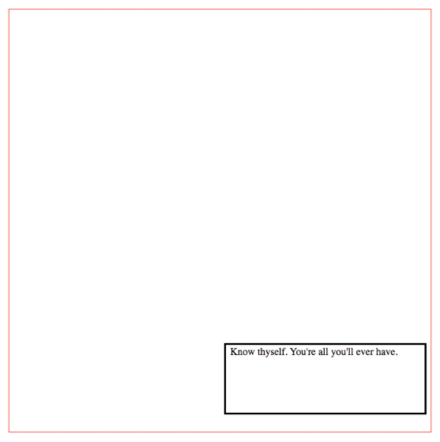
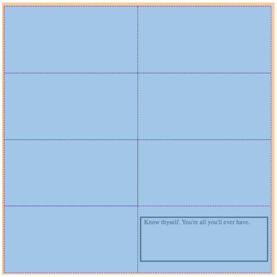
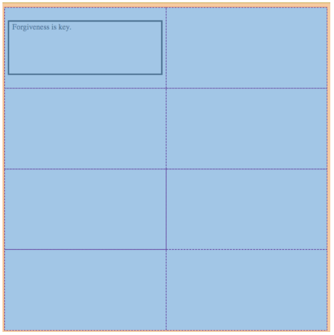

# Display: Grid

*“The world is indeed full of peril, and in it there are many dark places; but still there is much that is fair, and though in all lands love is now mingled with grief, it grows perhaps the greater.” ―J.R.R. Tolkien, **The Fellowship of the Ring***

## Overview

Now that wireframing is fresh on your mind and you're thinking about the way websites get planned and laid out let's introduce a new tool that will help you code these well designed websites, CSS Grid.

[Grids are used all over the place](https://www.smashingmagazine.com/2017/12/building-better-ui-designs-layout-grids/){:target="_blank"} : spreadsheets, shelves, cities, and even art paintings. If you've ever thought about the way newspapers, books, magazines, or in-general: **print work** is laid out, they use a grid to structure composition. Over time, the grid was brought over to the web because again, our whole society shifted from print to digital media.

When we begin building a website, laying out the overall structure is the first thing we do. It's like framing a house before deciding which wallpaper we'll put in. The skeleton of the page is, undoubtedly, the first part you should arrange every time you work on a project. Therefore, it is only fitting that we introduce it, sooner rather than later. Let's get to it.

Like CSS Flex, [CSS Grid](https://gridbyexample.com/what/){:target="_blank"} is a value in CSS we can assign to the `display` property of an HTML element to lay out our page in a specific way. Once we've applied the `grid` value to the `display` property, you can then use columns and rows to layout the Child Element within the selected Parent Element. This is a really useful way to lay out your page quickly and sustainably.


With the exception of the CSS Grid properties you see in the code given to you for your Portfolio Landing Page, you've been working with elements that stack below one another, due to normal document flow. But, as you know, typical websites have multiple elements across the screen and not just stacked on top of one another. This can be done with the value: flex given to the property display of the element we want. Let's dig into that.

Remember that each of the elements in an HTML file have many properties behind them that we can access with CSS and JavaScript(JS). One of these properties is the display property. Through it we can change the way the element is rendered on the screen and how its child elements are arranged within it.

### See It - Display: Grid

<iframe src="https://player.vimeo.com/video/392757781" width="655" height="368" frameborder="0" allow="autoplay; fullscreen; picture-in-picture" allowfullscreen></iframe>

To set an area of your webpage as a grid to layout out other elements on, just give it the property & value: display: grid;. Let's say we want our `<body/>` element to have a grid, simply select the `body` in your CSS file and set the property `display` to `grid` like so:

```css
  body {
    display: grid;
  }
```

Easy. Right?

From here on, we'll refer to our body element as our **Grid Container**. You will need one of these **Parent Grid Containers** every time you would like to arrange elements, or **Grid Items**, just the same way you use a **Flexible Box Container** for flexed items.

### Grid Template Properties

After that you'll need to set up the number of columns, `grid-template-columns`, and rows, `grid-template-rows`, you desire in the Grid Container. Let's say we want our `body` to have 2 equally sized columns and 4 equally sized rows:

```css
  body {
    display: grid;
    grid-template-columns: 50% 50%;
    grid-template-rows: 25% 25% 25% 25%;
  }
```

Do you see how we assigned multiple values to `grid-template-columns` and `grid-template-rows`? The number of values we assign equals the number of columns or rows and the percentage represent how much space they'll take up.

  > NOTE: Make sure your percentages add up to 100%.

Now our `body` element will have a grid with two columns that are 50% of the display wide and 4 rows that are each 25% of the total display's height.

Now we can place our Grid Items inside the Grid Container. Lets say we want our HTML element, maybe a `<section>` element, with the class name: `our-grid-item`, to be positioned at the bottom-right corner of our grid (in the last row of the right column). Take a look at the HTML and CSS snippets below and then the resulting screenshots the follows. [Try it yourself](https://replit.com)!

=== "index.html"
    ```html
    <!-- ...more HTML code here... -->
    <link href="./index-style.css" />
    <!-- ...more HTML code here... -->

    <body>
      <section class="our-grid-item">Know thyself. You're all you'll ever have.</section>
    </body>
    ```

=== "index-style.css"
    ```css
    body {
      display: grid;
      grid-template-columns: 50% 50%;
      grid-template-rows: 25% 25% 25% 25%;
      width: 500pt; /* Add some dimension and color for us to see it better */
      height: 500pt;
      border: solid red 1pt;
    }

    .our-grid-item {
      grid-column: 2/3;
      grid-row: 4/5;
      border: solid black 2pt; /* add color and dimension to see more easily */
      margin: 20pt 5pt;
      padding: 2pt 5pt;
    }
    ```

=== "Result"
    

Do you see that? We specify the grid-lines we want the element to start & end on to tell the browser where to place the element on the grid!

We use the property `grid-column` on the **Grid Item** and give it the value we want the element to start at and end on separated by a `/`. This tells the browser to find the line in the grid you specified on the left-side of the `/` and end on the number you gave on the right-side. The screenshot below is of the same code sample but with Chrome Inspector Tool turned-on so we can see a visual representation of the grid we created...

  

Here's another example, but now our element will be in the top-left of our document (top-row of the left-column).

=== "index-style.css"
    ```css
    .our-grid-item {
      grid-column: 1/2;
      grid-row: 1/2;
    }
    ```

=== "index.html"
    ```html
    <!-- ...more HTML code here... -->
    <link href="./index-style.css" />
    <!-- ...more HTML code here... -->

    <body>
      <section class="our-grid-item">Forgiveness is key.</section>
    </body>
    ```

=== "Result"
  