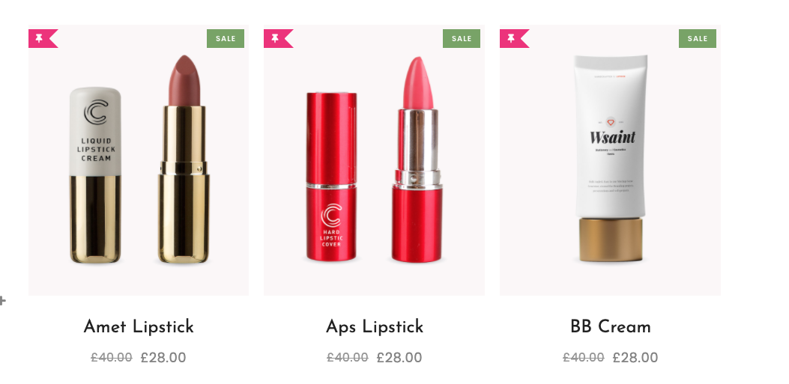
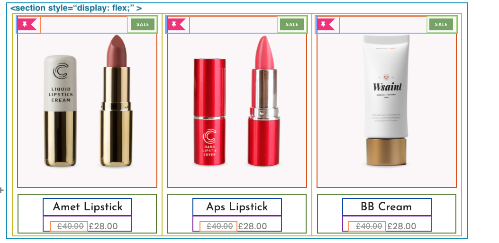

# The Display Property

*"The things you do for yourself are gone when you are gone, but the things you do for others remain as your legacy." ―Kalu Ndukwe Kalu*

With our new understanding of the Box Model Properties we can now size and shape our elements. But if you've noticed, our elements still "stack" below each other one after another. This is the default behavior of HTML called **Normal Document Flow**. Elements will appear on screen as they are read in the HTML file: top-to-bottom-left-to-right.

But what if we wanted to create a section on our page that had multiple element side by side? Like the you see below:



In this example we have three images inside three "containers" which are inside a larger "container" that lays them out horizontally rather than vertically(like, normal document flow). Look again.



In this screenshot we see a bunch of new boxes laid on top of the original screenshot. These boxes represent elements we would build in HTML. We use these **wireframes** to help us navigate the composition and construction of a web page. For now, notice the largest teal colored rectangle labeled `<section style="display: flex;">`. This element is what we want to focus on because this one has the property we need to use to lay out child elements (the images and text below) horizontally rather than vertically. But before we get to making a `flex`ible display let's quickly cover this `display` property.

## The Display Property + Possible Values

<!-- You've already used this property to hide the description of your products in the FakeStoreAPI Feature 1 Hackathon but there's more to this property than you might think. -->

All HTML elements can be divided into categories based on their default value of this property! The two main values, and therefore categories, are `block` and `inline`.

The default `block` elements are element that create an entire "block across the screen and consequentially force other block elements to be on new separate lines, i.e. **Normal Document Flow**. Elements included in the category are Section, Article, Div, H1-H6, and P and [a whole list more](https://developer.mozilla.org/en-US/docs/Web/HTML/Block-level_elements){:target="_blank"} . Block elements are usually used to create structure on the page and generally have other elements, both inline and block, inside of them.

If we were to write this property in CSS it would look like like this:

```css
  .all-block-elements {
    display: block;
  }
```

  > NOTE: We don't have to declare the value of Block elements to be block elements because that's their default value.

  > Thanks [@ACRamirez1](https://github.com/ACRamirez1){:target="_blank"}

The other main category is `inline` elements. These are elements that don't require a new line so they can start in the middle of a P Element if you'd like. These elements include: Span, Anchor, Button, Code, Img, and Input elements but you can find the entire list at [MDN Docs - Inline HTML Elements](https://developer.mozilla.org/en-US/docs/Web/HTML/Inline_elements). Inline elements don't have space inside of them for other elements to go inside.

And if we had to write this property in code it would look like this:

```css
  .all-inline-elements {
    display: inline;
  }
```

  > NOTE: Same as before, we don't have to declare this value because this is the default value. Only if we want to change this do we need to declare a new value.

Another value you can use is `none`, as in `display: none;`. When you add JavaScript to your page you can change the visibility of an element based on a certain condition by using this value.

But but what about the other possible values of the `display` property? Turns out there's a hybrid between the two main categories called `inline-block`. This value gives the associated element the flexibility of both properties allowing for it to act like an `inline` element where neighboring content will flow around it but still have the structure to hold child elements inside of it like a `block` element.

  > NOTE: While you won't use this property often in the beginning you shouldn't forget about it because it will prove very useful when your building more creative web pages.

## Display: Flex;

Beyond these newly discovered `display` values: `inline`, `block`, and `inline-block` there are a couple more value to learn: `flex` and `grid`. Within each are `inline-flex`, `inline-grid`, so forth. For this next lesson we'll learn about `flex` and its relevant properties. We'll get `grid` after our next class!

## Know Your Docs

* [MDN Docs - The Display Property & Its Values](https://developer.mozilla.org/en-US/docs/Web/CSS/display){:target="_blank"}

## Additional Resources

* [Display and Box Model](http://learn.shayhowe.com/html-css/opening-the-box-model/){:target="_blank"}
* [Video - How to Use Display Flex](https://player.vimeo.com/video/391868529){:target="_blank"}