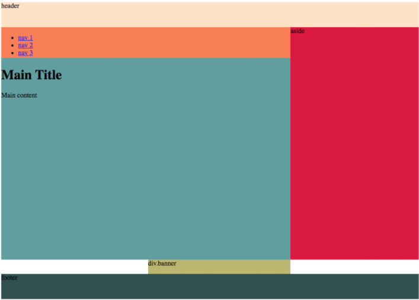
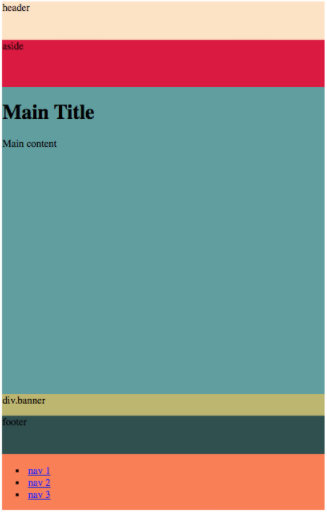

# Responsive Layouts & Grid Areas

*“There is neither happiness nor misery in the world; there is only the comparison of one state with another, nothing more. He who has felt the deepest grief is best able to experience supreme happiness. We must have felt what it is to die, [...] that we may appreciate the enjoyments of life. —Alexandre Dumas*

## Overview

Now that you have a solid understanding of CSS Grid, let's turn our attention toward the multiple layouts needed for different screen sizes like the view of a laptop to a phone to a tablet. It's almost ridiculous to mention the need for these layouts because we see it all over the place but its important to remember, that everything you see on the web was built by someone, just like you that learned the same thing you're learning now. Again, front-end developers are responsible for building all the possible views for a website or web app so let's figure out the best ways do this.

<iframe src="https://player.vimeo.com/video/393485080" width="655" height="368" frameborder="0" allow="autoplay; fullscreen; picture-in-picture" allowfullscreen></iframe>

## Grid Areas

Along with being an introduction to responsive design, we'll also be getting a deeper dive into CSS Grid by studying `grid-template-areas`. If you didn't get that far in your latest pre-class lessons, here you go. This property is an incredibly powerful property to use with `display: grid`; because it allows you to shuffle child elements around by just changing the value assigned to the `grid-template-areas` property! If you can imagine, this will make it very easy for us to develop a view for a phone and then a tablet and then a laptop!

Before moving ahead, I'd like you to read [this short article on Grid-Template-Areas](https://alligator.io/css/css-grid-layout-grid-areas/). When you finish, come back and follow along with the examples below.

*I'll wait...*

### Grid Areas Part One

First, let's layout our elements in HTML. We'll create a body element with the class name `container` so we know that it will be our parent element for this page.

```html
<body class="container">
  <header>header</header>
  <nav>
    <ul>
      <li><a href="#">nav 1</a></li>
      <li><a href="#">nav 2</a></li>
      <li><a href="#">nav 3</a></li>
    </ul>
  </nav>
  <main>
    <h1>Main Title</h1>
    <p>Main content</p>
  </main>
  <aside>aside</aside>
  <div class="banner">div.banner</div>
  <footer>footer</footer>
</body>
```

In our CSS file we declare each child element's `grid-area` property with a value we deem to be useful, i.e. the `<nav></nav>` element should get `grid-area: nav;`.

  > NOTE: The name we pass in as the value will be used to arrange the elements when we get back to changing the CSS rules of our parent element.

```css
header {
  /* give each element some color to see more easily */
  background-color: bisque;
  /* notice this property on each rule, though, we'll use it when we're laying out the Parent Element's grid-template-area */
  grid-area: header;
}
main {
  background-color: cadetblue;
  grid-area: main;
}
nav {
  background-color: coral;
  grid-area: nav;
}
aside {
  background-color: crimson;
  grid-area: aside;
}
.banner {
  background-color: darkkhaki;
  grid-area: banner;
}
footer {
  background-color: darkslategrey;
  grid-area: footer;
}
```

Fantastic! Now each of our child elements have a name we can reference them by when we tell them where to be in the "template-area".

In this next snippet, look at the number of `-columns` and `-rows` we create and then checkout the `grid-template-areas` property. Do you see the way we use the "names" of the child elements to position them on the screen?

  > NOTE: to play with this for yourself, copy/paste these code snippets into a [CodePen](https://replit.com) or your text editor. **This is your responsibility and privilege now.**

=== "Grid Area Styling"
    ```css
      .container {
        display: grid;

        grid-template-columns: auto auto auto auto;
        grid-template-rows: 45pt 55pt 180pt 180pt 25pt 45pt;

        grid-template-areas:
          "header header header"
          "nav nav aside"
          "main main aside"
          "main main aside"
          "... banner ..."
          "footer footer footer"
      }
    ```

=== "Result"
    

### Grid Areas Part Two

Before we dive into Media Queries in the next pre-class lesson let's first see how we can use the same HTML from above, and the same child element rules but change just the values of the `grid-template-areas` on the parent element to completely change the look on the screen.

  > NOTE: the `...` you see in the code stand for "blank" space on the screen. You saw this in the first example too: `"... banner ..."`.

=== "Grid Area CSS Code"
    ```css
      .container {
        display: grid;
        grid-template-columns: auto auto auto auto;
        grid-template-rows: 45pt 55pt 180pt 180pt 25pt 45pt;

        grid-template-areas:
          "... header ..."
          "... aside ..."
          "... main ..."
          "... main ..."
          "... banner ..."
          "... footer ..."
          "... nav ..."
      }
    ```

=== "Result"
    

  > Do you see how they're stacked upon one another now?

## Practice It - CSS Grid Areas

1. [Responsive CodePen](https://codepen.io/austincoding/pen/vdLQmo/)

    - [ ] Open the CodePen up and resize your browser's window while watching the content at the bottom of the screen.
    - [ ] Fork the CodePen and then try rearranging the grid-areas. Have fun. Seriously!
    - [ ] Can you guess how Media Queries work before the next lesson?

2. [Nested Grids](https://codepen.io/austincoding/pen/JMvLvx/)

    - [ ] You can also nest columns within columns. Let your curiosity over come you in the CodePen above to find out how!

## Additional Resources

- [ ] [Article, Alligator.io - Grid Areas](https://alligator.io/css/css-grid-layout-grid-areas/)
- [ ] [CSS Properties Cheatsheet](https://websitesetup.org/css3-cheat-sheet/)

## Know Your Docs

* [W3S Docs - Grid-Template-Areas](https://www.w3schools.com/cssref/pr_grid-template-areas.asp)
