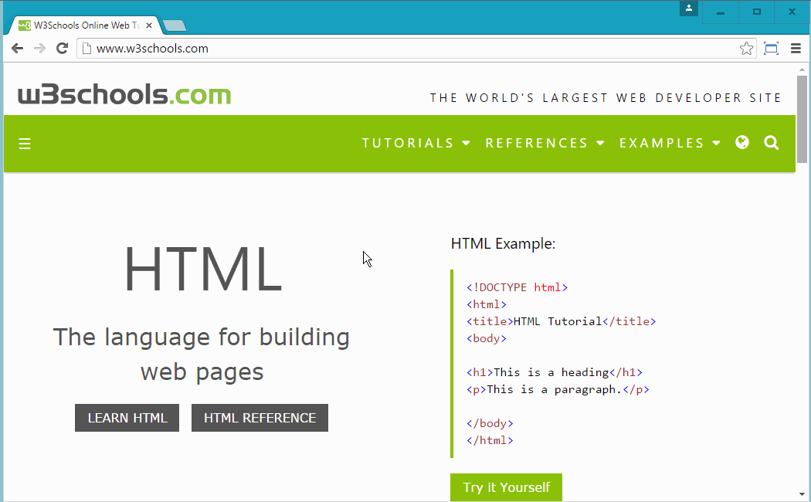

# The CSS Box Model

*Maybe everyone can live beyond what they're capable of.*

 ―Markus Zusak, I Am the Messenger

<!-- <iframe src="https://player.vimeo.com/video/391834446" width="900" height="600" frameborder="0" allow="autoplay; fullscreen" allowfullscreen></iframe> -->

<iframe src="https://player.vimeo.com/video/923488818?badge=0&amp;autopause=0&amp;player_id=0&amp;app_id=58479" width="900" height="600" frameborder="0" allow="autoplay; fullscreen; picture-in-picture; clipboard-write" title="101_-_box_model (720p)"></iframe>

Throughout this course and the rest of the program you'll be introduced to many "models". We mean models by the way we can understand how computers interact with the world around them. They don't see models or know about models, rather models are just ways we humans can conceptualize the way a computer keeps up with memory and transfers that information to other computers.

Today we're going to learn about the "[CSS Box Model](https://css-tricks.com/the-css-box-model/){:target="_blank"} "  which is, put shortly, a model that helps us understand how to change the size, shape and overall appearance on an HTML element on the screen.

Think, every element we put in our HTML code has a representation on the screen. That thing on the screen is just a box or rectangle. But with CSS we can change its properties to be taller, wider, centered, have a border and even change the shape to *not be a box*... The box model properties used to change the appearance of our rectangles are:

1. `height`
  * `min-height`
  * `max-height`
2. `width`
  * `min-width`
  * `max-width`
3. `margin` - (short-hand of the following 4 properties)
    * `margin-top`
    * `margin-right`
    * `margin-bottom`
    * `margin-left`
4. `border` - (short-hand of the following 3 properties)
  * `border-style`
  * `border-color`
  * `border-width`
5. `border-radius`
6. `padding` - (short-hand of the following 4 properties)
    * `padding-top`
    * `padding-right`
    * `padding-bottom`
    * `padding-left`

The six properties listed above comprise most of the Box Model properties. There are, of course, many more properties that allow you [very fine-tuned control over the shape and size of your elements](https://getflywheel.com/layout/create-shapes-css3/){:target="_blank"} . But for much of our lessons we won't have time to cover them all (you'll have to do that on your own time!).

To help you understand how the short-hand properties (seen above) can represent all of the long hand properties, below are two CSS declarations that style a Section Element the exact same way. Notice the differences...

```css
section {
  background-color: #b1deef;
  height: 200px;
  width: 200px;
  margin: 1% auto;
  padding: 5% auto;
  border: 1px solid #264653;
}
```

The same properties could have been written this way, as well:

```css
section {
  background-color: #b1deef;
  height: 200px;
  width: 200px;
  margin-top: 1%;
  margin-bottom: 1%;
  margin-left: auto;
  margin-right: auto;
  padding-top: 5%;
  padding-top: 5%;
  padding-right: auto;
  padding-left: auto;
  border-width: 1px;
  border-style: solid;
  border-color: #264653;
}
```

Did you pick it up? If not, look again until you understand it for yourself. Do not move on until you got it!

## Box Model Visualizer

We'll definitely be re-visiting this visualizer but it may be a good introduction for you now. This CSS Box Model Visualizer is a nifty tool built by [Caroline Artz](https://github.com/carolineartz){:target="_blank"} to help people see how each property on the element effects the visual representation of the element on the screen. Each of the sliders are labeled with the actual properties you could type in CSS and the values you see are actual values you could code in CSS. And the changing box at the bottom right is what the element would look like. Try it!

* [Box Model Visualizer](http://codepen.io/carolineartz/pen/ogVXZj/){:target="_blank"}

In the upcoming lessons we'll dig a little deeper into the four categories of the CSS Box Model:

> Content Height & Width
> Margin
> Border
> Padding

In addition to knowing the Box Model in your head, your browser's developer Tools offer a visualization of each element. Just open your browser's devtools, hover over an element, then click to select the element. In the DevTool Tray you should see the "Elements" Tab highlighted at the top-left and to the right you'll see two sub-tabs named "Styles" and "Computed".

The "Styles" tab will list all of the CSS rules that are applied to that element including rules that are overridden (denoted by a strike-through). Under the "Computed" tab you'll see a box with colors of blue(content), green(padding), yellow(border), orange(margin) along with numbers indicating the value in pixels.



Keep this tool handy as you learn the properties of the Box Model and for the rest of your career!!

## Additional Resources

* [See It - The Box Model](https://player.vimeo.com/video/391834446){:target="_blank"}
* [CSS Tricks: The CSS Box Model](https://css-tricks.com/the-css-box-model/){:target="_blank"}
* [Box Model, Sizing, Shadow](https://youtu.be/GvIP6QtCVSg?t=21){:target="_blank"}
* [Understanding Pixels & Other CSS Units](https://webplatform.github.io/docs/tutorials/understanding-css-units/)

<!-- [2nd Box Model Playground](https://codepen.io/mistakevin/pen/pbBGBp/) -->

<!-- !END -->
********************************************
<!-- ! END OF VIDEO 101.1.3.1 - EXAMPLE TITLE -->
<!-- ? Video Numbering and Title system: CourseNumber.ModuleNumber.LessonNumber.VideoNumber -->
<!-- * (VIDEO 101.2.4.3 - "CSS Selectors") === 101 Course, Module 2, Lesson 4, Video 3 - "CSS Selectors" -->

<!-- TODO - INSERT IMAGE EXAMPLE -->
********************************************