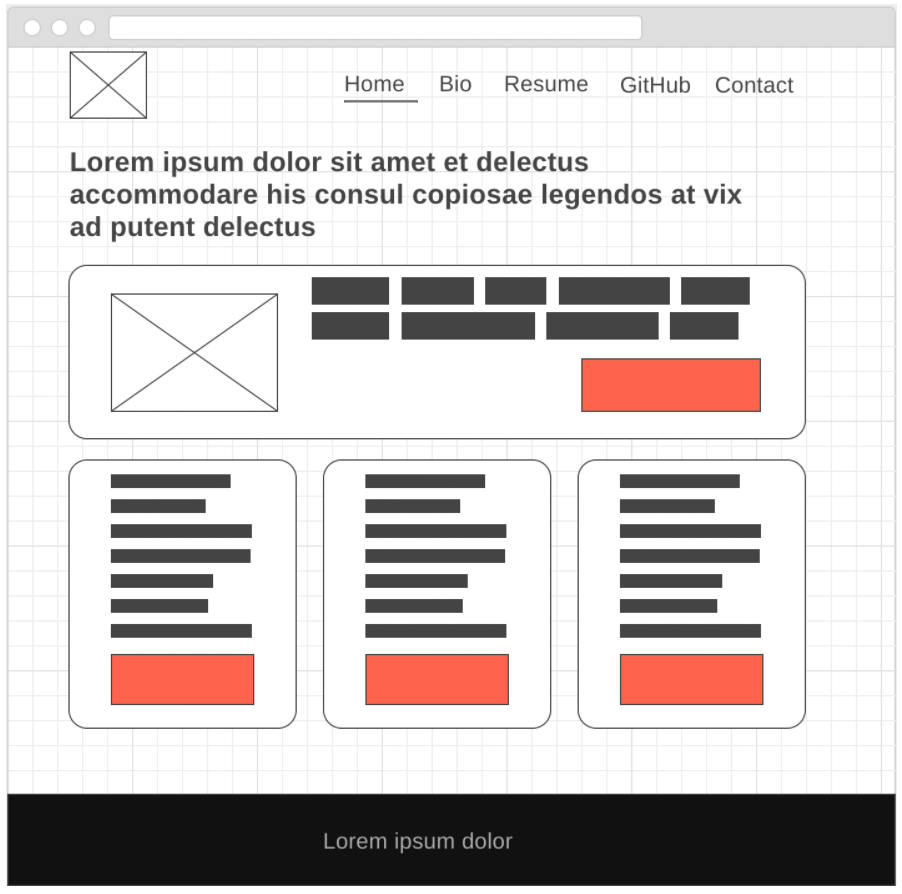
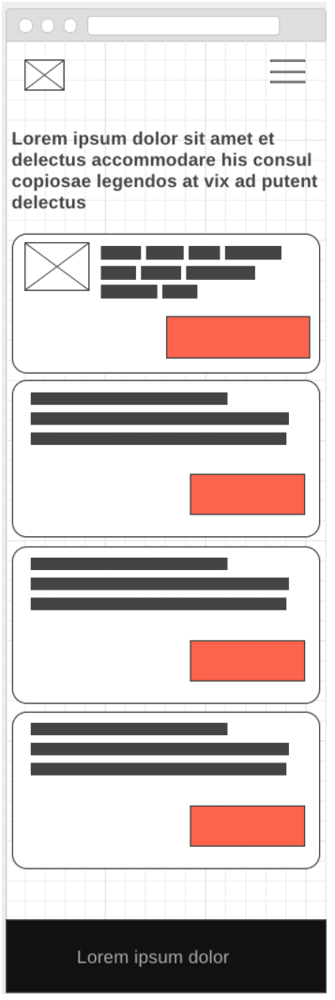
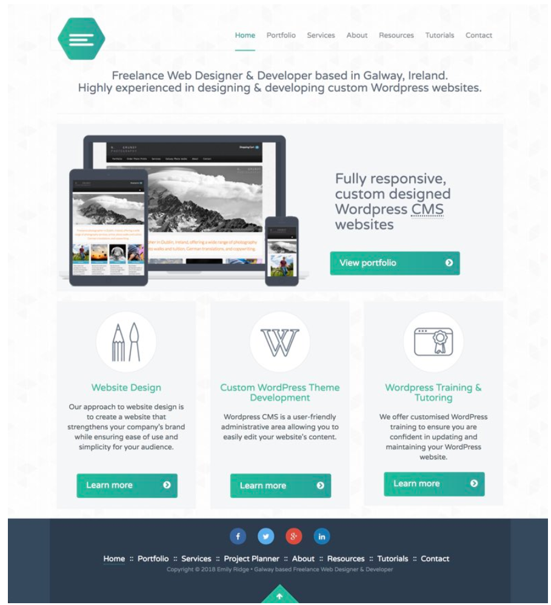

# UX, UI, & Wireframes

*“No product is an island. A product is more than the product. It is a cohesive, integrated set of experiences. Think through all of the stages of a product or service – from initial intentions through final reflections, from first usage to help, service, and maintenance. Make them all work together seamlessly.” —Don Norman, inventor of the term “User Experience”*

## Overview

<iframe src="https://player.vimeo.com/video/392746957" width="655" height="368" frameborder="0" allow="autoplay; fullscreen; picture-in-picture" allowfullscreen></iframe>

## UX & UI Design

First off, what are they? UI Design stands for **User-Interface Design** which means the layout of a web page on the screen for which our users will interact with our web app. UX stands for **User-Experience Design** which incorporates UI along with the flow of the app, the marketing of the app, the data collection and storage, the story that's told to the user from first advertisement through sign-on and day-to-day use. To be frank, it's a very wide and all encompassing craft; which begs the question: why are we talking about it here?

Most apps are built with distinct intention so that users adopt them into their daily life, use them with frequency, talk about them to their friends, and generate revenue for the company that built them. Behind these intentions are UX Designers who think about the way users might use the apps, how to improve them, and plan for future features. The decisions of these Designers will filter down through your team lead and onto your desktop to figure out how to implement into code. By learning about UI and UX Design now, you can practice on your own websites and prepare yourself for understanding why certain decisions are made. Don't worry, you don't have to be great at design to understand and do your job as a Front-End Dev.

One of the tools used to communicate between designers, product managers, product owners, clients, front-end developers, and graphic designers are **Wireframes**.

To really understand these two trades **PLEASE** see the video "Bad Doors = Bad Design" in the [Additional Resources](#additional-resources) below!

## Wireframes

Just as a blueprint is drafted for the construction of a house or building, **wireframes** are created to communicate the structure and functionality of a website or app. When a design, or **mockup** is given to you from your design team it will be your job to translate that mockup into code that is read by browsers of all sorts and shipped across the world. *Big stuff, right?*

Yeah, so we'll use a wireframe to help us, the Front-End Developer, to make a plan for our code before we get into the difficult tasks of seeing the big picture while typing out one. Line. At. A. Time.

It's important to understand that for designers, wireframing usually comes before a mockup because they're working out the rough ideas first. But, you can also use wireframing to draw on top of the mockups you get to create a plan for your code. This is what we'll be doing everyday in class from now on so you're really good at it.

### Constructing a Wireframe

Before beginning to wireframe, a designer would decide on the objective of their webpage. What idea are they trying to communicate? What do they want their user to do with it?

  > "Website wireframes are 90% thinking/planning and just 10% drawing" - *Design and Function*

The wireframe is a visual guide that gives us a framework, or plan, on which to build our website. We use it to lay our site's elements to best support our specific [purpose or goal](https://www.market8.net/b2b-web-design-and-inbound-marketing-blog/what-site-architecture-is-and-how-to-get-it-right-for-b2b).

Examples of Page Goals include:

* encourage a button to be clicked,
* earn your users' confidence,
* prove your social credibility,
* persuade your users to download an eBook,
* motivate your users to complete a payment,
* reaching potential customers in order to sell a product,
and much, much more....

**No doubt!** Wireframing can save you hours of time. As you saw in the video above, if you are worried about perfect alignment, or other details, when you're working on your basic layout, you're wasting time, and causing yourself needless stress. Break apart your tasks, and do them in the correct order. Planning visually on paper or in a wireframing tool before you think about the coding will save you time in the long run, because you will have a clear idea of what you're working toward, and won't waste work that will have to be redone. Do yourself a favor, and wireframe **every** project you work on — **every one**.

Your code may be efficient and elegant, and provide awesome functionality, but none of that will matter if users aren't sure where to click. That is why it's important to spend time focusing on the **user interface** (UI) and **user experience** (UX). A UX designer's job is to positively influence perception of products and companies, so as to encourage people to use them more. A couple of examples of excellent UX designs are [Spotify.com](https://www.spotify.com/us/) and [Apple.com](https://www.apple.com/). Examples of the opposite extreme might be [arngren.net](http://arngren.net/) and [RockAuto.com](https://www.rockauto.com/). Dig deeper into what makes for good (and bad) UX design [here](https://www.appcues.com/blog/bad-ux-mistakes).

Again, checkout the videos in the [Additional Resources](#additional-resources) to get some tips and tool for creating wireframes.

### Practice It - Build a Wireframe

Using a paper and pencil,

- [ ] sketch out the boxes you see in the picture above;
- [ ] think about the way you might code it in HTML;
- [ ] ask yourself which of the elements that you've learned so far would work best to create these boxes (i.e. `

` , `<article></article>`, etc.).
- [ ] What CSS rules might you need?
- [ ] Go get yourself some graph paper. It will make drawing in this class much easier.

### Push Yourself Further - Mobile Version

Here's a mobile version of the same website. Can you turn it into code, as well?

## Mockups

We've talked about [Mockups](https://en.wikipedia.org/wiki/Website_wireframe) coming down from a design team and landing on your desk but what are they in the first place? Think of a mock up as a non functional web page. It's a design, a complete layout of a web page but the buttons don't work and the picture & videos are static. It's meant to be a direct representation of what the web page will look like when you, the Front-End Dev(you), gets done making it functional.

{ :align=left}

### Tools

#### For Creating Wireframes

- [ ] [Figma](https://www.figma.com/)
- [ ] [wireframe.cc](https://wireframe.cc/)
- [ ] [Adobe XD](https://www.adobe.com/products/xd.html)
- [ ] [Adobe Comp](https://www.adobe.com/products/comp.html)

#### For Creating Mockups

- [ ] [Marvel](https://marvelapp.com/)
- [ ] [inVision](https://www.invisionapp.com/)
- [ ] [proto](https://proto.io/)

## Additional Resources

- [ ] [YT, Vox - Bad Doors = Bad UX](https://youtu.be/yY96hTb8WgI)
- [ ] [YT, Jessie Showalter - UX Crash Course](https://www.youtube.com/watch?v=_lyzy-vChh4)
- [ ] [YT, CharlieMarie-TV - How To Wireframe a Website](https://www.youtube.com/embed/PmmQjLqJQlY)
- [ ] [YT, ACA-Clayton - Wireframing and Code Planning](https://www.youtube.com/embed/iXf5DSCeyAA)
- [ ] [Tutorial, Market8 - How to Make Useful Wireframes](https://www.market8.net/b2b-web-design-and-inbound-marketing-blog/how-to-make-useful-website-wireframes-tutorial)

<!-- 

height/width = 1.777 ---- width="655" height="368"

-->