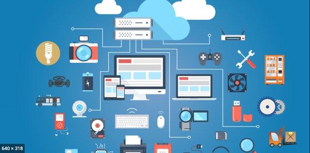

# The Internet/Web, Our Job as Developers, and Ways to Think About It

As we learn this new language called JavaScript it's important we start to create a new perspective in our minds about how computers interact with the world and how code is used to communication intentions to a computer because our website and apps will only grow in size from here on. It all works the same as HTML and CSS but requires a different way of thinking.

## How The Internet Works

In this course we're learning how to build websites. No, not apps yet but trust that the technology used for apps is the same technology used to build website and anything you'll ever want to build in the future, is also built on the foundations we'll learn in this course.

So where to begin? Assuming we know nothing about how the internet work, how computers function but someone told us we would like coding let's start from there. How does information/data that represents text, pictures, video, audio, and interactions move from one computer to another computer through wires and even air(WiFi).

<!-- TODO @CLAYTON [ VIDEO PROP: ethernet cable ] -->

The simple answer to this could be "magic". A better would be "science" but either way, you got into this coding program because you want to become the magician, right?

### What is the Internet?

The internet is a continuous connection of various computer and devices that includes your phone, computer, watch, and doorbell. They are all connected through various means including coax, CAT5, fiber, WiFi, bluetooth, 3G, 4G, LTE, & 5G. Through all of these connections and the millions of devices they connect to the internet is created. But this still doesn't answer our question: "How does it work??"

### How Does it Work?

In order for these devices to talk to one another they must rely on a series of steps that detail how, when, and what data transfers look like. There's a word, we don't often hear, called [protocol](https://www.dictionary.com/browse/protocol) that refers to a series of agreed upon steps taken when something happens as in: "Firemen have a protocol for leaving the firehouse and responding to a fire." The internet and its devices depend on an agreed about series of steps and organization of data to ensure that your computer knows how to interpret the information sent to it from Target or Netflix. This protocol is called HTTP or HTTPS, yes the prefix in your browser's address bar.(Go look.) HTTP/HTTPS stands for [Hypertext Transfer Protocol (secure)](https://en.wikipedia.org/wiki/HTTPS). This protocol, or series of agreed upon steps and how data transfers look, is what computers/machines use when they need to move data between one another. While this course will not dig into all the technical details of HTTP(S) we will learn much more about this protocol in 311 when we learn how to plan, design, and build databases and servers(computers without screens/The Cloud). For now, it's enough to know that what we will be learning in this 101 course, HTML, JS, & CSS, are languages that create data that fits within the HTTProtocol and represent to a web browser(Safari, Chrome, etc...) what content we want on our pages, what our pages will look like and how they interact with people(users).

<!-- ! END OF VIDEO 101.1.1.1 - How to the Internet Work? -->

<!-- ? Video Numbering and Title system: CourseNumber.ModuleNumber.LessonNumber.VideoNumber -->
<!-- * VIDEO 101.2.4.3 - "CSS Selectors" === 101 Course, Module 2, Lesson 4, Video 3 - "CSS Selectors" -->
