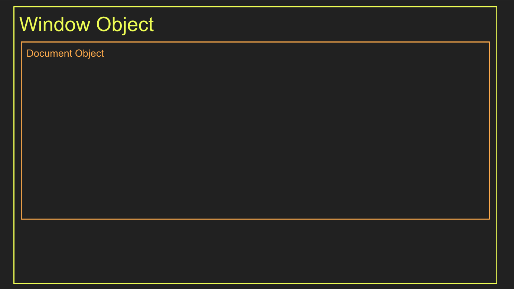
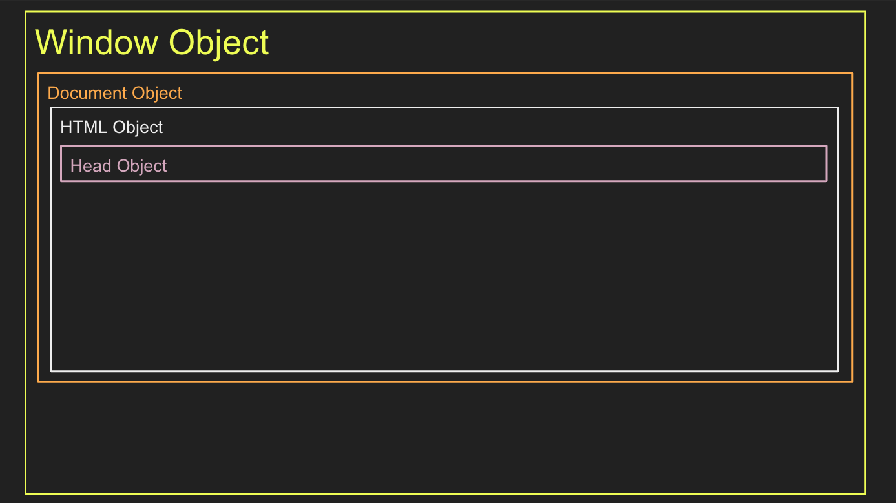
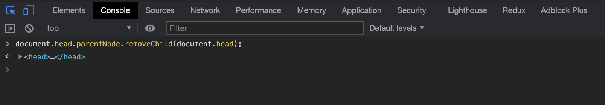
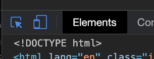
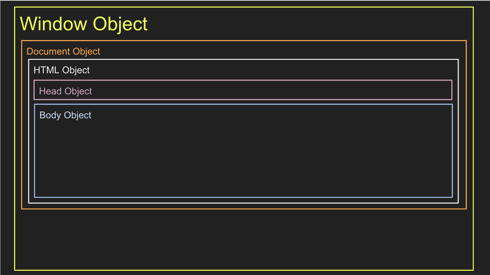

# The Body Object & The Elements of Web Pages

Now that we understand our a bit about Requests and Response and have our Req/Res Drawing handy let's examine where we've been working for these past few weeks.

We'll be referencing the code below because it is the minimum amount of code needed to build a web page. All other HTML elements/objects and their properties, methods, & events will stem from this basic code. 

You can quickly generate this **boilerplate code** by going to VS Code, then creating an `index.html` file and typing on the first line: `html:5` + ++enter++. Go ahead and try it. Create folder called `101-onlineClothingStore` and create an `index.html` file you can use to follow along with in these next few lessons. *I'll wait.*

```html
<!-- index.html -->

<!DOCTYPE html>
<html lang="en">
 <head>
   <meta charset="UTF-8">
   <meta name="viewport" content="width=device-width, initial-scale=1.0">
   <title>Document</title>
 </head>
 <body>
  
 </body>
</html>
```

## index.html

In most of the  projects you've built, you've been working in a file called `index.html`. The name of this file is incredibly important because it is the default file that is served FIRST. `index.html` is the **root** file for ALL websites. When you navigate to Facebook.com or Target.com you will receive their `index.html` file. If you click on links to go to other page you'll be given other pages like: `about.html` or `termsofagreement.html`. You are allowed to name your `.html` files whatever you want but the very first file you want served must be named: `index.html` and in the **root** directory/folder, meaning it can not be hidden in another folder, it must be at the top-level of the entire project's folder.

Furthermore, the `.html` extension denotes a file written in HTML code while `.css` denotes CSS code and `.js` denotes JavaScript code.

  > There's no requirement for you to use the name `index` for CSS or JS files but it may be helpful to you as a developer to name your files similarly so they can be grouped together in your mind and organized in folders. For instance, `index-styles.css` and `index-scripts.js` might be styles and scripts used only on the `index.html` file while `about-styles.css` and `about-scripts.js` might be used only on the `about.html` file. You'll figure it out as you go!

<!-- ! END OF VIDEO 101.1.2.3 - The File `index.html` & Its Structure -->

### DOCTYPE Tag

At the very top of all HTML files we see this strange looking, **self-closing tag**: `<!DOCTYPE html>`. This is a hold-over from older versions of the HTML language. It was originally used to declare the type of this document is ("HTML" and not "XML"), as well as, the version of HTML it's written in but now everyone uses HTML5+ so we only have to write `html` to declare that the document the computer is going to read is in HTML5.

It also communicates to the browser to build a Document object. Remember, code is used for communication. In this case, this bit of code is communicating to the browser, "Hey, inside your Window object go ahead and create a Document object so we can build some more objects inside of it." To us humans, we can read this code and visually imagine a Document object being built with other objects to be added as we go along. See a version of this object modeling below!!

<!-- TODO INSERT IMAGE OF WINDOW and DOCUMENT OBJECTS  images/Window-Document-Objects-101-1-2.png HERE -->



* [W3S Docs - doctype Element](https://www.w3schools.com/tags/tag_doctype.asp)

### html Element

The next bit of code we see in `<html></html>`. This code represents the `html` object. It is what's know as the **root element/object**. It's the actual **Document Object** that's being rendered on your screen. We call it the **root** element because all other elements/objects are children or descendants of it including Head and Body and all the elements we'll build inside them. This is the beginning(the **root**) of our **Document Object Model**, the first object that all other objects get put inside of; hence the moniker: "Mother of all Objects".

The second takeaway here is to make sure you define the human speaking language you're page is written in. For instances, `<html lang="en">` stands for English while `<html lang="fr">` would stand for French. You can find [all the Global Languages codes here](https://www.w3schools.com/tags/ref_language_codes.asp).

* [W3S Docs - html Element](https://www.w3schools.com/tags/tag_html.asp)



<!-- ! END OF VIDEO 101.1.2.4 - The Elements: DOCTYPE & html -->

### Head Element

As discussed earlier, the `<head>` element contains machine-readable information (**metadata**) about the documents content, like its title(the bit you see in the tab of your browser), scripts(JS)*see note*, and style sheets(CSS).

The elements/objects that go inside `<head>` are:

  * `<base>` - create base URLs for all links on a page (we'll learn about this later)
  * `<link>` - used to tell the browser where to find CSS files that define styles/the way our page is supposed to look
  * `<meta>` - multi-purpose including viewport sizing, Search Engine keywords, web services, and data about data (metadata); it contains information about the page. This includes information about styles, scripts, and data to help software (search engines, browsers, etc.) use and render the page.
  * `<style>` - an older and abandoned way of including styling to a page; use `<link>` element instead
  * `<title>` - the words that are displayed in the tab at the top of your browser

Aside from the content between the opening and closing tags of the `<title></title>` element/object, none of the code in the `<head>` element/object is displayed to the user. It is only read by the browser to know how to display the `<body>` and its content.

 > NOTE: Before going any further we need to clear up some terminology so we're all on the same page and can stop reading multiple words that refer to the same thing.
 > So far we know that computers use objects to store information. So to a computer, everything is an object. But in the HTML language, we often say the word "element". As in the `<body></body>` element has an **opening-tag**: `<body>` and a **closing-tag**: `</body>`. Together they create an HTML Element called the Body. This is just a language-specific way to describe an object. In HTML we say *element* instead of *object*. But as we dig into JavaScript and other languages we only say the word **Object**. Both are one and the same as far as the computer knows, they're just building blocks with their own properties, methods, and events.
 > "Element" is the HTML way of saying "Object" but because Elements are Objects that have visual representations on the screen we call them, Elements. From now on, if we're talking in HTML we'll use the word "**Element**" but just know in your mind it's the same thing as an **Object**. Just a thing with properties, methods, and events.

* [W3S Docs - Head Element](https://www.w3schools.com/tags/tag_head.asp)


  > ** NOTE: Usually scripts(.js files) are linked to HTML files at the bottom of the Body with a `<script href="">` element but with the new `defer` keyword it is acceptable to link your scripts in the Head element now.

<!-- ! END OF VIDEO 101.1.2.5 - The Head Element -->

### Body Element

Finally, we come to the exciting element: The Body Element!

Inside the Body Element is where ALL of the contents of a page live. Whatever page you navigate to on the web, you are viewing the contents of the page.

**Try it.** Go to [https://developer.mozilla.org/en-US/docs/Web/HTML/Element](https://developer.mozilla.org/en-US/docs/Web/HTML/Element) and open the Chrome Developer Tools (DevTools). Right-click > inspect > then click on the Console tab. Where the cursor's flashing, type or copy/paste this line of code: `document.head.parentNode.removeChild(document.head);` and press ENTER.



 > You should see a significant change in the appearance of the page. This is because you just removed the Head Element from the document and the Head Element contains links to stylesheets. The code you just wrote is a line of JavaScript that says, "Hey Console, go the document object and access its Head object, then find the property parentNode on the Head object. From there, invoke the removeChild method so the Head removes itself." It's a little lengthy but it gets the job done.

Now that we can see the content clearly without all that CSS in the way. Let's talk about it.

Click on the tiny button in the top-left with the arrow or type CMD + SHIFT + C (mac)/Ctrl + SHIFT + C(Windows). Now move your mouse along the page to see all the elements of the page highlight as you hover over them.

 > NOTE: If the elements are not highlighting repeat the previous instructions. You may have turned them off when they were already on.



Move your cursor around until you can find the Header Element. How many Article Elements can you find? Can you find the HTML element? All of these elements are various building blocks (Objects) that were arranged in a certain way to build this page. Check it out:

Back in the Console type: `document.querySelectorAll("h1").length` + ENTER. What number was returned?

You should have gotten 1 because there is only 1 `<h1>` element and there should only ever be 1 `<h1>` on any page! Try it again. Type: `document.querySelectorAll("a").length` How many Anchor elements are there? What about `document.querySelectorAll("article").length`? Go ahead and change the **argument** between the `()` to any of the elements you see on the page or currently know about to see how many there are on the entire page.

Do you know what this script is doing? Can you read it?

It goes like this: "Hey Console, ask the Document object to invoke its "querySelectorAll" method with `"a"` as its argument to find all Anchor elements, then give us the value of the length property on the object that method returns." The `querySelectorAll` method selects/finds all elements that match the **argument** you pass into. Give it `"h1"` and it'll return 1, give it `"section"` and it'll return 1, `"a"` will return 481. Go ahead and try any or all of the [115 different HTML elements](https://eastmanreference.com/complete-list-of-html-tags) to see what you find!

* [W3S Docs - Body Element](https://www.w3schools.com/tags/tag_body.asp)
* [W3S Docs - .querySelectorAll() Method](https://www.w3schools.com/jsref/met_document_queryselectorall.asp)



<!-- ! END OF VIDEO 101.1.2.6 - The Body Element -->

## Indentation

Code is used to communicate programming intentions to a computer but the computer doesn't have eyes it just has 0s and 1s so space/whitespace doesn't matter to it. In fact, when your HTML, CSS, and JS code files are prepared for a **production environment**(open for the world to see) they are **minified** which means all of the **whitespace** is removed including space between words, space between lines of code, and indentations. Your files will be minified/compress so they are faster for the computer to run and lighter for the internet to transfer. So why indentation?

Because code is also used to communicate to humans, we use indentation to organize objects; or rather representation of objects in our code. When you auto-generated your **boilerplate** HTML earlier there likely wasn't any indentation before the `head` and `body` elements/objects but in this code example there is. This extra **whitespace** is to help you start seeing these different objects using different vertical layers, **indentation**.

```html
<!-- index.html -->
 
<!DOCTYPE html>
<html lang="en">
 <head>
   <meta charset="UTF-8">
   <meta name="viewport" content="width=device-width, initial-scale=1.0">
   <title>Document</title>
 </head>
 <body>
   <header></header>
   <main>
     <h1>Hello World</h1>
     <section></section>
     <section></section>
   </main>
   <footer></footer>
 </body>
</html>
```

The `html` element is the the top-level/root element so it is slammed up against the far-left side of file. But `head` and `body` are direct descendants of `html` and siblings to one-another; therefore they are indented one tab (2-4 spaces). Objects directly inside the `head` and `body` are thusly tabbed in again: `meta`, `meta`, and `title`. These element can be described as **Siblings Elements**.

In the `body` we see some new elements. Can you guess which elements are direct descendants of the `body` element and siblings to one another?

<!-- ! END OF VIDEO 101.1.2.7 - Indentation -->

## In Summary: The Building Blocks of a Web Developer

All web pages and sites are built with the same HTML Elements(objects). These are our building blocks as web developers. Learning about them and their properties, methods, and events is what we will be doing in this course. In the next lesson we'll break the surface of how to capture interactions between humans and computers and how to give instructions to the computer when those Events/interactions occur.

* [W3S Docs - HTML Events](https://www.w3schools.com/tags/ref_eventattributes.asp)

> NOTE: When you see these links ^ saying something about "Docs" or "Know Your Docs" you should bookmark them in a bookmarks folder called HTML Docs or CSS Docs or JS Docs for the language they relate to. Documentation is one of the top three tools of developers. Every developer depends on them because there's so much "invisible" stuff to learn we mere-humans can't remember it all. What we can do is spend our energy creatively building with these technologies and relying on documentation(docs) to help us find the path when we're lost and exploring.

<!-- ! END OF VIDEO 101.1.2.8 - Summary: The Building Blocks of a Web Developer -->

## Know Your Docs

* [W3S Docs - doctype Element](https://www.w3schools.com/tags/tag_doctype.asp)
* [W3S Docs - html Element](https://www.w3schools.com/tags/tag_html.asp)
* [W3S Docs - Head Element](https://www.w3schools.com/tags/tag_head.asp)
* [W3S Docs - Body Element](https://www.w3schools.com/tags/tag_body.asp)
* [W3S Docs - HTML Events](https://www.w3schools.com/tags/ref_eventattributes.asp)
* [W3S Docs - .querySelectorAll() Method](https://www.w3schools.com/jsref/met_document_queryselectorall.asp)
