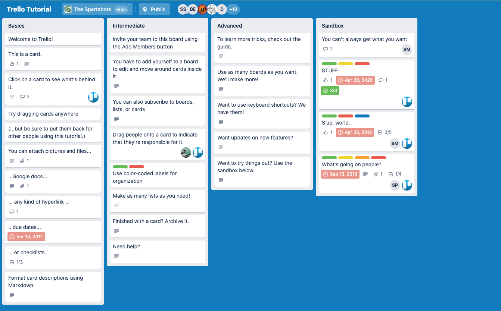

# Using Trello

*“In essence, if we want to direct our lives, we must take control of our consistent actions. It’s not what we do once in a while that shapes our lives, but what we do consistently.” –Tony Robbins*

## Overview

Continuing on with that idea of breaking down large ideas into smaller pieces, then into tiny steps that will build that bridge from point-A to point-B. Let's introduce [Trello](https://trello.com/), a free software owned by Atlassian for doing exactly what was described above by creating tiny draggable steps to keep you organized!


With [Trello](https://trello.com/) we can create **Swim Lanes**. This is **AGILE** jargon for columns that represent the status of a task, i.e. inbox, doing, done, etc.

Where,

**Inbox** would mean a place team members could add things to be done.
**Doing**, since your whole team works on one board, this show what tasks are being worked on and by who.
**Done**, beyond the obvious here, it's also a place that could signal a team lead/code reviewer to review your latest Pull Request.
**Archived**, after your teams has finished a code sprint you'll still want access to tasks that have been completed, when, and by who.
**Icebox**, kept for a later date, this category is reserved for tasks that seem a little too extra or your team doesn't have bandwidth for right now. This is a good place to keep up with stretch goals.
You should begin building your team board with these swim lanes or something very similar since this is what most companies practice.


<!-- ! Video Contents:  (width="655" height="368", ratio 1.77) -->

## Practice It

Starting next week we'll be building a new portfolio website with a partner. It's important to stay organized and motivated on the tasks so you both complete it. Remember, you already know everything you need to know to build this website so you don't have to focus on learning new code or programming, so use this time to apply what you've learned and build your confidence with these tools: HTML, CSS, and JS while learning so cool things as you go.

This new tool, Trello, is just to help you get & stay organized and help you communicate between each other. So get to learning about this new tool:



Accounts are free but do require a sign-up. So let's get an account and a board created today!

- [ ] Navigate to the [trello tutorial](https://trello.com/b/I7TjiplA/trello-tutorial)
- [ ] Click around on the cards and start to get familiar with this tool.
- [ ] Go answer your **Questions for Student Discussion** while you're here.
- [ ] Now click "Sign-up", create an account.
- [ ] Create a new board and set it up the way you've learned so far.
- [ ] See if you can begin translating your sketches and notes from your notepad to your board.

## Additional Resources

- [ ] [YT, Simpletivity - 7 Things You Should Do with Every Trello Board](https://youtu.be/HvkTamEjDXk)

## Know Your Docs

- [ ] [Trello Docs - Keyboard Shortcuts](https://trello.com/shortcuts)
- [ ] [Trello Docs - How to Use Trello Like a Pro](https://help.trello.com/article/734-how-to-use-trello-like-a-pro)


<!-- ! END OF VIDEO 101.1.3.1 - TITLE-->
<!-- ? Video Numbering and Title system: CourseNumber.ModuleNumber.LessonNumber.VideoNumber -->
<!-- * (VIDEO 101.2.4.3 - "CSS Selectors") === 101 Course, Module 2, Lesson 4, Video 3 - "CSS Selectors" -->

<!-- 

```javascript

```

| Method      | Description                          |
| ----------- | ------------------------------------ |
| `GET`       | Fetch resource                       |
| `PUT`       | Update resource |
| `DELETE`    | Delete resource |


    `line numbers`
:do you like 'em?


++slash++
https://facelessuser.github.io/pymdown-extensions/extensions/keys/

=== "Javascript"

    ```javascript
    ```

=== "Python"

  ```python
  ```

=== "Example"
    ```console
      .
    ```

=== "Instructions"
    ```markdown
      .
    ```

=== "Result"
    
-->