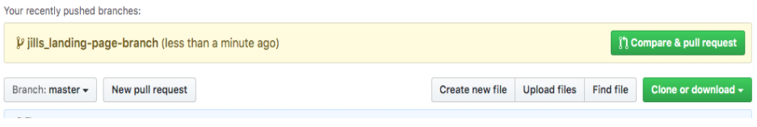
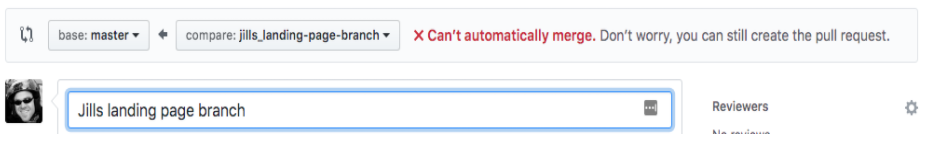
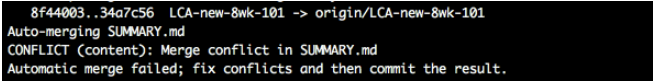

# Merge Conflicts in Git

*“Go confidently in the direction of your dreams. Live the life you have imagined.“ –Henry Thoreau*

## Overview

As we get prepared to work with another developer there's another hiccup you're going to need to be made aware of which is Merge Conflicts. To explain them, how to avoid them, and how to fix them let's start with the flow of getting a repo, editing it, and pushing it back up.

### Non-Merge Conflict Scenario

You and your classmate have decided on what you'd like to build and are confident and excited to begin. One of you creates a repo called: `"New-Portfolio"` and invites the other partner to be a collaborator in the "Settings" tab. After cloning, your partener creates a `README.md`, a `style.css`, a `main.js` file, and an `index.html` with the basic HTML5 boilerplate code in it: `body`, `head`, `meta`, linking your JS and CSS files to it, etc... then they `push` up the new files, still on the `main` branch. You then `git clone` the repo to your computer so you both have the exact same files.

Now you begin work, *but wait*, because you're both smart you decide to create two separate branches off of `main` named `maggie-feature-1` & `brian-feature-2`. Now you begin to work. Maggie, you're working on the Contact Page and Brian is working on the landing page, `index.html`.

Maggie, you create three new files: `contact-scripts.js`, `contact-styles.css`, and `contact-page.html`. And Brian continues to build on the Landing Page with the other files already created.

After both of you have finished your work you each `git status`, `add`, `commit`, `push` which pushes each of your respective code changes to the repo. But now you need to **merge** those two different branches into the `main` branch. Great, you each create a **Pull Request** and ask the other to review your code.

Once you've approved of Brian's code you merge it into `main` and he does the same for yours. All is good and now you can both switch your terminals to point to the `main` branch with `git checkout main` command and then bring down all the changes with `git pull`. This will bring down all the new code you both merged into `main`. Now you can keep working on the next feature!!! `git checkout -b maggie-feature-3` & `git checkout -b brian-feature-4`.

### Merge Conflict - Scenario One

You've both found a rhythm and now you're both knocking out one feature after another, creating new branches off of `main`, working ONLY in the files you were assigned to, `git status`, `add`, `commit`, pushing, creating Pull Requests:



Do code reviews of each other's code, merge them, `git checkout master`, and `git pull`ing the new code down.

But one time, Brian remembers that he needs to change the anchor tag for the Portfolio Page on the Landing page at the same time Maggie, you `add` a new anchor tag to the Landing Page for users to get to the Resume Page and switch the order of the links.

Both of you do the regular steps `git status`, `add`, `commit`, `push`, create a PR, and ask for the other to review the code but *UH OOH*, when you go to created your PR it said there are conflicts that must be resolved.



And after you've reviewed the code it says there are merge conflicts that must be resolved before it can be merged.

What happened?

Both of you changed code on the Portfolio Page(the `index.html` file) and GitHub won't allow automatic merging if the original copies don't match. See, when you're merging new code the git software holds on to the original and compares it to see changes so that it changes only what needs to be changes rather than the whole file. When it does this it will notice that the original on `main` doesn't match the original on Maggie's `maggie-feature-15` which also doesn't match the original on Brian's `brian-feature-13` and therefore, will require a manual change.

#### Scenario One Fix

For merge conflicts caught when trying to merge a PR, you can use GitHubs online text editor. You can access the online text editor by clicking on the "Resolve Conflicts" button as you'll see in the video below.

<!-- ! Video Contents: 101 - Merge Conflict Resolution on GitHub (width="655" height="368", ratio 1.77) -->
<iframe src="https://player.vimeo.com/video/403182815" width="655" height="368" frameborder="0" allow="autoplay; fullscreen; picture-in-picture" allowfullscreen></iframe>

### Merge Conflict - Scenario Two

But let's say you've successfully merged newly changed code so now your master branch in the repo has the new code but your local version of master is behind and instead of pulling those changes you forget and start adding new coding again directly on master. Next thing you know, you see the message from Brian reminding you that you need to pull the new changes. So you do and all of a sudden you see an error message on your terminal:



To solve this conflict run git push then use VS Code to go to the file with the conflict (see error message). From there you'll see Current Changes and Incoming Changes. Current changes are the ones on the local version of your branch while incoming changes are on the remote version of the branch. You get to decide which one you want or manually snip out and leave what you want from both.

#### Scenario Two Fix

<!-- ! Video Contents: 101 - Merge Conflict Resolution w/ VS Code (width="655" height="368", ratio 1.77) -->
<iframe src="https://player.vimeo.com/video/403181140" width="655" height="368" frameborder="0" allow="autoplay; fullscreen; picture-in-picture" allowfullscreen></iframe>

## Additional Resources

- [ ] [YT, The Coding Train - Resolving Merge Conflicts](https://youtu.be/JtIX3HJKwfo)
- [ ] [YT, CodeSpace - How to Resolve Merge Conflicts VS Code](https://youtu.be/kBIMGOxqqnk)
- [ ] [YT, Fireship - VS Code Top-Ten Pro Tips](https://youtu.be/u21W_tfPVrY)

## Know Your Docs

- [ ] [GitHub Docs - Resolving Merge Conflicts](https://help.github.com/en/github/collaborating-with-issues-and-pull-requests/resolving-a-merge-conflict-using-the-command-line)


<!-- ! END OF VIDEO 101.1.3.1 - TITLE-->
<!-- ? Video Numbering and Title system: CourseNumber.ModuleNumber.LessonNumber.VideoNumber -->
<!-- * (VIDEO 101.2.4.3 - "CSS Selectors") === 101 Course, Module 2, Lesson 4, Video 3 - "CSS Selectors" -->

<!-- 

cp workspace/resources/templateFile.md docs/module- 

```javascript

```

| Method      | Description                          |
| ----------- | ------------------------------------ |
| `GET`       | Fetch resource                       |
| `PUT`       | Update resource |
| `DELETE`    | Delete resource |


    `line numbers`
:do you like 'em?


++slash++
https://facelessuser.github.io/pymdown-extensions/extensions/keys/

=== "Javascript"

    ```javascript
    ```

=== "Python"

  ```python
  ```

=== "Example"
    ```console
      .
    ```

=== "Instructions"
    ```markdown
      .
    ```

=== "Result"
    
-->