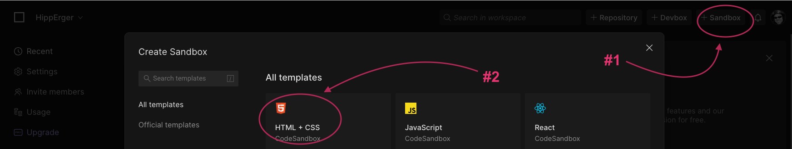
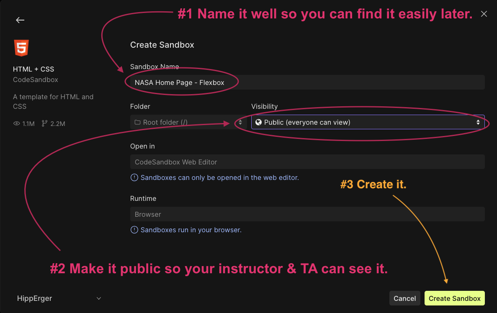

# Playing with Code in a Sandbox

## Overview

Up until now you've been using [Codepen.io](http://codepen.io/) to build projects. Programs like this are referred to as "Code Sandboxes" meaning you can build and play in a secure controlled environment without much setup, overhead, or concern about breaking something. Starting with this next class you're going to move to a new sandbox called [Code Sandbox](https://codesandbox.io/).

Code **sandboxes** are useful tools to share ideas and explore new possibilities – without the pressures of building a **file structure**, setting up your machine, working through on the console, or remembering git commands. For the forseeable future, we'll use [Code Sandbox](https://codesandbox.io/) to share snippets of code, practice coding, and discover new things. Get in the habit building in CodePen as you work through the textbook; it's "where the rubber meets the road."With them, you can apply the concepts you've learned, and experiment with the technologies at the heart of your future career.

### TODO - Create a CodeSandbox Account

Go ahead a get started by creating a free account with either Google, Apple, or GitHub. Don't worry, there are no charges and there are lots of things you can do with the free account.

In addition to being a cleaner interface, Code Sandbox offers code suggestions and auto-complete which will help you learn faster, code faster, and grow faster!!

## See It - Why Coding Sandboxes

In the video below, Joe (an ACA Alumnus) explains the use of coding sandboxes like CodePen and Repl.it.

<!-- ! Video Content: Joe@ACA =  211 codesandboxes -->
<iframe src="https://player.vimeo.com/video/928495258?badge=0&amp;autopause=0&amp;player_id=0&amp;app_id=58479" width="655" height="368" frameborder="0" allow="autoplay; fullscreen; picture-in-picture; clipboard-write" title="jss211_sandboxes"></iframe>

<!-- TODO Delete - Zcopy - https://player.vimeo.com/video/372995742  -->

## Practice It

1. Create a Code Sandbox Account.
1. Create a new HTML + CSS sandbox:
    
1. Name the sandbox & make it public:
    
1. Transfer your [First Web Page(SurfCity.io)](../preCourse/cssForLooks.md) from CodePen to CodeSandbox and feel the difference. Notice the code suggestions and auto-complete.

    > BIG NOTE: Unlike CodePen, you'll need to manually save your work in CodeSandbox to see it rendered in the browser viewer. To save use CMD/CTRL + ++s++ .

<!-- TODO - Move this to Day 1??? [Portfolio Landing Page](../module-1/class-1.md)  -->


<!-- **HOW TO MAKE A CODE FENCE:
```javascript

```

**HOW TO MAKE A TABLE:
| Method      | Description                          |
| ----------- | ------------------------------------ |
| `GET`       | Fetch resource                       |
| `PUT`       | Update resource |
| `DELETE`    | Delete resource |

**HOW TO CREATE A LINK:
- [ ] [LINK DESCRIPTION](<URL>){:target="_blank"}

**HOW TO DISPLAY AN IMAGE:
- [ ] 

**HOW TO MAKE LINE NUMBERS:
    `line numbers`
: line 1
: line 2

**HOW TO MAKE KEYBOARD KEYS:
++slash++
https://facelessuser.github.io/pymdown-extensions/extensions/keys/

**HOW TO MAKE AN ORDER LIST:
1. something...
1. something else...
1. something more...

**HOW TO MAKE AN UNORDERED LIST:
- something...
- something else...
- something more...

**HOW TO MAKE AN CHECKBOX LIST:
- [ ] something...
- [ ] something else...
- [ ] something more...

**HOW TO MAKE AN INDENTED NOTE:

  > NOTE: This is a note that will be highlighted and indented.

**HOW TO COPY A LESSON TEMPLATE ON THE CLI:
cp workspace/resources/templateFile.md docs/module-

**HOW TO SET THE WIDTH OF VIDEOS:
! height/width = 1.777 ---- width="655" height="368"

**HOW TO MAKE CODE FENCES/IMAGES WITH TABS:
=== "Javascript"

    ```javascript
      .
    ```

=== "Python"

  ```python
    .
  ```

=== "Example"
    ```console
      .
    ```

=== "Instructions"
    ```markdown
      .
    ```

=== "Result"
    
-->
