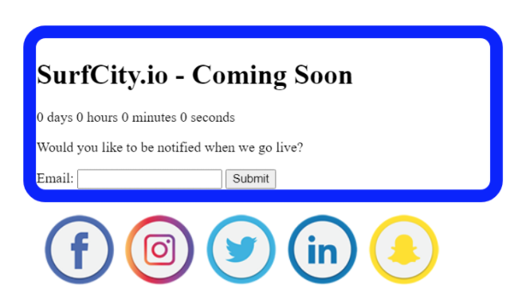
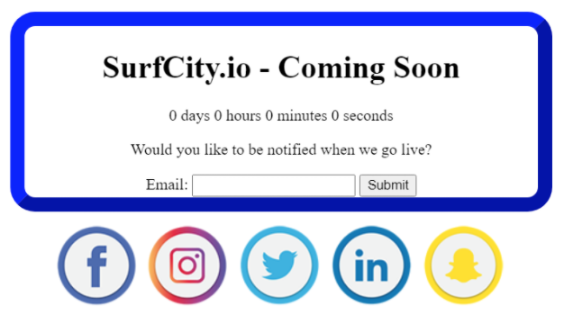
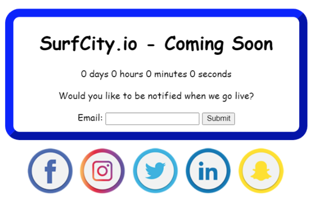
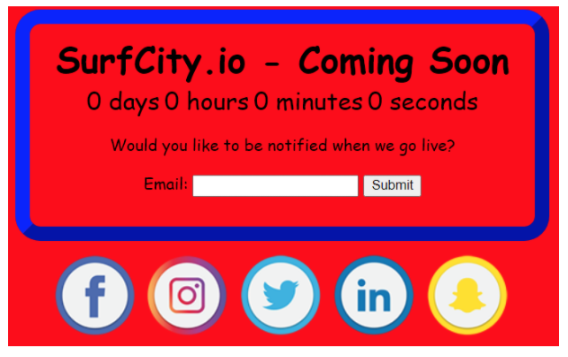
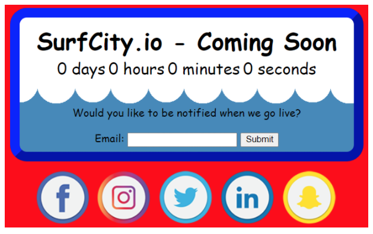

# CSS is for Looks, JS is for Interactivity

CSS works by targeting, selecting, and changing the HTML content, from basic things like text color to more advanced techniques for placing content on the page.

You can target and select HTML in a number of ways. Today we're going to select it by the **tag name**, or the **ID** name.

## Border

Let's start by selecting the ID `box`. If you look in your HTML you'll see that the `box` ID is applied to the `main` tag holding all our content. IDs in CSS always start with a `#` in front of the ID name. Then, the **properties** & **values** we want to apply to the HTML go inside `{}` to form a **declaration block**. So we'll write our CSS Rule by typing the ID name then adding curly brackets `{}`. The curly brackets tell the browser where the rule begins and where it ends.

Inside the brackets, we are going to add a `border` property and set it to `15px solid blue`. This creates a blue, 15-pixel wide border around all the content inside the element with the ID `box`.

<!-- TODO This should be changed to not use the short-hand of the border property -->
=== "the CSS"

    ```css
    #box {
      border: 15px solid blue;
      border-radius: 25px;
    }
    ```

=== "the Result"

    

## Align & Margin

The next thing we want to do is align some of the content. To this, we'll add another property to our `#box` rule declaration block. This one is `text-align: center;`.
  
  > We always want to remember to add the `:` and the `;` when adding properties. The part on the left of the `:` tells the browser what to change, the part on the right tells it how to change it, and the `;` tells the browser when the rule is completed.

Next, let's center our container by adding, `margin: auto;`. This tells the browser to put an equal amount of space on either side of the container.

While we are centering things, let's center that image container we added in HTML. The Img container has an ID of `social` on it. In order to center it, we need to set its width to be less than its parent's width, the `main` container, and add another `margin: auto;`:

=== "the CSS"

    ```css
    #box {
      border: 15px outset blue;
      border-radius: 25px;
      text-align: center;
      margin: auto;
    }


    #social {
      width: 500px;
      margin: auto;
    } 
    ```

=== "the Result"

    

## Font

The next thing we want to do is set a specific `height` and `width` on the `#box` container. Let's set it to `width: 500px;` and `height: 200px;`

After that, let's change the font. If you don't specify which font to use, the browser will just use a [default font](https://www.granneman.com/webdev/coding/css/fonts-and-formatting/web-browser-font-defaults). Telling the browser what font to use is a little tricky because not all machines have the same fonts installed. We could tell the browser to download a font, but instead we are just going to assign a category and let the browser pick its default one of that category. We do that with the following key/value pair: `font-family: cursive;`

=== "the CSS"

    ```css
    #box {
      border: 15px outset blue;
      border-radius: 25px;
      text-align: center;
      margin: auto;
      width: 500px;
      height: 200px;
      font-family: cursive;
    }
    ```

=== "the Result"

    

## Background

Let's add a little more color by setting the `background` of the `body` to `red`. The whole visible area in the browser is inside the body. To change its background color, we add `background: red;`

Next we want to clean up some of the spacing and formatting in the `#box` container. We'll do this by changing some font sizes and margin spacing. We're adding a new type of measurement here, the `em`. The `em` is similar to the pixel(`px`), but it's a relative measurement and helps the browser resize the text on different screen sizes.

=== "the CSS"

    ```css
    body {
        background-color: red;
    }

    h1 {
      font-size: 2.2em;
      margin-top: 10px;
      margin-bottom: 0;
    }

    span {
      font-size: 1.5em;
    }
    ```

=== "the Result"

    

The black text on the red background is a little harsh. We could change the font color, but instead, we are going to change the background of the `#box` container. We just saw how we can change the background to a specific color, but we can also change it to a pattern. Creating these pattens can be complicated, but fortunately, someone has created a bunch of them and shared the code with us. You can find them by going to this website [CSS3 Patterns Gallery](http://lea.verou.me/css3patterns/).

Scroll down until you see a pattern called "Wave" and click it. This will bring up the code, and you can copy the code/paste it into the `#box` rule as shown below.

=== "the CSS"

    ```css
    #box {
      border: 15px outset blue;
      border-radius: 25px;
      text-align: center;
      margin: auto;
      width: 500px;
      height: 200px;
      font-family: cursive;
      background: linear-gradient(#ffffff 50%, rgba(255,255,255,0) 0) 0 0,
    radial-gradient(circle closest-side, #FFFFFF 53%, rgba(255,255,255,0) 0) 0 0,
    radial-gradient(circle closest-side, #FFFFFF 50%, rgba(255,255,255,0) 0) 55px 0 #48B;
      background-size: 110px 200px;
      background-repeat: repeat-x;
    }
    ```

=== "the Result"

    

The last thing we need to do is make the countdown clock work. Writing JavaScript is a little more complicated than CSS or HTML, but you did a quick Google search and [found that someone else had written the code already](https://stackoverflow.com/questions/20618355/how-to-write-a-countdown-timer-in-javascript) and like the CSS background patterns, they have shared the code for other developers to use and learn from.

Copy the code from below and paste it into the JS window in your code pen. And with that working, we are ready to show it to our friend (the customer/client)

=== "the JS"

    ```js
    // set up variable to manage date rules
    const date = new Date(); // New Date object
    date.setDate(date.getDate() + 30) // Current day plus 30 days
    const second = 1000;
    const minute = second * 60;
    const hour = minute * 60;
    const day = hour * 24;

    // convert target date to a date object
    let targetDate = date;

    // set up the loop to update the countdown once a second
    let x = setInterval(function() {

      // get the current time
      let now = new Date().getTime();

      // get the time remaining
      let distance = targetDate - now;

      // update the <span> tags with the countdown values
      document.querySelector('#days').innerHTML = Math.floor(distance / (day))+" days, ";
      document.querySelector('#hours').innerHTML = Math.floor((distance % (day)) / (hour))+" hours, ";
      document.querySelector('#minutes').innerHTML = Math.floor((distance % (hour)) / (minute))+" minutes, ";
      document.querySelector('#seconds').innerHTML = Math.floor((distance % (minute)) / second)+" seconds ";
    }, second)
    ```

=== "result"

    

## Additional Resources

- [ ] [Reference, granneman.com - Web Browser Font Defaults](https://www.granneman.com/webdev/coding/css/fonts-and-formatting/web-browser-font-defaults)
- [ ] [Reference, lea.verou.me - CSS3 Patterns Gallery](http://lea.verou.me/css3patterns/)