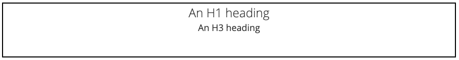
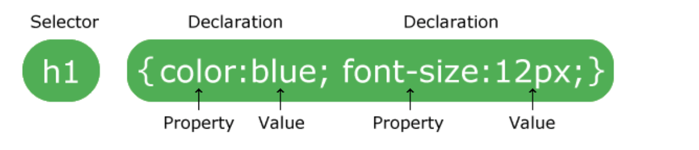

## Intro to CSS

**Objective**: *By the end of this lesson, the student will be able to apply styles to HTML elements using CSS rules.*

**Assignment**: *CSS Practice CodeSandbox*

## Review and Recap

In the last lesson, we covered how to use HTML tags to add structure to our webpage. All HTML elements have properties that can be given different values. When we do this, it will change how those elements are styled on the page. We will explore that using CSS.

## What and Why is CSS?

**CSS** stands for **Cascading Style Sheets**. CSS is used to define styles for your web pages, including the design, layout and variations in display for different devices and screen sizes.

Using CSS allows us to change properties attached to HTML elements. You saw in the previous assignment that some HTML elements looked differently.

For example:

=== "Heading Default Styles"

    

=== "the code"

    ```html
      <h1>An H1 heading</h1>
      <h3>An H3 heading</h3>
    ```

These two elements have properties, like the `font-size`, that start out with different **default values**. In our CSS file, we can change lots of different properties.

### Read It - Properties

A **property** is an **attribute** and they store values on an element. We can change the value of any property using CSS. Go to [W3Schools](https://www.w3schools.com/cssref/default.asp) and look through the properties. These are all of the different attributes that you can change about an HTML element.

### Where does CSS go?

There are different ways to apply CSS to the HTML. We are going to focus on the **external method**. This means the CSS styles will be contained in a separate file. Just like the example we saw of our front-end code and our back-end code being separate; we'll keep our HTML content and CSS styling in separate files but link them together so the browser knows how to apply the styles to our content.

Link your CSS file by copying and pasting the following code into the Head Element of your HTML:

```html
<head>
 <title>Awesome website</title>
 <link rel="stylesheet" href="style.css">
</head>
```

`"style.css"` is the name of the file that contains your CSS styles. 

> This is called a **pathname** because it tells the browser how to find the appropriate file, i.e. `./styles/index-styles.css` would tell the browser to first find a folder called `styles` then search it for a file called `index-styles.css`

The file name could be different, but it has to have the `.css` on the end.

#### Alternative Places to Write CSS

These are NOT the preferred way to write CSS but just in case you see it done this way on your learning journey we don't want you to be alarmed:

=== "In-line Styles"

    ```html
      <p style="background-color:blue; font-size: 20px;">This will have a blue background & be 20px font-size<p>
    ```

=== "In-File Styles"

    ```html
      <style>
        p {
          background-color:blue; 
          font-size: 20px;
        }
      </style>

      <p>This will have a blue background & be 20px font-size<p>
    ```

## What Does CSS Look Like?

Now that we know what CSS is, let's take a look at how it is written.

### CSS Syntax

A CSS rule consists of a **selector** and a **declaration** block.



The selector points to the HTML element to style; here it's the h1 (the thing from our HTML that gets the styles attached to it).

The declaration block (in curly braces) contains one or more declarations separated by semicolons. Each declaration changes a different property.

Each declaration includes a CSS property name and a value, separated by a colon.

Separate declarations with a semicolon.

In the above example, there are two declarations being made on the selected h1 element:

The color property is being given a value of blue.
The font-size property is being given a value of 12 pixels.

## Practice It - CodeSandbox

- [ ] Fork the embedded [CodeSandbox](https://codesandbox.io/s/css-practice-k79ks?fontsize=14&hidenavigation=*theme=dark) to practice adding styles to HTML Elements.
- [ ] The rule templates are already in the CSS file. Fill in the correct properties and values to complete each task.
- [ ] You will need to match the HTML elements with their CSS declaration.

<iframe src="https://codesandbox.io/embed/css-practice-k79ks?fontsize=14&hidenavigation=1&theme=dark"
     style="width:100%; height:500px; border:0; border-radius: 4px; overflow:hidden;"
     title="CSS Practice"
     allow="accelerometer; ambient-light-sensor; camera; encrypted-media; geolocation; gyroscope; hid; microphone; midi; payment; usb; vr; xr-spatial-tracking"
     sandbox="allow-forms allow-modals allow-popups allow-presentation allow-same-origin allow-scripts"
   ></iframe>

  > Hint: A CSS comment in the code is indicated by the following syntax.

## Additional Resoureces

Watch these videos for a mini-crash course in CSS.

- [ ] [YT, BlondieBytes - CSS in 5 Minutes](https://youtu.be/3T4BsrBISnI)
- [ ] [YT, DevTips - CSS Basics pt2](https://youtu.be/tZhmjgLQgXU)

## Know Your Docs

Be sure to reference the official documentation on CSS on W3Schools Tutorials. Documentation makes software useful. All good software comes with documentation so new developers can pick it up, learn quickly, apply, and even change it if needed.

- [ ] [W3S Docs - Default Styles](https://www.w3schools.com/css/default.asp)

## QUESTIONS FOR CLASS DISCUSSION

- [ ] What does CSS do?
- [ ] What is a selector?
- [ ] What is a declaration block?
- [ ] How do you make sure that the HTML file and CSS file are linked together?
- [ ] Can you change more than one property in a declaration block?
- [ ] Terminology to Know
- [ ] Take a look at these terms. If you don't know or can't describe any of them, take some time to teach yourself. You're a developer, which means you're also learning to develop yourself.=
- [ ] Declaration Block
- [ ] Selector
- [ ] Link in the Head
- [ ] Property
- [ ] Value