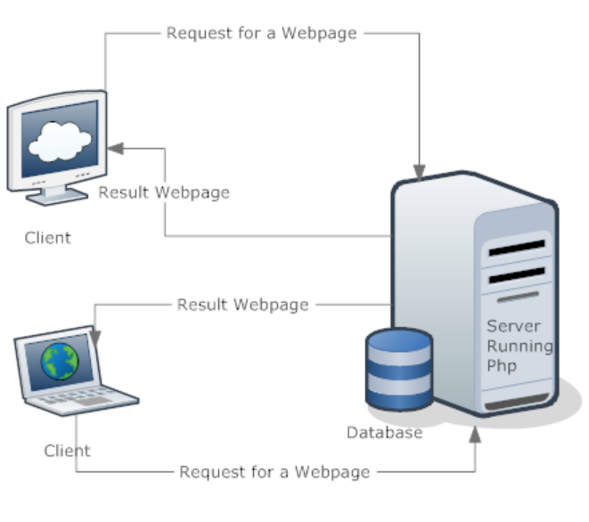

# Day One Homework - Intro to the Web

The **internet** may seem vast, daunting, and unreal. Oftentimes, people don't stop to ask how it works. And really, they don't need to. They just need to know how to use it.

You, on the other hand, are embarking on a journey to hone your knowledge and skills of web development. In order for you to know what you're doing and what is possible, you'll need to understand how the web functions. We'll start by laying out a map of terms, concepts, and flows so that you can begin to create your own mental models of how this thing we use every day actually functions.

We'll talk about each of these terms in-depth in the next lessons, but let's just throw them out there for now since you'll be hearing each of them every day for the rest of your career.

## Front-end/Client-side

[Front-end](https://en.wikipedia.org/wiki/Front-end_web_development) / [client-side](https://www.sqa.org.uk/e-learning/ClientSide01CD/page_18.htm) refers to the part of a website, page or app that you're looking at right now. The front- or client- simply means what the users see when navigating the web. This is generated by the browser (Chrome, Safari, Firefox) thus these softwares and your computer are called the **client** and what the user (you) see is called the front-end.



## Back-end/Server-side

By contrast, the [Back-end](https://en.wikipedia.org/wiki/Front_and_back_ends) / [Server-side](https://en.wikipedia.org/wiki/Server-side_scripting) is the section of the website, page, or app that the user can't see. This is where **data** (information stored in numbers and letters) is stored in **databases**, and computers that run server software to serve the data out of the databases live. We call these computers and their software **servers**, thus **server-side**

We use these titles to plan, divide work, assign tasks, and create solutions. In web development, the front-end can't work without the back-end collecting data and information, and the backend isn't useful to humans without a front-end to navigate with our eyes, ears, voice, and fingers. Developers that work on both front-end and back-end are known as **full stack developers**. In this program you'll learn to build in both the front-end and back-end, giving you the tools to work as a full-stack developer. What you may find as you progress through this program is that developers tend to gravitate towards one or the other. **This is perfectly normal.** But whether you are a full-stack, front-end, or back-end developer, it will only help you professionally to understand how both of these focuses of web development come together.

If you're interested in learning a bit more about the day-to-day difference between a front-end and back-end developer, feel free to read more here:

- [ ] [Article, Medium - Modern Front-End Dev](https://medium.com/tech-tajawal/modern-frontend-developer-in-2018-4c2072fa2b9c)
- [ ] [Article, Medium - Modern Back-End Dev](https://medium.com/tech-tajawal/modern-backend-developer-in-2018-6b3f7b5f8b9)

Back to our introduction to the web:

A **server** (where the back-end code is executed) holds files like an `index.html` at certain addresses called **URLs**. When we navigate the web, our web browser (Chrome, Firefox, Safari, etc.) can request access to those files through URL addresses.

You see, servers still hold front-end code but only front-end tools like a web browser are able to read/execute them. Thus, servers serve files to our client-side browser so that we're able to view them as web pages. It really is as simple as that!

## What You'll Learn in the Program

This program is design to take you, someone who may not have any experience programming and coding, and turn you into a professional and confident developer in a few months! To do this you are required to learn a significant amount of information and apply to creating your very full-stack app. We call this app your Capstone App because it combines all of the information you'll learn in the next few months into a project you can be proud of and share with the world.

As you build your Capstone App or any other app, you'll normally be bundling both front-end code and back-end code together in the same place but still divide these two sets of code into different folders like: `client/` and `server/`, so you and your team know where to find certain functionality. In this case, your file structure would look like this:

```console
  myCapstoneApp/
      client/
        index.html
        style.css
        scripts.js
      server/
        routes.cs
        auth.cs
        app.cs
```

This may look foreign to you right now, but it is something that you will become familiar with as you move through the program. For now, just try and keep the separation between front-end and back-end in your mind. Luckily, we keep a similar structure and separation in your courses to help out:

* 101 Level is about the frontend: HTML, CSS, and DOM manipulation with JavaScript
* 211 Level focuses on programming basics that will be used on both front-end and back-end
* 311 Level is all about the back-end: SQL, Databases, and back-end JavaScript(Node)
* 411 Level focuses on the front-end using React & the passing of data from the front-end to the back-end

## Assigned Viewing

Make sure you watch the video below before the next class:

<!-- ! Video Content: YT, Code.org - What is the Internet? -->
<iframe width="655" height="368" src="https://www.youtube.com/embed/Dxcc6ycZ73M" title="YouTube video player" frameborder="0" allow="accelerometer; autoplay; clipboard-write; encrypted-media; gyroscope; picture-in-picture" allowfullscreen></iframe>

## Terms to Know

- [ ] **Server** - A computer or computer program which manages access to a centralized resource or service in a network.
- [ ] **Front-end/client-side** - Client-side refers to operations that are performed by the client in a client–server relationship in a computer network. 
- [ ] **Back-end/server-side** - Server-side refers to operations that are performed by the server in a client–server relationship in a computer network.
- [ ] **URL** - A URL (Uniform Resource Locator) is a unique identifier used to locate a resource on the internet. It is also referred to as a web address. URLs consist of multiple parts—including a protocol and domain name—that tell a web browser how and where to retrieve a resource.
- [ ] **Data** - Data is a collection of facts, such as numbers, words, measurements, observations or just descriptions of things.
- [ ] **Database** - A structured set of data held in a computer, especially one that is accessible in various ways.
- [ ] **Browser** - A computer program with a graphical user interface for displaying and navigating between web pages.
- [ ] **Internet** - An electronic communications network that connects computer networks and organizational computer facilities around the world.