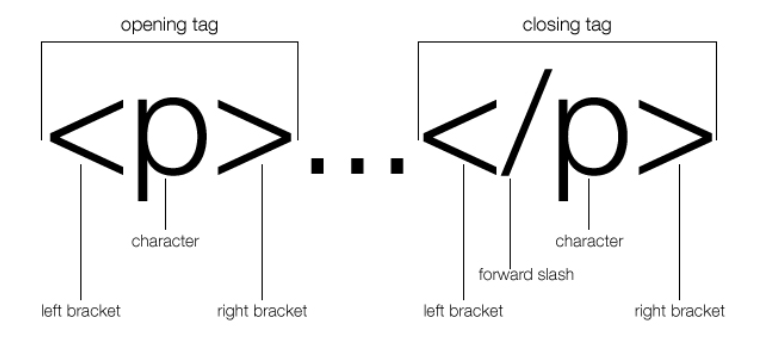

# HTML Basics Review

```html
<!DOCTYPE html>
<html>
  <head>
    <meta charset="UTF-8">
    <title>Static Template</title>
  </head>
  <body>
    <h1>This is a basic static template!</h1>
  </body>
</html>
```

> Does this make sense to you? Can you explain this code to someone that doesn't understand it?

## HTML Structure

`<h1> </h1>`

The `<h1>` is an opening tag for a Heading1 element.
The `</h1>` is a closing tag for a Heading1 element.

> What is the difference between the two?

All of the content displayed on the webpage is between these two tags/inside this one element:
`<body> </body>` tags.

The opening and closing tags create the container that will hold the content. Think of the closing tag as the lid on the container.



## Elements

When we place content between the two tags, we have created an HTML element.

```html
<h1>Content between the opening and closing tag.</h1>
```

* The whole thing represents an H1 Element.
* There are lots of other types of elements depending on the tag that is used.
* They each represent different objects that the browser sees.
* Explore the different types of elements before moving on to the practice activity.

- [ ] [W3S Docs - HTML Tags Reference - Click Me!!](https://www.w3schools.com/TAGS/default.ASP)

> the HTML code to make the link you see above is: `<a href="https://www.w3schools.com/TAGS/default.ASP">W3S Docs - HTML Tags Reference - Click Me!!<a>`

## Meaningful Elements (Semantic Elements)

We are now going to practice using different tags to create some structure to an HTML document. Follow the instructions in the code comments to use the correct tags.

Project Directions:

- [ ] Open the [CodeSandbox](https://codesandbox.io/) below
- [ ] Make sure you are signed in.
- [ ] Fork your own copy.
- [ ] Follow the directions in the comments to complete the assignment.

<iframe src="https://codesandbox.io/embed/meaningful-tags-practice-q4yus?fontsize=14&hidenavigation=1&theme=dark"
     style="width:100%; height:500px; border:0; border-radius: 4px; overflow:hidden;"
     title="Meaningful tags Practice"
     allow="accelerometer; ambient-light-sensor; camera; encrypted-media; geolocation; gyroscope; hid; microphone; midi; payment; usb; vr; xr-spatial-tracking"
     sandbox="allow-forms allow-modals allow-popups allow-presentation allow-same-origin allow-scripts"
   ></iframe>

## Terms to Know

Take a look at these terms. Take some time to teach yourself. You're a developer, which means you're also learning to develop yourself!

- [ ] **HTML** - Hyper Text Markup Language
- [ ] **Browser** - A computer program with a graphical user interface for displaying and navigating between web pages.
- [ ] **Opening Tag** - These tags define where the element begins, where it ends, and assign a meaning to the element. The beginning of an element is marked by an opening tag. An HTML opening tag consists of a left angle bracket (<), the name of the element (“p” in the case of a paragraph), and a right angle bracket (>).
- [ ] **Closing Tag** - An HTML element is defined by a starting tag. If the element contains other content, it ends with a closing tag. For example, `<p>` is the starting tag of a paragraph and `</p>` is the closing tag of the same paragraph, but `<p>`This is a paragraph`</p>` is a paragraph element.
- [ ] **Element** - The code element represents a fragment of computer code, which can be any piece of computer readable text. Among many other examples, you can find inside the code element a piece of a program in any programming language, an HTML or XML document, a set of CSS declarations, the contents of a configuration file, etc.
- [ ] **Tag** - The `<code>` tag is used to define a piece of computer code. The content inside is displayed in the browser's default monospace font. Tip: This tag is not deprecated. However, it is possible to achieve richer effect by using CSS.
- [ ] **Comment** - In computer programming, a comment is a programmer-readable explanation or annotation in the source code of a computer program. They are added with the purpose of making the source code easier for humans to understand, and are generally ignored by compilers and interpreters.

=== "HTML Comment Syntax"

    ```html
      <!-- This is a comment in HTML -->
    ```

=== "CSS Comment Syntax"

    ```css
      /* This is a comment in CSS */
    ```

=== "JS Comment Syntax"

    ```javascript
      // This is a single-line comment in JS
      
      /* This is a 
      multi-line comment 
      in JS */
    ```

> NOTE: When working in VS Code and most other editors you can simply press ++cmd+question++ / ++ctrl+question++ while on the line you want to comment out. No highlighting needed.