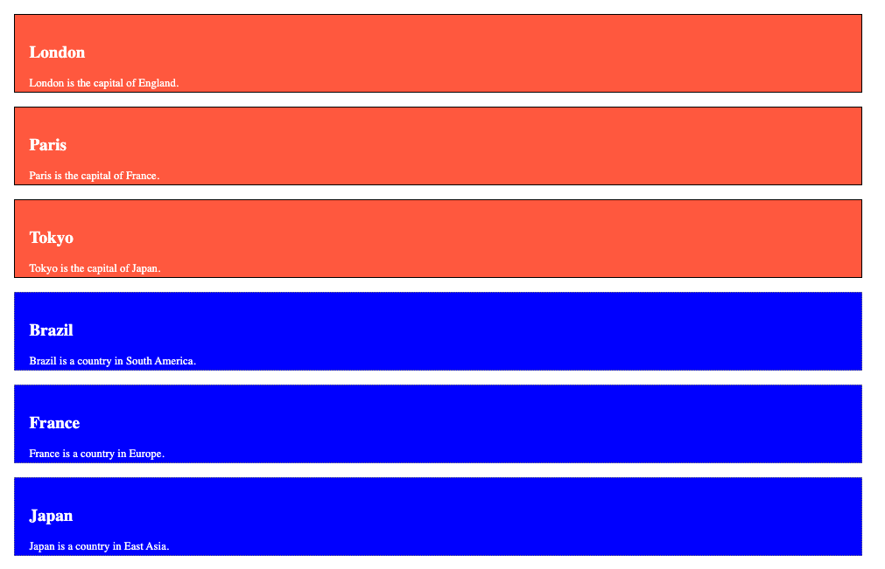

# HTML Attributes

When we say **attributes** in HTML we're talking about the bits of code inside the **opening tag** of the element like `id="box"` , `type="number"`, `href="https://mywebsite.com"`, etc. 

=== "For Instance"

  ```html
  <main id="box"> </main>

  <input type="number" />

  <a href="https://mywebsite.com">Click Here to go to My Website</a>
  ```

These bits of code store useful **values** inside what we call **properties** on the Element object. These **values** communicate crucial information to the browser about what it's supposed to do with the HTML, CSS, and JS code it receives.

 > NOTE: While we will interchangeably call these bits of information **attributes** and **properties** - know that we're talking about the same thing: *the little bits of code inside the opening tag of the HTML element.*

## Class

The HTML `class=` attribute is used to label a set of HTML element with a **class name**. Unlike the `id` attribute, multiple HTML elements can share the same `class` name.

### Using Class Names

The class attribute is often used on multiple HTML elements to point styling rules or JavaScript programs to all of the elements labelled with a specific class name.

In the following example we have three `<div>` elements, each with a class attribute labelled on them. Some have the value of "city" and others have the value "country". All of the elements with the `.city` class name will be styled the same while the other three with the class name `".country"` will be styled differently, see the CSS code for the differences.

=== "the HTML"

    ```html
    <!DOCTYPE html>
    <html>
      <body>

        <div class="city">
          <h2>London</h2>
          <p>London is the capital of England.</p>
        </div>
        <div class="city">
          <h2>Paris</h2>
          <p>Paris is the capital of France.</p>
        </div>
        <div class="city">
          <h2>Tokyo</h2>
          <p>Tokyo is the capital of Japan.</p>
        </div>

        <div class="country">
          <h2>Brazil</h2>
          <p>Brazil is a country in South America.</p>
        </div>
        <div class="country">
          <h2>France</h2>
          <p>France is a country in Europe.</p>
        </div>
        <div class="country">
          <h2>Japan</h2>
          <p>Japan is a country in East Asia.</p>
        </div>

      </body>
    </html>
    ```

=== "the CSS"

    ```css
    div {
      color: white;
      margin: 20px;
      padding: 20px;
      width: 50%;
      height: 70px;
    }

    .city {
      background-color: tomato;
      border: 2px solid black;
    }

    .country {
      background-color: blue;
      border: 2px dotted grey;
    }
    ```

=== "Result"

    

<hr>

## HTML/CSS Burger Exercise

Make the burger your own, you can click the "Open Sandbox" button and change the CSS to change colors, shapes, and sizes of your burger fixin's.

- [ ] To save use CMD/CTRL + ++s++
- [ ] Must save both files
- [ ] Delete, multiply, reorganize the HTML to make your own dream burger.
- [ ] Adjust, cut, search, add, make new the CSS to make any same or color you want!
- [ ] Lastly, try to create a new ingredient: 
  - Create an HTML `<div>`, 
  - give it a class name: `class="bacon"` 
  - style the class name in the CSS: `.bacon { }`
  - [Look around on the web](https://css-generators.com/wavy-shapes/)

<iframe src="https://codesandbox.io/embed/html-burger-o9qwj?fontsize=14&hidenavigation=1&theme=dark"
     style="width:100%; height:500px; border:0; border-radius: 4px; overflow:hidden;"
     title="HTML Burger"
     allow="accelerometer; ambient-light-sensor; camera; encrypted-media; geolocation; gyroscope; hid; microphone; midi; payment; usb; vr; xr-spatial-tracking"
     sandbox="allow-forms allow-modals allow-popups allow-presentation allow-same-origin allow-scripts"
   ></iframe>

<hr>