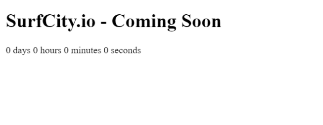
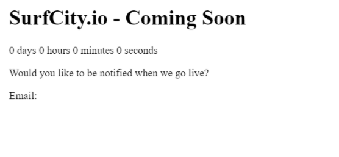
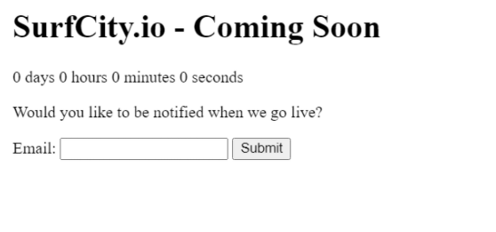
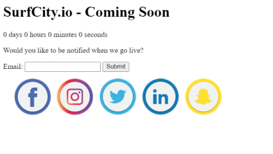

# Let's Write Some Code

## Create the Main Section

The main thing to not about HTML is: HTML is for Content. We use HTML to organize our content on the web page. Text, images, video, forms, PDFs, etc... are all created by the HTML tags we use.

Some elements like **Header**, **Main**, and **Footer** are used to group together multiple smaller pieces of content.

Let's create a Main element to hold the informational content of this web page. Be sure to follow along in CodePen. Copy/Paste the following code into your CodePen text editor:

```html
  <main id="box">

  </main>
```

Our `<main>` opening tag looks a little different than some of the other elements coming up because we added an `id=` **property** to it.

**ID**s are like labels. We can use these labels in CSS and JavaScript to 'select and affect' the contents of our HTML elements..

Inside the **Main** tag, let's create an **H1** tag and give the page a title with it. Again, copy/paste this code into CodePen to match this example exactly:

```html
<main id="box">
  <h1>SurfCity.io - Coming Soon</h1>
</main>
```

## The Countdown Clock

Now we need to create the structure for our countdown clock. We are going to do that by creating a series of four **Span** elements. The Span element is usually used to wrap around bits of text that we want to change using CSS or JavaScript. In this case we are going to use JavaScript to make the countdown timer, and we need to update the contents of these span tags once every second.

  > Notice the new **ID**s we are adding. It's important to note that IDs like these have to be typed exactly as we show them here. Typos, or making the first letter upper-case *instead of lower-case* will confuse the browser and it will not work.

=== "the HTML"

    ```html
    <main id="box">
      <h1>SurfCity.io - Coming Soon</h1>

      <span id="days">0 days</span>
      <span id="hours">0 hours</span>
      <span id="minutes">0 minutes</span>
      <span id="seconds">0 seconds</span>
    </main>
    ```

=== "the Result"

    

Now we're going to add two more elements. A **br** element which adds a **line-break** to force the following content onto the next line, and a **p** elements. The `p` stands for paragraph and is designed to hold multiple lines of text.

We will use this space to ask if our users would like to join the mailing list.

=== "the HTML"

    ```html
    <main id="box">
      <h1>SurfCity.io - Coming Soon</h1>

      <span id="days">0 days</span>
      <span id="hours">0 hours</span>
      <span id="minutes">0 minutes</span>
      <span id="seconds">0 seconds</span>

      <br>
      <p>
        Would you like to be notified when we go live?
      </p>
    </main>
    ```

## The Form

Now we come to the **Form** element. Every time you've given your email address, logged in to an account, bought something with a credit card, or filled out a survey online, you've done it in a **Form** element.

*Continue copy/pasting the code snippets into your CodePen text editor to make yours look exactly like the examples.*

=== "the HTML"

    ```html
    <main id="box">
      <h1>SurfCity.io - Coming Soon</h1>

      <span id="days">0 days</span>
      <span id="hours">0 hours</span>
      <span id="minutes">0 minutes</span>
      <span id="seconds">0 seconds</span>

      <br>
      <p>
        Would you like to be notified when we go live?
      </p>

      <form>
        Email:

      </form>
    </main>
    ```

=== "the Result"

    

## Form Inputs

**Form** elements are how we accept information from our users and they are critically important to most web sites. The form is just a content container though, and inside the container we can design it to look any way we like, but in order to accept data from the user, we need to add at least one **Input** element.

There are a variety of different types of data that can be *input ;)* on a form. Inside the **Input opening tag** is a attribute/property called `type=`. Changing the **type property** changes what kind of data the input accepts, and we need the user to give us an email, so we will use `type="email"`.

The second input is a little different. It has its `type` property/attribute set to `submit` which will create a button that will be used to trigger a submission function on the Form.

  > NOTE: we also give Input elements a `name=` property. This gives us a way to access the value stored in that input via a thing called a **key**. This input's **key** will be `userEmail` and its **value** will be whatever the user inputs. As you progress, you'll here the term **key:value pairs**; this describes the relationship of these pieces of data.

=== "the HTML"

    ```html
    <main id="box">
      <h1>SurfCity.io - Coming Soon</h1>

      <span id="days">0 days</span>
      <span id="hours">0 hours</span>
      <span id="minutes">0 minutes</span>
      <span id="seconds">0 seconds</span>

      <br>
      <p>
        Would you like to be notified when we go live?
      </p>

      <form>
        Email:
        <input type="email" name="userEmail">
        <input type="submit" name="submit" value="Submit">

      </form>
    </main>
    ```

=== "the Result"

    

## Social Images

Ok, we're almost done with the HTML, but our friend, the client, just called to say we need to include links to their social media... He doesn't have the links yet because some of the accounts are still being created, but that's OK. We can include an image for now and add the link later when it's available.

In the meantime, the Img element just needs the `src=` property filled in with a URL so that it knows where find the image. Go ahead and wrap that Img Element with a Div Element to make it easier to position and style with the CSS. *(see the code snippet)*

That's it! We're done with the HTML. It still looks a little plain...let's learn how to use CSS to transform the look of it!!

=== "the HTML"

    ```html
    <main id="box">
      <h1>SurfCity.io - Coming Soon</h1>

      <span id="days">0 days</span>
      <span id="hours">0 hours</span>
      <span id="minutes">0 minutes</span>
      <span id="seconds">0 seconds</span>

      <br>
      <p>
        Would you like to be notified when we go live?
      </p>

      <form>
        Email:
        <input type="text" name="email">
        <input type="submit" name="submit" value="Submit">

      </form>
    </main>

    <div id="social">

      

    </div>
    ```

=== "the Result"

    

