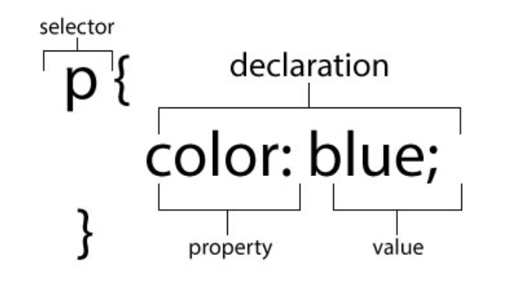

# More CSS Techniques

**Objective**: *By the end of this lesson, the student will use W3Schools as a resource to apply additional styles to HTML elements using CSS rules.*

**Assignment**: *CSS Advanced Practice CodeSandbox*

## Review and Recap

Previously, we covered how to write CSS rules to add some style to our webpage. Remind yourself of the 3 parts of a CSS rule:



For today's activity, we will explore CSS a little deeper into the different properties that we could change about an object. You will use [W3Schools](https://www.w3schools.com/css/default.asp) to help you complete the assignment.

> Hint: You may have to use previous lesson material to help you. Use your resources to complete the assignments.

## Targeting Multiple Selectors

If you want to apply the same style to multiple HTML elements, using a comma `,` will allow this to happen.

Applying color values to both the `h3` and `p` tags:

```css
h3 , p {
    color: blue;
    font-family: Arial, Helvetica, san-serif;
}
```

This will make all the H3 and the Paragraph Elements blue and change the font to Helvetica.

## Color Codes

There are different ways to assign a color value to an element. The three most common color representation models are:

### By Color Name

You can use the names of some colors.
This option limits the choice that you have for colors because the color has to have a Name: `color: blue;`

For all other shades that don't necessarily have names, we use a code:

### By Hex Code

Hex code is a code [represented by combination of letters](https://www.mathsisfun.com/hexadecimal-decimal-colors.html#:~:text=So%20one%20hexadecimal%20digit%20can,256%20different%20levels%20of%20color.) and numbers ranging between `00-FF`: `color: #0000ff;`

### By Red, Green, Blue values (called RGB values)

All colors on a computer are different combinations of values of red, green, and blue.
`color: rgb(0, 0, 255);`

> What's really happening here is that we call a function called `rgb()` and pass it arguments in the `r`ed, `g`reen, `b`lue order and it returns the color on the screen....!

All of these codes are for the exact same color!

### Tools for Colors

There are tools like:

- [ ] **[ColorPick EyeDropper](https://chrome.google.com/webstore/detail/colorpick-eyedropper/ohcpnigalekghcmgcdcenkpelffpdolg?hl=en)** that can help you choose a color off your screen and it will give you the code for you to copy/paste.
- [ ] [Color Picker](https://www.google.com/search?q=color+picker) the provides a color palette to choose colors and their codes from.
- [ ] [Scheme Color](https://www.schemecolor.com/) provides you with pre-made color schemes.
- [ ] **[Mycolor Space](https://mycolor.space/)** that helps you create a well designed scheme of colors around one color.
- [ ] [Adobe Color Wheel](https://color.adobe.com/create/color-wheel) where you can create a custom color scheme for any project.
- [ ] **[Color Book Value Converter](https://www.colorbook.io/hexcolors/view/FF919C)** will convert any color into any code you need!

## Practice It

- [ ] Fork the following [CodeSandbox](https://codesandbox.io/s/css-advanced-practice-inw3y?fontsize=14&hidenavigation=1&theme=dark).
- [ ] You will have to create and link your CSS stylesheet. (Hint: Use your resources to remind yourself how to do this)
- [ ] Follow the instructions in the CodeSandbox to style the HTML elements.

<iframe src="https://codesandbox.io/embed/css-advanced-practice-inw3y?fontsize=14&hidenavigation=1&theme=dark"
     style="width:100%; height:500px; border:0; border-radius: 4px; overflow:hidden;"
     title="CSS Advanced Practice"
     allow="accelerometer; ambient-light-sensor; camera; encrypted-media; geolocation; gyroscope; hid; microphone; midi; payment; usb; vr; xr-spatial-tracking"
     sandbox="allow-forms allow-modals allow-popups allow-presentation allow-same-origin allow-scripts"
   ></iframe>

If you don't know how to do something right away, don't just sit - **S.A.T.**!! **S**earch for the answer in your textbook or Google, **A**sk your classmates and/or teacher, and when you find it: **T**each your solution. Someone else may have the same question.

## Know Your Docs

Be sure to reference the official documentation on CSS on W3Schools Tutorials. Documentation makes software useful. All good software comes with documentation so new developers can pick it up, learn quickly, apply, and even change it if needed.

- [ ] [W3S Docs - CSS Selectors](https://www.w3schools.com/css/css_selectors.asp)

## Questions for Discussion

- [ ] What is a selector?
- [ ] What are the different ways to assign a color value to an element?
- [ ] How do you make sure that the HTML file and CSS file are linked together?
- [ ] Can you change more than one property in a declaration block?

## Terms to Know

Take a look at these terms. If you don't know or can't describe any of them, take some time to teach yourself. You're a developer, which means you're also learning to develop yourself.


- [ ] **CSS** - "Cascading Style Sheets" is a Rule-based language that is used to style the HTML.


- [ ] **Declaration** - A statement that shows the property and value that is changed from its default value.


- [ ] **Selector** - Part of the CSS Rule that shows the element selected to have styles applied. There are many more selector techniques that will be covered more in the course.


- [ ] **Property** - A specific style you are trying to add/change about the element selected.


- [ ] **Value** - The chosen option for the property.

  ```css
  p {
    color: red;
    text-align: center;
  }
  ```

- [ ] *`p` is the selector*
- [ ] *`color` and `text-align `are properties*
- [ ] *`red` and `center` are values for the properties.*

   > (Note: there are other possible values for each property)

- [ ] **Link** - To link your stylesheet to your HTML you will need to put the following line of code in the `<head>` section of your HTML file.

`<link rel="stylesheet" href="styles.css">`
