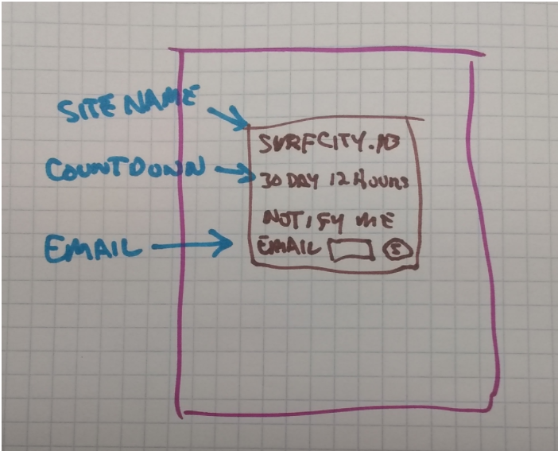
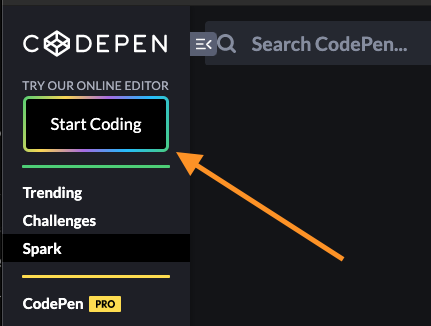
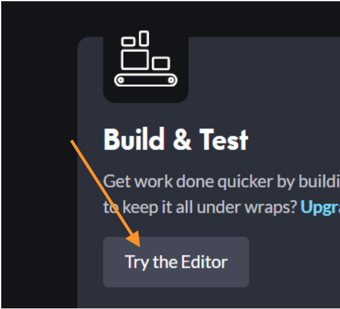

# Building Our First Web Page

## Program Learning Goals

In the next two weeks, at a minimum, you should understand:

* There are 3 types of code used to build modern web applications: HTML, CSS, and Javascript
* HTML is used to add content to your application (text, images, video, buttons, etc)
* HTML is a tag-based language.
* CSS is used to change the "look and layout" of the HTML content.
* CSS is a rule-based language
* CSS rules "select" HTML and "affect", or change HTML.
* JavaScript is primarily used to add interactivity to your application.
* Front-end and back-end web developers perform different, but equally important jobs.

## Your First Web Job

You bump into an acquaintance and get to chatting. You tell them that you are learning to build web applications and they seem very interested.

>They tell you that they "need a website built... Are you interested?"

> "I don't know," you reply. "I'm still new to all this."

> "I think it'll be pretty easy," they say. "I just need a simple webpage that I can use to collect emails. Let me show you what I'm thinking..."

> They start sketching out the basic layout to the page. It includes a title, a countdown clock, and a place where people can submit their emails.



> As they do, they let you know that they are going to be running a kickstarter campaign for a new product idea, and they want to collect emails in advance to help with promotion.

> You take a good look at the sketch and decide to go for it!

### Let's get started

#### HTML IS A TAG-BASED LANGUAGE

The first thing you need to know about HTML is there are two different kinds of tags.

Some tags, like the **H1**, are wrapped around content. The 'h' in **H1** is short for **heading**. It has an **opening tag**, `<h1>`, and a **closing tag**, `</h1>`, (see below) and the text of the heading goes in between them.

```html
  <h1>SurfCity.io - Coming Soon</h1>
```

The other type of HTML tags are called **self-closing tags** and they contain all that they need in the opening tag and do not need a closing tag. One example is the **Img** tag (see below) that includes the source `src=` **attribute** which gives directions on where to find the image that's supposed to be shown to the user. The Img tag is not wrapped around the image, instead it tells the browser where to find the source of the image and put the image on the page.

```html
  
```

These are the two categories of HTML Tags we write when building web pages: **Normal** or **Non-void** tags and **Self-Closing** or **Void** tags. These tags create **HTML Elements** on our page. We'll learn much more about who to use these elements, in due time.

## Where Do I Write The Code?

In this two week class we are going to write code in three different environments, but the easiest to get started with is a website called [codepen.io](http://www.codepen.io/).

[Codepen](http://www.codepen.io/) asks you to make an account, and we'll do that later, but for now just scroll down the page until you see the 'Try the Editor' button and click it.

Once it loads, you will see two parts, a section where you write the code, and a section where you see the page you're building. The code section has a separate place for each type of code (HTML, CSS, and JS). The page is designed to be responsive, meaning it changes itself to fit different size screens. If you have a high resolution monitor, you will see three panels in the code section that can be expanded to maximize the area you are coding in. If you have a smaller screen, you will see tabs at the top that allow you to choose which type of code to edit.

In either case, we are ready to get started on building the page.

=== "Option 1"
    

=== "Option 2"
    

<!-- ## Additional Resources

- [ ] [YT, tuber - title]()

## Know Your Docs

- [ ] [MDN Docs - title]() -->


<!-- ! END OF VIDEO 101.1.3.1 - TITLE-->
<!-- ? Video Numbering and Title system: CourseNumber.ModuleNumber.LessonNumber.VideoNumber -->
<!-- * (VIDEO 101.2.4.3 - "CSS Selectors") === 101 Course, Module 2, Lesson 4, Video 3 - "CSS Selectors" -->

<!-- 

cp workspace/resources/templateFile.md docs/module- 

```javascript

```

| Method      | Description                          |
| ----------- | ------------------------------------ |
| `GET`       | Fetch resource                       |
| `PUT`       | Update resource |
| `DELETE`    | Delete resource |


    `line numbers`
:do you like 'em?


++slash++
https://facelessuser.github.io/pymdown-extensions/extensions/keys/

=== "Javascript"

    ```javascript
    ```

=== "Python"

  ```python
  ```

=== "Example"
    ```console
      .
    ```

=== "Instructions"
    ```markdown
      .
    ```

=== "Result"
    
-->