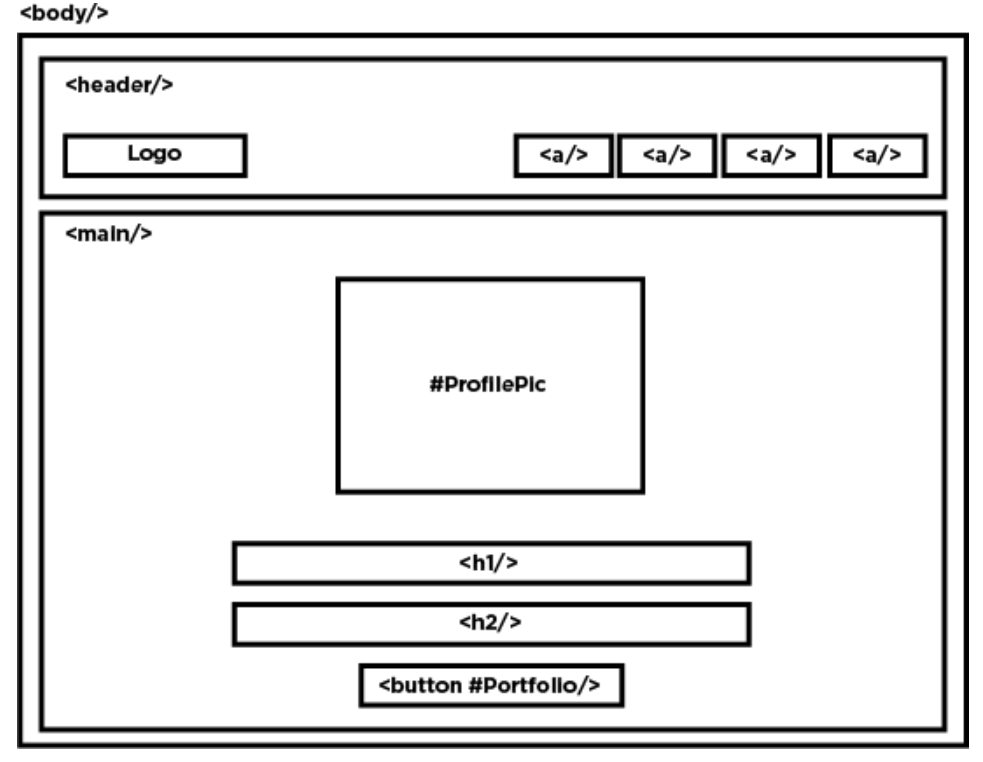
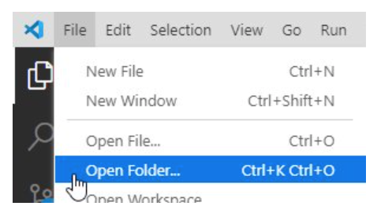
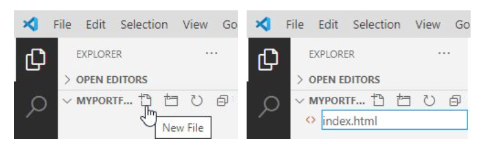
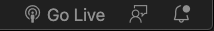
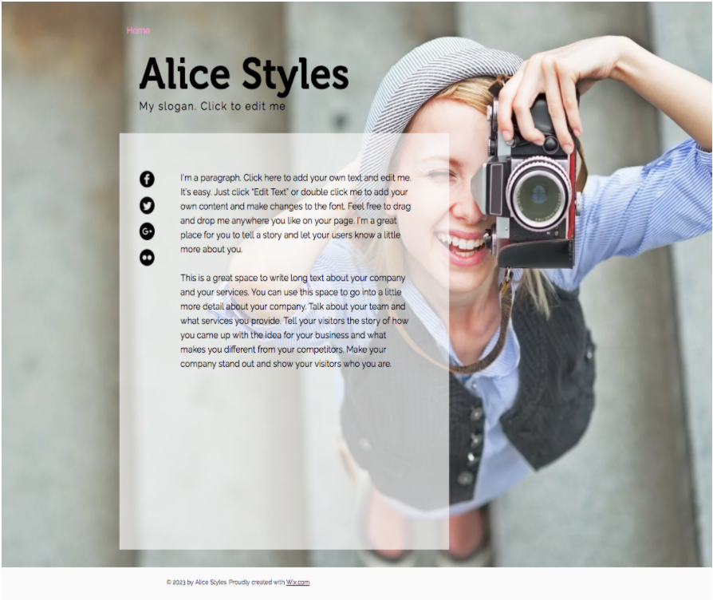
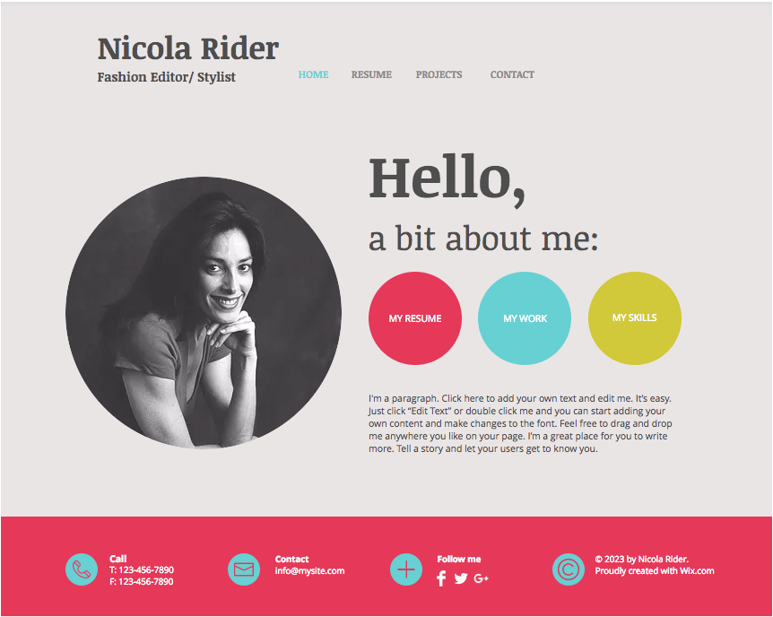

# Portfolio Landing Page

*A journey of a thousand miles begins with a single step. – Lao Tzu*

## Overview

Today you will build the first page of your portfolio website! You'll get the hang of it quickly, so don't worry if you don't understand all the code. You'll build your page using VS Code and view it using the Live Server extension. In the next lesson, we'll get your site hosted for the world to see!

## How Classes Work

Each class throughout the program will include a "checklist" that describes the general flow of the class, as well as, key points and topics so you will know what to expect before diving in.

## Today's Checklist

- [ ] Create a folder called `myPortfolio` in your Documents folder.
- [ ] Create your `index.html` file.
- [ ] Build your first webpage using HTML.
- [ ] Link a CSS file.
- [ ] Copy/Paste CSS code into that CSS file.
- [ ] Experiment with CSS on your own.
- [ ] Build a modified "hero" style landing page by the end of class.

## Project Instructions

### Draw a Wireframe

  *A [wireframe is a simplified outline](https://careerfoundry.com/en/blog/ux-design/how-to-create-your-first-wireframe/) that defines the main design of a web page or site. Wireframes are used to plan the page structure, specify major elements, and explain functionality. It is the skeleton or blueprint of a website. You'll be using wireframes to plan your work throughout this course and your career.*

  Take a look at the wireframe below. This is the outline of the page you're building today and will serve as blue print for you to build from.

  

*****

### CreateYour Folder and First Page

- [ ] Create a folder called: myPortfolio in your Documents folder.
- [ ] Open VS Code (Your text editor).
- [ ] Click File > Open Folder in the top navigation bar and find the new folder you just created.
  


- [ ] Click the New File icon next to your folder and name it `index.html`. The file will automatically open in the editor pane.
  


- [ ] Copy and paste the following code into your blank `index.html` file:

```html
  <!DOCTYPE html>
  <html lang="en">
  <head>
    <meta charset="UTF-8">
    <meta name="viewport" content="width=device-width, initial-scale=1.0">
    <meta http-equiv="X-UA-Compatible" content="ie=edge">
    <link rel="stylesheet" href="./style.css">
    <title>My Portfolio</title>
  </head>
    <body>
    <!-- This is a what comment line looks like in HTML -->
    <!-- The rest of your code goes between here... -->


    <!-- ...and here. -->
    </body>
  </html>
```

*****

### Add Your header and main Elements
  
- [ ] Save your page. ++cmd+s++ / ++ctrl+s++

  > TIP: Select **File** > **Auto Save** to automatically save any changes.

- [ ] Create two elements inside the Body tags called Header and Main. Copy/paste the code below to get started.

  > NOTE: Remember to reference your previous lessons and bookmarked docs. And be sure you have only ONE Body element.

```html
  <!-- Don't include this <body> tag. It's for reference only -->
  <!-- <body>  -->
    <header>
    <!-- REPLACE THIS LINE WITH THE PROVIDED LOGO IMG TAG  -->
    <!-- REPLACE THIS LINE WITH A NAV ELEMENT -->
    </header>
    <main>
      <!-- REPLACE THIS LINE WITH YOUR HEAD SHOT IMG TAG -->

      <!-- REPLACE THIS LINE WITH THE PORTFOLIO BUTTON -->
      <a class="small-text" href="https://austincodingacademy.com/">© Austin Coding Academy</a>
    </main>
  <!-- </body> -->
  <!-- Don't include this </body> tag. It's for reference only -->
```

*****

### Add a Logo and Navigation to the Header Section

- [ ] Copy/paste the line of code below inside the Header element:

  ```html
  
  ```

- [ ] Create a Nav element below this code but still inside the Header tag.
- [ ] Create 4 Anchor elements inside the Nav element for each of the following: "Resume", "About Me", "My Blog", and "Contact Me".

  > HINT: The anchor tag for "Contact Me" should look like this: `<a class="has-border">Contact Me</a>`

*****

### Add Your Content to the Main Section

- [ ] Paste in this line of code in between the main tags :
``
- [ ] Navigate to your finder/file explorer on your computer and open two separate windows on your computer.
- [ ] Find a good, clear, professional picture of yourself in one of the windows.
- [ ] Navigate to your `myPortfolio` project in the other window.
- [ ] Drag the image of yourself from the first window into the `myPortfolio` folder in the other window.
- [ ] Rename the image  `myProfilePic.jpg`.

  > NOTE: if your image is a `.png`, `.jpeg`, or another format, simply change the suffix in the line of code from step above.

- [ ] Create an **H1** element with your full name in it below this new **Img** tag.
- [ ] Create an **H2** element with your current title: Student of Web Development below the new H1 element.
- [ ] Copy/paste this line of code below the **H2** element to create a **Button** element:
  
  `<button id="portfolio">Portfolio</button>`.
  
- [ ] Save your code.

- [ ] Click the Go Live link in the bottom right-hand corner of VS Code. Go Live

  

  > TIP: If the button doesn't show up, try quitting VS Code and restarting it. Or uninstall Live-Server and reinstall then restart VS Code again.

- [ ] Look at your website in Chrome.

Not matching your wireframe? That's okay. What you see is called **normal document flow**. In all web files, each element is read top-to-bottom and left-to-right and rendered on the screen top-to-bottom and left-to-right. Next, we'll add styles to arrange our page and make it pretty.

*****

### Add Your Styles

We're going to include a set of rules listed in a CSS file to make everything look pretty.

Look in the **Head** tag at the top of your `index.html` file. Do you see `<link rel="stylesheet" href="./style.css">`? This line of code allows you to link styles to the otherwise very boring web page. The line is telling the browser to go find a file called style.css in the same folder as your index.html file. Let's create one now.

- [ ] Click the New File icon next to your folder and name it `style.css`. The file will automatically open in the editor pane.

  

- [ ] Copy and paste the following code inside your new `style.css` file:

  ```css
  body {
      font-family: Arial, Helvetica, sans-serif;
      background-image: url("https://png.pngtree.com/thumb_back/fh260/back_pic/00/15/30/4656e81f6dc57c5.jpg");
      background-repeat: no-repeat;
      background-size: cover;
    }
    /* What kind of selector is this? */
    .logo {
      width: 150px;
      height: 100px;
      margin: 3% 10%;
    }

    header {
      display: grid;
      grid-template-columns: 40% 60%;
      width: 100%;
    }

    main {
      height: auto;
      width: 100%;
      display: grid;
      grid-template-columns: 30% 40% 30%;
    }

    /* This is an element within and element selector */ 
    nav > a {
      margin: 2% 1% 3%;
      height: 10%;
      width: 15%;
      color: white;
      font-family: Arial, Helvetica, sans-serif;
      font-size: 20px;
      border-radius: 25px;
      background: transparent;
      padding: 20px;
      text-align: center;
      border: 2px solid white;
    }

    .has-border {
      border-radius: 25px;
      border: 2px solid #0795C3;
      background: none;
      padding: 20px;
    }

    nav {
      display: flex;
      justify-content: flex-end;
      width: 100%;
      padding-right: 2%;
    }
    /* This is an ID selector */
    #profile-pic {
      width: 300px;
      height: 300px;
      border-radius: 50%;
      margin: 15% auto;
      grid-column: 2/3;
    }

    h1 {
      color:white;
      grid-column: 2/3;
      margin: 3% auto;
      border-bottom: 2px solid #1940A9;;
    }

    h2 {
      grid-column: 2/3;
      margin: 3% auto;
      font-style: italic;
    }

    .small-text {
      grid-column: 2/3;
      color: white;
      font-size: 10px;
      margin: 3% auto;
    }

    button {
      grid-column: 2/3;
      margin: 3% auto;
      width: 70%;
      height: 15%;
      font-family: Arial, Helvetica, sans-serif;
      font-size: 20px;
      border-radius: 25px;
      background: transparent;
      padding: 20px;
      padding-bottom: 5%;
      text-align: center;
      color: white;
      letter-spacing: 16px;
      font-style: italic;
    }
  ```

*****

### Playtime

- [ ] Save your file and then go back to your browser to see what happened.
- [ ] What happened? Is it all working?
- [ ] If so, read through and see if you can figure out how to change the background img to something you like better.
- [ ] Can you figure out how to change the color of the links at the top?
- [ ] What about the logo at the top-left?
- [ ] **Finally**: Fix any bugs you have and get excited about playing with stuff.

This is how you will be learning from here on out! Playing, breaking, fixing, playing, breaking and fixing again! Don't be afraid to change colors, text sizes, font families – whatever! You can always undo.

> NOTE: As you learn you will be pushing into unfamiliar territory. This will be your job! To push the boundary, experiment, and come up with solutions to problems. Embrace this learning, love the bugs, find joy in squashing them and you will do well!

## Review and Push Yourself Further

*Every lesson in this book will end with a **Review and Push Yourself Further** section. These sections are here to help you push yourself further once you've completed the in-class assignment. You should never stop coding or think you can't do or learn more. So to help guide you forward, these sections are given as highly-recommended suggestions on what you should code next. Take advantage of them and don't be afraid to Google your way through the challenges*

- [ ] Play with the properties and other values in the CSS file to see what they are changing on the page. Don't be afraid to break things. Just click undo! If you feel like you've made a mess, remember that you have all of the original code here within this assignment.
- [ ] Google each of the properties in the CSS file like  margin, font-family, text-align, color, and so forth.
- [ ] Learn new values for each of those properties.
- [ ] **Don't be afraid to break things**. You can always come back and fix them. Just come back to these instructions!
- [ ] See what else you can change and really get this page customized to your tastes. We'll learn more about CSS later on, but you should start experimenting and playing with it now.
- [ ] [Learn more](https://www.shortcutfoo.com/app/dojos/vscode-win/cheatsheet) about your editor.
- [ ] Use these pages for inspiration:


