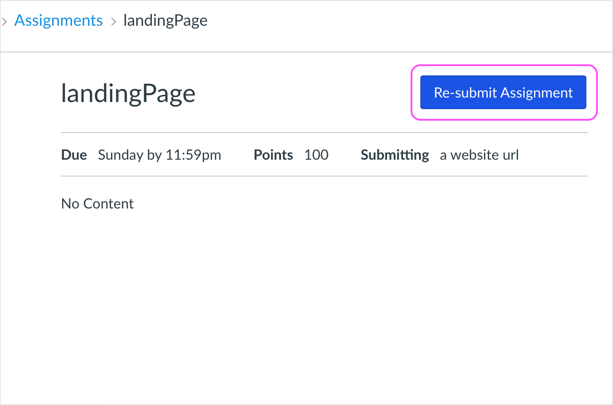

# Turning in Your Code

Assignment submissions are via your LMS (Canvas) through the method given to you by your instructor:
  * URL to live web pages, 
  * GitHub PRs, 
  * repos, 
  * or sometimes screenshot.

So far you've been creating your projects on CodeSandbox or CodePen. The URL to the codebase there is exactly what you'll turn in (*as long as its publicly available*).

Now where do you submit the URL?

## Submitting on Canvas

Follow these steps when you're ready to submit your assignment:

- [ ] Step 1. Click "Assignments" on the left hand nav

- [ ] Step 2. Click on the name of assignment you're submitting

- [ ] Step 3. Click "Submit Assignment"

- [ ] Step 4. Enter the URL for the website you're submitting
- [ ] Step 5. Click "Submit Assignment"

- [ ] And that's it! You can re-submit if for whatever reason you need to turn in a different URL.

 

## Move Your Project Files

For the first assignment, you've already been working in a folder that is **NOT** a Git repo. And, you have a new repo with nothing but a `README` file in it.

To continue, you need to move the files of `myPortfolio` folder into your `ACA_web101_yourname` folder so Git can move your project to GitHub.

- [ ] Navigate to your finder/file explorer on your computer and open two separate windows.
- [ ] Navigate to your **ACA_web101_yourname** folder in the first window.
- [ ] Navigate to your **myPortfolio** folder in the other window.
- [ ] Drag the files of **myPortfolio** folder into the **ACA_web101_yourname** folder in the first window.

<!-- Your folder structure should look like this: -->
<!-- TODO NO!! the files should be in the root directory of the git repo not in a folder. The `index.html` file needs to be exposed! -->
<!--  -->

<!-- https://studio.zollege.com/container/block-v1:ACA+PW101+2021-Feb2+type@vertical+block@4b74efe2a5064ffb97f882fc3007ae31 -->

*There is a way to turn a folder on your computer into a git repo using `git init` but that's an abstract lesson for where we are in your learning journey now. In the future, we will walk you through that method but for now, just copy/paste or drag and drop the files into the newly cloned folder/repo.*

