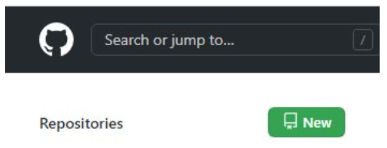

# Submitting Coding Homework

## Create Your Development Folder

You'll need a designated folder to keep all your projects together on your computer.

- [ ] Open your terminal program and navigate to Documents: `cd Documents`
- [ ] Make a new folder named `devFolder`: `mkdir devFolder`
- [ ] Change into the new folder/directory you made in the last class: `cd devFolder`

> NOTE FOR WINDOWS MACHINES USING ONEDRIVE:
> If you use OneDrive to save your photos, music, and other files, you may run into problems using Git and GitHub to create and manage your repos. If you have any issues, please refer to [How to Configure OneDrive to Sync Only Certain Folders in Windows 10](https://www.howtogeek.com/222817/how-to-configure-onedrive-to-sync-only-certain-folders-in-windows-10/) to unsync your `devFolder`.

## Create a Repo for Each Assignment

- [ ] Open your web browser and sign in to your GitHub account. 
- [ ] Click the **New** button in the top-right corner of the window.

- [ ] Enter `ACA_web101_yourFirstName_yourLastName` in the **Repository name** field. 

  > NOTE: Change `firstName` for your **actual** first name and `lastName` for your **actual** last name.

- [ ] Enter `This is my ACA portfolio` in the Description field. 
- [ ] Leave the **Public** radio button selected.
- [ ] Check the **Add a README** file checkbox. (this will create a `README.md` file for you to take notes in.)
- [ ] Click the **Create repository** button.

- [ ] Once the repo is created, click the **Code** button and copy the link it provides in the drop-down menu by clicking on the icon that looks like a page with the arrow pointing left.

- [ ] Go back to your terminal.
- [ ] Type `git clone` and paste the link you copied from your repo on GitHub to clone the repo onto your computer: `git clone paste-that-link-here-and-replace-me`
- [ ] Press the ++enter++ key and watch it work!

## Move Your Project Files

For the first assignment, you've already been working in a folder that is NOT a Git repo. And, you have a new repo with nothing but a README file.

To continue, you need to move your myPortfolio folder into your ACA_web101_yourname folder so Git can move your project to GitHub.

- [ ] Navigate to your finder/file explorer on your computer and open two separate windows.
- [ ] Navigate to your **ACA_web101_yourname** folder in the first window.
- [ ] Navigate to your **myPortfolio** folder in the other window.
- [ ] Drag the **myPortfolio** folder into the **ACA_web101_yourname** folder in the first window.

Your folder structure should look like this:

<!-- https://studio.zollege.com/container/block-v1:ACA+PW101+2021-Feb2+type@vertical+block@4b74efe2a5064ffb97f882fc3007ae31 -->