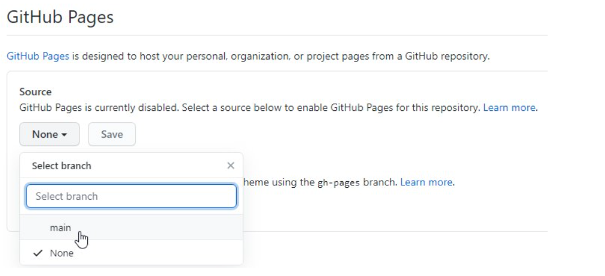

# Submitting Coding Homework

## Create Your Development Folder

For sanity and organization sake, you'll need a designated folder to keep all your coding projects together on your computer. This isn't a special folder just one that will be dedicated to keeping up with coding project.

- [ ] Open your terminal program and navigate to Documents: `cd Documents`
- [ ] Make a new folder named `devFolder`: `mkdir devFolder`
- [ ] Change into the new folder/directory you made in the last class: `cd devFolder`

> NOTE FOR WINDOWS MACHINES USING ONEDRIVE:
> If you use OneDrive to save your photos, music, and other files, you may run into problems using Git and GitHub to create and manage your repos. If you have any issues, please refer to [How to Configure OneDrive to Sync Only Certain Folders in Windows 10](https://www.howtogeek.com/222817/how-to-configure-onedrive-to-sync-only-certain-folders-in-windows-10/) to unsync your `devFolder`.

*You will only need to create one folder for all of your coding projects to go into for the entirety of the program. When you graduate and get a job you will want to create a new folder to organize that work in.*

*****

## Create a Repo for Each Assignment

- [ ] Open your web browser and sign in to your GitHub account.
- [ ] Click the **New** button in the top-right corner of the window.


- [ ] Enter `ACA_web101_yourFirstName_yourLastName` in the **Repository name** field.

  > NOTE: Change `firstName` for your **actual** first name and `lastName` for your **actual** last name.

- [ ] Enter `This is my ACA portfolio` in the Description field.
- [ ] Leave the **Public** radio button selected.
- [ ] Check the **Add a README** file checkbox. (this will create a `README.md` file for you to take notes in.)
- [ ] Click the **Create repository** button.


- [ ] Once the repo is created, click the **Code** button and copy the link it provides in the drop-down menu by clicking on the icon that looks like a page with the arrow pointing left.


- [ ] Go back to your terminal.
- [ ] Type `git clone` and paste the link you copied from your repo on GitHub to clone the repo onto your computer: `git clone paste-that-link-here-and-replace-me`
- [ ] Press the ++enter++ key and watch it work!


*You will need to create a repo for most assignments and every time you want to start a new project on your own, for a friend or whenever you want to build something new. Keep this instructions handy as they will be the same in the future.*

*****

## Move Your Project Files

For the first assignment, you've already been working in a folder that is **NOT** a Git repo. And, you have a new repo with nothing but a `README` file in it.

To continue, you need to move the files of `myPortfolio` folder into your `ACA_web101_yourname` folder so Git can move your project to GitHub.

- [ ] Navigate to your finder/file explorer on your computer and open two separate windows.
- [ ] Navigate to your **ACA_web101_yourname** folder in the first window.
- [ ] Navigate to your **myPortfolio** folder in the other window.
- [ ] Drag the files of **myPortfolio** folder into the **ACA_web101_yourname** folder in the first window.

<!-- Your folder structure should look like this: -->
<!-- TODO NO!! the files should be in the root directory of the git repo not in a folder. The `index.html` file needs to be exposed! -->
<!--  -->

<!-- https://studio.zollege.com/container/block-v1:ACA+PW101+2021-Feb2+type@vertical+block@4b74efe2a5064ffb97f882fc3007ae31 -->

*There is a way to turn a folder on your computer into a git repo using `git init` but that's an abstract lesson for where we are in your learning journey now. In the future, we will walk you through that method but for now, just copy/paste or drag and drop the files into the newly cloned folder/repo.*

*****

## Push to GitHub

You've created a new repo, cloned it to your local machine, and moved your `myPortfolio` folder with your project files into the new repo. Now it's time to push your files to GitHub.

- [ ] Open your terminal,  and `cd` (change directory) to your `ACA_web101_yourname` folder:
  
  * Example:  `cd ACA_web101_yourname` 

  >TIP: Type the first few letters of the folder and press ++tab++, and the terminal will fill in the rest of the folder name.

- [ ] You will see the full directory path with (`main`) or (`master`) at the end. This confirms you are in a Git repo and on the `main`/`master` branch.


- [ ] Type `git status` + ++enter++. You will see your `myPortfolio` folder (or a list of files) that have been changed in red.


- [ ] Type `git add -A` + ++enter++ to add/**track** all files to what will be **committed**.

  > You won't get a message back.

- [ ] Type `git status` + ++enter++ again and you will see the files you just **staged** to commit *now* in green.


- [ ] Type `git commit -m "moved files into repo"` + ++enter++ to **commit** your changes (the files you just moved over) so they're ready(**staged**) to be sent to GitHub.

  > You will see a summary of changes about to be pushed in white.


  > the `commit` command takes an argument `-m` for "message" followed by some plain text inside `" "`. This is for you to write a detailed message about the code changes you've made so your team can easily reference & understand the updates.

- [ ] Type `git push` + ++enter++ to **push** your files to GitHub. You will see the a success messages in white.


- [ ] **IF** *you get a DENIED error you may need to redo your Git Configurations with the proper email/username and password*

- [ ] **IF** *you get a fatal message:*
  
  ```console
    fatal: The current branch example-branch has no upstream branch.
    To push the current branch and set the remote as upstream, use
  ```

  > simply copy/paste the command it gives you: `git push --set-upstream origin <example-branch>`


- [ ] See [Git & Terminal Commands](./../additionalResources/gitCommands.md) for a full list of commands.

  > NOTE: All over the web and in this ebook when you see `<yourName>` or `<example-branch>` this means you should type in the name of your file or folder **WITHOUT** the wrapping `<` and `>`.

*You will do this step over, and over and OVER throughout the rest of your career. So write it down now, ask questions, understand what's happening and remember, **git status**, **git add**, **git commit**, and **git push**. Over and over and over again.*

*****

## Host Your Webpage

Before you can view your web page in a browser and turn in your assignment, you need to set your repository as a GitHub page. This tells GitHub you want to display this repo to the web.

- [ ] Go to your GitHub account and open your **ACA_web101_yourname** repo.
- [ ] Click the Settings icon in the top navigation menu.


- [ ] Scroll down almost to the bottom of the page to the **GitHub Pages** section.
- [ ] Click the **Source** dropdown and select the `main` or `master` branch (the first option).



- [ ] Click the **Save** button. The page will automatically refresh.
- [ ] Scroll back down to the **GitHub Pages** section, and you will see a message and link that says *“Your site is published at https://yourusername.github.io/ACA_web101_yourname."*.


Click the link. This is the **Root** of your live site.


- [ ] Always test your site to make sure everything is working. You can make and push changes as many times as you need.
- [ ] **Bookmark this link** so you can find it throughout the course. This will be the link you turn in for your assignments.

*You will only use GitHub pages when you want to host a page to the world. Most of our assignments won't require you to do this but it's a darn handy tool for when you want to get something up on the cheap.*

*****

## Turn in Your Assignment

Follow these steps when you're ready to submit your assignment:

- [ ] Step 1. Click "Assignments" on the left hand nav


- [ ] Step 2. Click on the name of assignment you're submitting


- [ ] Step 3. Click "Submit Assignment"


- [ ] Step 4. Enter the URL for the website you're submitting
- [ ] Step 5. Click "Submit Assignment"


- [ ] And that's it! You can re-submit if for whatever reason you need to turn in a different URL.


